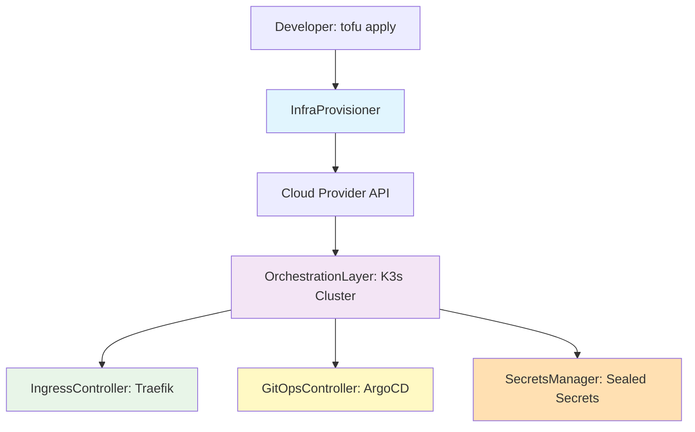
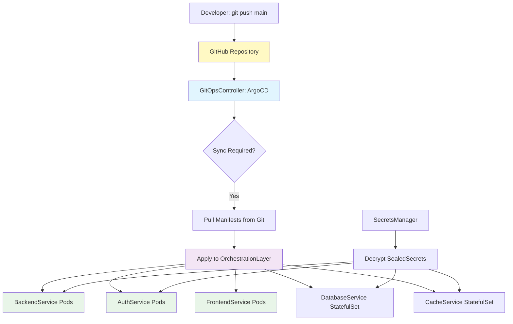
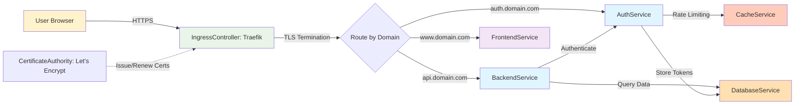
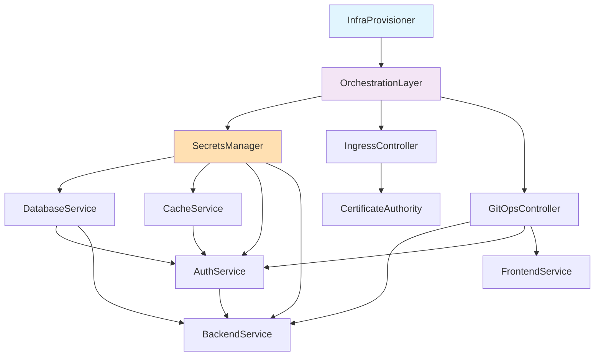

# Architectural Blueprint

## 1. Core Objective

Deploy the Alternate Futures platform (backend GraphQL API, authentication REST API, and Next.js marketing site) on production-grade Kubernetes infrastructure with automated GitOps deployment, secure secrets management, automatic SSL certificate provisioning, and zero-downtime updates—all using 100% open source technologies.

**Success Criteria:**
- All three services deployed and accessible via HTTPS
- GitHub push to `main` branch triggers automatic deployment within 5 minutes
- Secrets (JWT_SECRET, database credentials) managed securely via encrypted GitOps workflow
- SSL certificates automatically provisioned and renewed via Let's Encrypt
- Service-to-service communication (backend ↔ auth) functions correctly
- System handles 10,000+ requests/day with <200ms p95 latency

---

## 2. System Scope and Boundaries

### In Scope

**Infrastructure Provisioning:**
- K3s cluster provisioned via OpenTofu (compute, networking, storage)
- Multi-node setup for high availability (3 control plane nodes + worker nodes)
- Persistent storage configuration for PostgreSQL and Redis
- Load balancer and ingress configuration
- DNS configuration for service endpoints

**Application Deployment:**
- `backend` (Node.js GraphQL API on port 4000)
- `auth` (Hono REST API on port 3001)
- `home` (Next.js static site on port 3000)
- PostgreSQL database (shared by backend and auth)
- Redis cache/session store (used by auth service)

**GitOps Automation:**
- ArgoCD deployment and configuration
- GitHub repository monitoring for all three services
- Automatic synchronization on git push to main branch
- Health checks and rollback capabilities
- Deployment notifications

**Security & Secrets:**
- Sealed Secrets controller for encrypting secrets in Git
- etcd encryption at rest
- RBAC policies for cluster access
- Network policies for service isolation
- JWT_SECRET synchronization between backend and auth

**SSL/TLS:**
- Traefik ingress controller deployment
- Automatic Let's Encrypt certificate provisioning
- Certificate renewal automation
- TLS termination at ingress
- HTTP → HTTPS redirect

**Monitoring & Observability:**
- Basic health checks for all services
- ArgoCD dashboard for deployment status
- Traefik dashboard for traffic metrics
- Application logs accessible via kubectl

### Out of Scope

**Not Included in Initial Deployment:**
- Custom metrics/monitoring (Prometheus, Grafana) - future enhancement
- Distributed tracing (Jaeger, Zipkin) - future enhancement
- Service mesh (Linkerd, Istio) - not needed for 3-service architecture
- Backup/disaster recovery automation - manual procedures initially
- Multi-region/multi-cluster deployment - single cluster MVP
- Advanced CI/CD (testing, staging environments) - deploy main branch only
- Custom domain email (system@alternatefutures.ai) - out of infrastructure scope
- Database migration automation - manual migrations initially
- Auto-scaling based on load - fixed replica counts initially

**External Systems Not Managed:**
- GitHub repository hosting (using existing repos)
- DNS provider (assume DNS already configured)
- Cloud provider account setup (assume cloud account exists)
- Developer workstation configuration (assume developers have git, kubectl)

**Technologies Explicitly Excluded:**
- HashiCorp Terraform (BSL license) - using OpenTofu instead
- HashiCorp Vault (BSL license) - using Sealed Secrets instead
- Proprietary cloud provider managed services (AWS RDS, GCP Cloud SQL) - using self-hosted PostgreSQL

---

## 3. Core System Components

| Component Name | Single Responsibility |
|---|---|
| **InfraProvisioner** | Provision and manage K3s cluster infrastructure using OpenTofu (compute nodes, networking, storage volumes, load balancers) |
| **OrchestrationLayer** | Run containerized workloads and manage pod scheduling, service discovery, and resource allocation via K3s |
| **GitOpsController** | Monitor GitHub repositories for changes and automatically synchronize cluster state with declared configuration via ArgoCD |
| **IngressController** | Route external HTTP/HTTPS traffic to internal services, terminate TLS, and manage SSL certificates via Traefik |
| **SecretsManager** | Encrypt sensitive configuration for safe Git storage and decrypt into Kubernetes Secrets at runtime via Sealed Secrets Controller |
| **BackendService** | Serve GraphQL API for application data and proxy authentication requests to AuthService |
| **AuthService** | Manage Personal Access Tokens (PATs), handle SIWE authentication, provide JWT tokens, and enforce rate limiting |
| **FrontendService** | Serve static Next.js marketing site with product information and documentation links |
| **DatabaseService** | Persist application data and authentication tokens in PostgreSQL with ACID guarantees |
| **CacheService** | Store rate limiting counters and session data in Redis for fast in-memory access |
| **CertificateAuthority** | Issue and renew SSL certificates via Let's Encrypt ACME protocol (external dependency) |

---

## 4. High-Level Data Flow

### 4.1 Infrastructure Provisioning Flow


### 4.2 Application Deployment Flow


### 4.3 Runtime Request Flow


---

## 5. Key Integration Points

### 5.1 Infrastructure Layer

| Integration | Protocol/Mechanism | Details |
|-------------|-------------------|---------|
| **InfraProvisioner ↔ Cloud Provider** | Cloud Provider API (REST) | OpenTofu uses provider-specific APIs to create VMs, networks, storage volumes, load balancers |
| **InfraProvisioner ↔ OrchestrationLayer** | SSH + K3s Install Script | OpenTofu executes K3s installation script on provisioned nodes via SSH |
| **OrchestrationLayer ↔ IngressController** | Kubernetes API | K3s deploys Traefik as a DaemonSet and creates LoadBalancer Service |
| **OrchestrationLayer ↔ GitOpsController** | Kubernetes API | K3s deploys ArgoCD as a Deployment and grants cluster-admin RBAC |

### 5.2 GitOps Layer

| Integration | Protocol/Mechanism | Details |
|-------------|-------------------|---------|
| **GitHub ↔ GitOpsController** | Git over HTTPS + Webhook (optional) | ArgoCD polls GitHub every 3 minutes OR receives webhook on git push |
| **GitOpsController ↔ OrchestrationLayer** | Kubernetes API | ArgoCD applies manifests (Deployments, Services, Ingress) to K3s |
| **GitOpsController ↔ SecretsManager** | Kubernetes API | ArgoCD applies SealedSecret CRDs; controller decrypts into Secrets |

### 5.3 Application Layer

| Integration | Protocol/Mechanism | Details |
|-------------|-------------------|---------|
| **BackendService ↔ AuthService** | HTTP REST API | Backend calls `AUTH_SERVICE_URL/api/validate` with JWT tokens |
| **BackendService ↔ DatabaseService** | PostgreSQL Wire Protocol (TCP 5432) | GraphQL resolvers query PostgreSQL via connection pool |
| **AuthService ↔ DatabaseService** | PostgreSQL Wire Protocol (TCP 5432) | Auth service stores PATs and user data in PostgreSQL |
| **AuthService ↔ CacheService** | Redis Protocol (TCP 6379) | Rate limiting counters stored in Redis with TTL |
| **FrontendService ↔ User** | Static Files over HTTPS | Next.js static export served directly by NGINX or Node.js |

### 5.4 Ingress & Security Layer

| Integration | Protocol/Mechanism | Details |
|-------------|-------------------|---------|
| **User ↔ IngressController** | HTTPS (TLS 1.2+) | Traefik terminates TLS and routes to internal services |
| **IngressController ↔ BackendService** | HTTP (internal, no TLS) | Traefik forwards decrypted traffic to backend pods |
| **IngressController ↔ AuthService** | HTTP (internal, no TLS) | Traefik forwards decrypted traffic to auth pods |
| **IngressController ↔ FrontendService** | HTTP (internal, no TLS) | Traefik forwards decrypted traffic to frontend pods |
| **IngressController ↔ CertificateAuthority** | ACME Protocol (HTTPS) | Traefik requests certificates from Let's Encrypt via HTTP-01 or TLS-ALPN-01 challenge |

### 5.5 Secrets Management

| Integration | Protocol/Mechanism | Details |
|-------------|-------------------|---------|
| **Developer ↔ SecretsManager** | kubeseal CLI | Developer encrypts secrets locally with cluster public key, commits SealedSecret to Git |
| **SecretsManager ↔ OrchestrationLayer** | Kubernetes API | Sealed Secrets controller watches for SealedSecret CRDs and creates Secret objects |
| **BackendService ↔ Secrets** | Environment Variables | K3s mounts Secret values as env vars: `JWT_SECRET`, `DATABASE_URL` |
| **AuthService ↔ Secrets** | Environment Variables | K3s mounts Secret values as env vars: `JWT_SECRET`, `REDIS_URL`, `DATABASE_URL` |

### 5.6 Data Format Standards

| Data Type | Format | Usage |
|-----------|--------|-------|
| **API Requests** | JSON | All HTTP APIs use JSON for request/response bodies |
| **GraphQL Queries** | GraphQL Query Language | Backend accepts GraphQL queries over POST /graphql |
| **Database Schema** | PostgreSQL SQL | Application data stored in relational tables |
| **Kubernetes Manifests** | YAML | All K8s resources defined in YAML (Deployments, Services, Ingress, SealedSecrets) |
| **Infrastructure Code** | HCL (HashiCorp Configuration Language) | OpenTofu modules written in HCL |
| **Environment Variables** | KEY=VALUE | Secrets and config injected as env vars |
| **JWT Tokens** | JSON Web Token (RFC 7519) | Authentication tokens signed with HS256 using shared JWT_SECRET |

### 5.7 Authentication Flow

| Step | Components Involved | Protocol |
|------|-------------------|----------|
| 1. User requests PAT | User → IngressController → AuthService | HTTPS (REST API) |
| 2. Auth validates SIWE signature | AuthService → DatabaseService | PostgreSQL protocol |
| 3. Auth generates JWT | AuthService (internal) | HS256 signing with JWT_SECRET |
| 4. User calls GraphQL with JWT | User → IngressController → BackendService | HTTPS (GraphQL) |
| 5. Backend validates JWT | BackendService → AuthService | HTTP REST (`/api/validate`) |
| 6. Backend returns data | BackendService → User | HTTPS (JSON) |

---

## 6. Component Dependencies

### Critical Path Dependencies



**Deployment Order:**
1. InfraProvisioner (OpenTofu) provisions cluster
2. OrchestrationLayer (K3s) becomes operational
3. SecretsManager (Sealed Secrets) deployed
4. IngressController (Traefik) deployed
5. GitOpsController (ArgoCD) deployed
6. DatabaseService (PostgreSQL) deployed
7. CacheService (Redis) deployed
8. AuthService deployed (depends on Database + Cache)
9. BackendService deployed (depends on AuthService)
10. FrontendService deployed (no dependencies)

---

## 7. Network Architecture

### Service Mesh (Internal)

```
┌─────────────────────────────────────────────────────────────┐
│                        K3s Cluster                           │
│                                                              │
│  ┌──────────────┐     ┌──────────────┐     ┌─────────────┐ │
│  │ BackendPod   │────▶│  AuthPod     │────▶│ PostgreSQL  │ │
│  │ :4000        │     │  :3001       │     │ :5432       │ │
│  └──────────────┘     └──────────────┘     └─────────────┘ │
│         │                     │                             │
│         │                     ▼                             │
│         │             ┌─────────────┐                       │
│         │             │   Redis     │                       │
│         │             │   :6379     │                       │
│         │             └─────────────┘                       │
│         │                                                   │
│  ┌──────────────┐                                          │
│  │ FrontendPod  │                                          │
│  │ :3000        │                                          │
│  └──────────────┘                                          │
│         ▲                     ▲                     ▲       │
│         │                     │                     │       │
│  ┌──────┴─────────────────────┴─────────────────────┴────┐ │
│  │           Traefik Ingress Controller                   │ │
│  │              (TLS Termination)                         │ │
│  └────────────────────────────────────────────────────────┘ │
│                            ▲                                │
└────────────────────────────┼────────────────────────────────┘
                             │
                    ┌────────┴─────────┐
                    │  Load Balancer   │
                    │  (Cloud Provider)│
                    └──────────────────┘
                             ▲
                             │ HTTPS
                             │
                        [Internet]
```

### DNS Routing

```
www.alternatefutures.ai     → Load Balancer → Traefik → FrontendService
api.alternatefutures.ai     → Load Balancer → Traefik → BackendService
auth.alternatefutures.ai    → Load Balancer → Traefik → AuthService
argocd.alternatefutures.ai  → Load Balancer → Traefik → ArgoCD UI
```

---

## Quality Attributes

| Attribute | Requirement | How Achieved |
|-----------|-------------|--------------|
| **Availability** | 99.9% uptime | Multi-replica deployments, K3s HA control plane, health checks |
| **Security** | All traffic encrypted, secrets never in plaintext | TLS at ingress, Sealed Secrets, etcd encryption |
| **Scalability** | Handle 10k+ req/day | Horizontal pod autoscaling (future), stateless services |
| **Maintainability** | GitOps single source of truth | All config in Git, ArgoCD sync, infrastructure as code |
| **Observability** | Deployment status visible | ArgoCD UI, Traefik dashboard, kubectl logs |
| **Reliability** | Automatic rollback on failure | ArgoCD health checks, Kubernetes liveness/readiness probes |

---

## Approval Gate

Architectural blueprint complete with:
- ✅ **11 core components** clearly defined with single responsibilities
- ✅ **3 data flow diagrams** showing infrastructure, deployment, and runtime flows
- ✅ **35+ integration points** documented with protocols and mechanisms
- ✅ Clear **scope boundaries** (in-scope vs. out-of-scope)
- ✅ **Network architecture** and DNS routing defined
- ✅ **Deployment dependencies** and critical path identified

**Component names defined in this blueprint will be used consistently across all subsequent documents (requirements.md, design.md, tasks.md, validation.md).**

**Proceed to generate requirements with acceptance criteria?**
