# AlternateFutures Marketing Admin Platform: Comprehensive Requirements Document

**Version:** 1.0.0
**Date:** 2026-02-14
**Status:** Draft for CEO Review
**Synthesized from:** 8 Marketing Agent Specs + 1 Architecture Audit

---

## Table of Contents

1. [Executive Summary](#1-executive-summary)
2. [Platform Architecture Overview](#2-platform-architecture-overview)
3. [Business Functions Registry](#3-business-functions-registry)
4. [User Stories](#4-user-stories)
5. [Data Architecture](#5-data-architecture)
6. [API Specification](#6-api-specification)
7. [User Experience Specification](#7-user-experience-specification)
8. [Integration Architecture](#8-integration-architecture)
9. [Security and Compliance](#9-security-and-compliance)
10. [Implementation Roadmap](#10-implementation-roadmap)
11. [Non-Functional Requirements](#11-non-functional-requirements)
12. [Appendices](#12-appendices)

---

## 1. Executive Summary

### 1.1 Platform Vision

The AlternateFutures Marketing Admin Platform is a unified command center for orchestrating marketing operations across 16 social platforms, 8 AI marketing agents, and a human leadership team. It manages the full lifecycle of marketing content -- from strategic planning through creation, brand governance, publishing, community engagement, and performance analysis -- while providing the CEO with real-time visibility into all marketing operations, budget allocation, and business outcomes.

The platform operates in a unique market moment: Fleek and Spheron have exited Web3 hosting, creating a vacuum that AF is positioned to capture. The $600K annual marketing budget and the GTM 2026 plan (5 H1 verticals, H2 enterprise expansion) demand a system that enables high-velocity, brand-consistent, data-driven marketing execution with minimal CEO bottlenecks.

### 1.2 Current State (What Is Built)

Based on the architecture audit, the platform at `web-alternatefutures.ai` currently includes:

| Module | Status | Key Capabilities |
|--------|--------|-----------------|
| **Campaign Composer** | Built | 4-step wizard with content transformer, tone/source selection, multi-platform generation |
| **Social Post Management** | Built | CRUD, scheduling, 10-platform publishing with OAuth + rate limiting |
| **Approval Workflow** | Built | Request/approve/reject/request-changes with history tracking |
| **Approval Rules Engine** | Built | Auto-approve, require-review, require-admin, per-platform rules |
| **Team Management** | Built | Admin/editor/reviewer roles with permissions matrix |
| **Digital Asset Management** | Built | Categories, tags, IPFS pinning, version tracking |
| **Inbox** | Built | Messages + approvals unified view |
| **Analytics** | Built | Post activity, platform breakdown, status distribution, hashtag analysis |
| **Blog Management** | Built | Full CRUD with TipTap editor, SEO fields, status workflow |
| **Calendar** | Built | Month/week/list views, 11 event types, social post overlay |
| **UTM Management** | Built | Presets with platform-aware defaults |
| **Trending Topics** | Built | Multi-source aggregation with relevance scoring |
| **Content Transformer** | Built | Claude-powered platform-specific variant generation |

**Tech Stack:** Next.js 16.1.6, React 19, TypeScript 5.9, TipTap (rich text), Marked 4.3.0 (pinned), Jose (JWT), Resend (email), NATS (agent messaging), GraphQL (API layer).

**Design System:** Soft Brutalism + Wabi-Sabi with comprehensive design tokens (Stone color scale, Ultramarine primary, Terracotta accent, Aizome depth scale, body-referenced spacing, asymmetric radii, warm offset shadows).

**API Pattern:** All modules follow `authGraphqlFetch` + `useSeedData()` with in-memory mock stores for development.

### 1.3 Gap Analysis (What Is Needed)

The following capabilities are entirely absent and represent the scope of this requirements document:

| Domain | Gap | Requesting Agents |
|--------|-----|-------------------|
| **Brand Governance** | No brand style guide enforcement, no automated voice validation, no terminology scanning, no compliance scoring | Brand Guardian |
| **Content Strategy** | No content briefs, no editorial calendar auto-population, no content gap analysis, no SEO optimization | Content Writer |
| **Growth Operations** | No experiment engine, no A/B testing, no funnel analytics, no attribution modeling, no CAC/LTV tracking | Growth Hacker |
| **Market Intelligence** | No competitor tracking, no pricing intel, no sentiment analysis, no battle cards, no market sizing | Market Intel |
| **Community Management** | No unified inbox across platforms, no member profiles, no moderation tools, no engagement scoring | Community Manager |
| **Developer Relations** | No changelog automation, no code snippet management, no docs sync, no developer onboarding funnel | DevRel Lead |
| **Partnerships & Grants** | No partner CRM, no grant tracking, no co-marketing workflows, no referral management | Partnerships/Grants |
| **Strategic Orchestration** | No OKR tracking, no executive dashboard, no budget management, no cross-agent coordination, no GTM milestone tracking | Strategic Orchestrator |

---

## 2. Platform Architecture Overview

### 2.1 Current Technical Stack

```
Frontend:  Next.js 16.1.6 (App Router) + React 19 + TypeScript 5.9
Styling:   Custom CSS with design tokens (Soft Brutalism + Wabi-Sabi)
Editor:    TipTap (rich text) + Marked 4.3.0 (markdown)
Auth:      JWT (Jose) + HttpOnly cookies + Edge-compatible
Email:     Resend
Icons:     React Icons 5.5
API:       GraphQL (client-side) with seed data fallback
Messaging: NATS (agent coordination)
Hosting:   Akash Network (decentralized compute)
Image:     ghcr.io/wonderwomancode/web-alternatefutures-ai:v9.4-soft-brutalism
```

### 2.2 Proposed Architecture Extensions

```
New API Modules:     brand-api, brief-api, growth-api, intel-api,
                     community-api, devrel-api, partnerships-api,
                     orchestrator-api, experiments-api, okr-api,
                     budget-api, alerts-api
New Integrations:    Stripe (billing), GA4/Plausible (analytics),
                     GitHub API (repos), npm Registry (downloads),
                     Social Platform Analytics APIs,
                     On-chain Data (Akash/Filecoin/Arweave)
New Infrastructure:  Time-series KPI store, Intel data warehouse,
                     Code snippet execution sandbox, RSS feed aggregator,
                     Web scraping scheduler
```

### 2.3 System Architecture Diagram

```
                     +------------------------------------------+
                     |          CEO / Human Team                 |
                     |   (Browser: Next.js App Router UI)        |
                     +-------------------+----------------------+
                                         |
                     +-------------------v----------------------+
                     |           Next.js Frontend               |
                     |   App Router + Server Components          |
                     |   Design System: Soft Brutalism           |
                     +---+----------+----------+--------+-------+
                         |          |          |        |
              +----------v--+  +---v----+  +--v----+  +v--------+
              | GraphQL API  |  | REST   |  | NATS  |  | Webhooks|
              | (Production) |  | APIs   |  | Pub/  |  | (Inbound|
              | authGqlFetch |  | /api/* |  | Sub   |  |  events)|
              +------+-------+  +---+----+  +--+----+  +---+----+
                     |              |           |           |
    +----------------v--------------v-----------v-----------v----+
    |                     Backend Services                        |
    |  +----------+  +-----------+  +----------+  +----------+   |
    |  | Cloud API|  | Auth Svc  |  | NATS Bus |  | Infisical|   |
    |  | (GraphQL)|  | (Hono)    |  | (Events) |  | (Secrets)|   |
    |  +----+-----+  +-----+-----+  +----+-----+  +----------+   |
    |       |              |              |                        |
    |  +----v--------------v--------------v-----+                  |
    |  |         PostgreSQL (Prisma)             |                  |
    |  +-----------------------------------------+                  |
    +---------------------------------------------------------------+
                              |
    +-------------------------v-------------------------------------+
    |                  Agent Swarm (8 Marketing Agents)              |
    |  Brand Guardian | Content Writer | Growth Hacker | Market Intel|
    |  Community Mgr  | DevRel Lead    | Partnerships  | Orchestrator|
    |  (All communicate via NATS subjects)                           |
    +---------------------------------------------------------------+
                              |
    +-------------------------v-------------------------------------+
    |               External Integrations                            |
    |  16 Social Platforms | Stripe | GA4 | GitHub | npm | RSS      |
    |  Akash/Filecoin/Arweave (on-chain) | Crunchbase | Search APIs |
    +---------------------------------------------------------------+
```

---

## 3. Business Functions Registry

All business functions are organized by domain, deduplicated across agents. Each function has a unique ID following the pattern `BF-{DOMAIN}-{NUMBER}`.

**Priority Legend:** P0 = Critical (launch blocker), P1 = High (first quarter), P2 = Medium (second quarter), P3 = Low (H2 2026)

### 3.1 Brand and Content Governance

*Requesting agents: Brand Guardian (BG), Content Writer (CW)*

| ID | Name | Description | Priority | Perspective | Agents |
|----|------|-------------|----------|-------------|--------|
| BF-BG-001 | Brand Style Guide Registry | Machine-readable, versioned repository of all brand rules: voice attributes with pass/fail examples, two-track messaging (Track A DePIN-aware 30%, Track B DePIN-unaware 70%), color/typography/logo usage specs. Single source of truth for both humans and agents. | P0 | Both | BG |
| BF-BG-002 | Brand Compliance Scoring Engine | Automated scoring (0-100) of any content against brand voice, terminology, partner positioning, competitor treatment, track alignment, and tone. Pre-publication gate with configurable threshold. Batch scoring for campaign-level coherence. | P0 | Agent | BG, CW |
| BF-BG-003 | Terminology Scanner and Auto-Corrector | Real-time and batch detection of forbidden terms with approved replacements. Context-aware (e.g., "ship" vs "deploy"). Inline warnings in composer. Custom dictionary management UI. | P0 | Both | BG, CW |
| BF-BG-004 | Brand-Aware Approval Gate | New `require_brand_review` approval rule type. Automated brand scoring on approval entry. Nori can programmatically approve/reject via API. Brand review history alongside general approval history. Blocking authority for partner positioning violations. | P0 | Both | BG |
| BF-BG-005 | Brand Voice Validation API | REST and NATS endpoints for any agent to validate content against brand voice. Input: content, platform, author, type. Output: approved boolean, score, violations, corrections, suggestions. | P0 | Agent | BG, CW, GH, CM, DR |
| BF-BG-006 | Brand Asset Governance | Extend existing DAM with `brandControlled` flag, usage rules (min dimensions, clearance zones, approved backgrounds), platform-specific variants, brand asset approval workflow, usage tracking. | P1 | Both | BG |
| BF-BG-007 | Content Template Governance | Templates with locked zones (brand elements) and editable zones. Per-platform templates. Version and approval workflow. Template compliance checking. Agent-accessible template API. | P1 | Both | BG, CW |
| BF-BG-008 | Cross-Platform Campaign Coherence Analysis | Analyze all campaign variants together for cross-platform consistency: core message alignment, voice adaptation, hashtag coordination, visual asset consistency. Contradiction detection. | P1 | Agent | BG |
| BF-BG-009 | Brand Health Dashboard | Aggregated brand compliance metrics: score trends, violation frequency, per-agent adherence, per-platform consistency, terminology compliance rate, partner positioning audit trail, alert thresholds. | P1 | Human | BG |
| BF-BG-010 | Competitive Content Guardrails | Entity recognition for partner/competitor mentions. Sentiment analysis. Hard block on negative partner mentions (Akash, ICP, Livepeer, Filecoin). Fair comparison enforcement for competitor mentions. Escalation triggers. | P0 | Agent | BG |
| BF-BG-011 | Brand Audit Trail | Immutable log of brand decisions: approvals, rejections, overrides, exemptions, rule changes, escalations. Pattern analysis. Exportable quarterly reports. | P1 | Both | BG |
| BF-BG-012 | Agent Brand Certification | Structured onboarding for new agents: brand guide in JSON, comprehension tests, certification levels (trainee/certified/trusted) mapping to approval permissions. | P2 | Agent | BG |
| BF-BG-013 | Visual Identity Compliance | Image analysis for brand color compliance, logo detection and validation, font detection, platform dimension validation, quality gating. | P2 | Agent | BG |
| BF-BG-014 | Brand Voice Training Data | Auto-collect approved/rejected content as training corpus. Curated example gallery. JSONL export for fine-tuning. | P3 | Both | BG |
| BF-BG-015 | External Brand Perception Monitor | Social mention aggregation, sentiment analysis, terminology mismatch detection in external mentions, brand ambassador identification. Integration with inbox. | P3 | Both | BG, MI |

### 3.2 Content Creation and Publishing

*Requesting agents: Content Writer (CW), DevRel Lead (DR)*

| ID | Name | Description | Priority | Perspective | Agents |
|----|------|-------------|----------|-------------|--------|
| BF-CW-001 | Content Brief System | Structured briefs defining audience, goals, tone, keywords, CTAs, constraints. Auto-generated from campaign objectives or manually authored. Assigned to agents with deadlines. | P0 | Both | CW |
| BF-CW-002 | Multi-Format Content Editor | Rich editor supporting blog, social, email, ad copy, changelog, case studies, docs snippets -- each with format-specific constraints. Extends existing TipTap editor. | P0 | Both | CW |
| BF-CW-003 | Content Template Library | Parameterized templates for recurring types: product launch, weekly roundup, case study, comparison post, tutorial, partnership announcement. Brand voice encoded. | P0 | Agent | CW, BG |
| BF-CW-004 | Tone and Voice Adaptation Engine | Per-platform tone profiles (LinkedIn: professional, X: punchy, Discord: casual, Dev.to: educational) with automatic adaptation during content transformation. | P0 | Agent | CW |
| BF-CW-005 | Content Transformer Pipeline | Multi-stage: long-form to social snippets, blog to email digest, changelog to tweet thread, case study to carousel. Each transformation preserves key messages. Extends existing transformer. | P1 | Agent | CW |
| BF-CW-006 | A/B Copy Variant Generator | Generate 2-5 variants with controlled axes: headline alternatives, CTA phrasing, hooks, emotional angle. Track selection patterns and eventual performance. | P1 | Agent | CW, GH |
| BF-CW-007 | SEO Content Optimizer | Keyword research, meta description generation, heading structure analysis, internal link suggestions, readability scoring, keyword density checks. | P1 | Both | CW, DR |
| BF-CW-008 | Hashtag and Keyword Strategy Engine | Platform-specific hashtag recommendations, trending analysis, competitor hashtag monitoring, branded hashtag tracking (#AlternateFutures, #DecentralizedCloud). | P1 | Agent | CW |
| BF-CW-009 | Draft-Review-Publish Pipeline | Enhanced lifecycle: Draft > Agent Review > Human Review > Scheduled > Published > Archived. Each stage has SLA timers, permissions, notifications. Extends existing approval workflow. | P0 | Both | CW |
| BF-CW-010 | Editorial Calendar Enhancement | Visual calendar showing all content across platforms/formats. Drag-and-drop rescheduling. Conflict detection. Campaign grouping. Vertical tagging. Auto-population from content plans. | P0 | Both | CW, SO |
| BF-CW-011 | Content Approval Queue Enhancement | Platform-native preview in approval queue. One-click approve/reject. Batch approval for campaign bundles. Mobile-friendly. Brand score displayed alongside content. | P0 | Human | CW, BG |
| BF-CW-012 | Content Versioning and History | Full version history with diff view and rollback. Branch-like workflow for A/B variants sharing a common ancestor. | P1 | Both | CW |
| BF-CW-013 | Campaign Content Planner | Auto-generate content plans from campaign briefs: blog cadence, social schedule, email sequence, supporting docs, with content dependencies mapped. | P1 | Both | CW |
| BF-CW-014 | Vertical-Specific Content Tracks | Separate streams for each H1 vertical (AI Startups, Cost-Opt SaaS, Gaming, Web3 Indie, Low-Code) with tailored messaging, use cases, pain points. CEO sets priority weighting. | P1 | Both | CW |
| BF-CW-015 | Content Gap Analysis | Cross-reference published content against target keywords, funnel stages, audience segments, product features. Surface gaps proactively. | P2 | Agent | CW |
| BF-CW-016 | Blog-to-Social Atomizer | Extract tweetable quotes, statistics, how-to snippets from blogs. Generate 5-10 social promotion posts per blog article per platform. | P1 | Agent | CW |
| BF-CW-017 | Agent Learning Feedback Loop | Capture CEO edit deltas as structured learning data. Pattern recognition across edit history. Quality score trends per agent. | P0 | Both | CW |
| BF-CW-018 | Content Attribution and ROI Tracking | Track content contribution to signups, deployments, revenue via UTM. Conversion path analysis. Content-influenced pipeline value. | P1 | Human | CW, GH |
| BF-CW-019 | Annotation and Feedback System | Inline commenting on content pieces with threaded conversations. Agent responds with revised options. | P2 | Human | CW |
| BF-CW-020 | Email Sequence Builder | Visual builder for multi-step email sequences: welcome, onboarding, re-engagement, product updates. Subject line variants, preview text, personalization tokens. | P1 | Both | CW |
| BF-CW-021 | Newsletter Curator | Auto-curate weekly/monthly newsletter from published blog posts, product updates, community highlights. Agent drafts; CEO reviews. | P1 | Both | CW, DR |

### 3.3 Developer Relations

*Requesting agent: DevRel Lead (DR)*

| ID | Name | Description | Priority | Perspective | Agents |
|----|------|-------------|----------|-------------|--------|
| BF-DR-001 | Changelog-to-Content Automation | Monitor SDK, CLI, and API repos for version bumps and schema changes. Auto-generate changelog entries, social posts, blog summaries, newsletter segments. | P0 | Agent | DR |
| BF-DR-002 | Code Example Management | Centralized library of validated, versioned code snippets tied to SDK/CLI versions. Auto-test against current API. Inline embedding support. | P0 | Both | DR |
| BF-DR-003 | Technical Accuracy Review Workflow | Multi-stage: agent drafts, validates code examples against live API, flags for human review if confidence below threshold. SLA tracking. | P0 | Both | DR |
| BF-DR-004 | GitHub Issue-to-Content Pipeline | Monitor AF GitHub repos for recurring questions, common errors, feature requests. Auto-generate FAQ entries, troubleshooting docs, blog posts. | P0 | Agent | DR |
| BF-DR-005 | Developer Onboarding Funnel Tracking | Track journey: landing page > docs > CLI install > first deploy > second project > advocacy. Identify drop-off points. Trigger targeted content per stage. | P0 | Both | DR, GH |
| BF-DR-006 | API/Schema Documentation Sync | Detect drift between Prisma schema, GraphQL resolvers, and published docs. Auto-generate command reference pages. Queue doc update tasks. | P0 | Agent | DR |
| BF-DR-007 | Developer Newsletter Composer | Assemble developer newsletter from changelog entries, blog posts, community highlights, events, tutorials. Segmented by developer type. | P0 | Both | DR, CW |
| BF-DR-008 | Content Freshness Scoring | Assign freshness scores based on last update, API/SDK version references, dependency versions, engagement metrics. Flag stale content. | P1 | Agent | DR |
| BF-DR-009 | Link Rot Detection | Scan all published DevRel content for broken links. Auto-queue fixes. | P1 | Agent | DR |
| BF-DR-010 | Template Gallery Management | Curate starter template catalog (Astro, Next.js, React, Vue, Hugo). Track usage, freshness, dependency updates. | P1 | Agent | DR |
| BF-DR-011 | Fleek/Spheron Migration Content | Specialized migration guides and comparison pages for developers displaced by competitor pivots. Track migration conversions. | P0 | Both | DR, GH |
| BF-DR-012 | Developer Community Metrics Dashboard | GitHub stars/forks/contributors, Discord members, npm downloads, CLI installs, docs page views, tutorial completion rates, developer NPS, time-to-first-deploy. | P0 | Human | DR, CM |
| BF-DR-013 | Hackathon Management | Full lifecycle: theme, registration, submissions, judging, prizes, post-event content (winner spotlights, project showcases). | P1 | Both | DR |
| BF-DR-014 | Developer Event Calendar | Track conferences, meetups, Spaces, AMAs. CFP deadlines, speaker submissions, prep status, post-event content tasks. | P1 | Both | DR |
| BF-DR-015 | Ecosystem Integration Tracking | Monitor framework releases (Next.js, SvelteKit, Astro) for compatibility. Trigger template updates and deploy guide revisions. | P1 | Agent | DR |
| BF-DR-016 | Code Snippet Execution Sandbox | Isolated Akash-deployed environment to validate code examples against live API before publication. | P1 | Agent | DR |

### 3.4 Growth and Analytics

*Requesting agent: Growth Hacker (GH)*

| ID | Name | Description | Priority | Perspective | Agents |
|----|------|-------------|----------|-------------|--------|
| BF-GH-001 | Growth Experiment Engine | Structured system for proposing, prioritizing (ICE/RICE), executing, measuring, and archiving experiments. Hypothesis definition, statistical significance calculators, result reporting. | P0 | Both | GH |
| BF-GH-002 | A/B and Multivariate Testing Framework | Split tests across landing pages, email subjects, CTAs, onboarding flows. Traffic allocation, variant definition, conversion tracking, automated winner selection. | P0 | Both | GH |
| BF-GH-003 | Conversion Funnel Builder and Analytics | Visual funnel modeling: first touch > activation > conversion > expansion. Drop-off tracking. Multiple funnel definitions per vertical. Anomaly detection. | P0 | Both | GH |
| BF-GH-004 | Attribution and UTM Analytics Engine | Multi-touch attribution (first/last/linear/time-decay/position). Connect UTMs to signups, activations, revenue. Channel and campaign-level ROI. Extends existing UTM management. | P0 | Both | GH |
| BF-GH-005 | CAC/LTV Tracking and Unit Economics | Customer Acquisition Cost by channel, campaign, vertical, cohort. LTV with predictive modeling. LTV:CAC ratios, payback periods. Stripe integration. | P0 | Both | GH |
| BF-GH-006 | Growth Scorecard and OKR Dashboard | North Star (monthly active deployers), supporting metrics (signups, activations, MRR, churn), growth rate trends. GTM 2026 target comparison. Board-ready exports. | P0 | Human | GH, SO |
| BF-GH-007 | Activation Metrics and Aha-Moment Tracker | Per-vertical aha-moment identification and tracking. Time-to-activation, activation rate by cohort, correlation with retention. | P0 | Both | GH |
| BF-GH-008 | Growth Automation Workflow Builder | Visual workflow for multi-step automations with conditional branching, time delays, event triggers. Agent's primary tool for autonomous growth operations. | P0 | Agent | GH |
| BF-GH-009 | Signup Funnel Optimization | Track time-to-first-deploy, onboarding completion rates, auth method preferences, friction points, abandonment analysis. A/B testing of onboarding variants. | P0 | Both | GH |
| BF-GH-010 | Cohort Analysis Engine | Group users by signup date, channel, vertical, plan type. Retention curves, activation rates, expansion revenue, churn tracking. Weekly/monthly granularity. | P1 | Both | GH |
| BF-GH-011 | Referral Program Management | End-to-end: unique links, reward tiers, fraud detection, funnel analytics, leaderboard. Billing integration for credit application. | P1 | Both | GH, CM |
| BF-GH-012 | Viral Loop and Network Effect Tracker | K-factor and cycle time measurement. Track organic invitations, social sharing, "Powered by AF" badge conversions. | P1 | Agent | GH |
| BF-GH-013 | Landing Page Builder and Optimizer | Template-based creation with dynamic personalization. Built-in A/B testing. Heatmap integration. Self-deployed on AF infrastructure. | P1 | Both | GH |
| BF-GH-014 | Retention Campaign Automation | Trigger-based re-engagement: usage decline, failed deploys, billing issues, inactivity. Automated sequences with cooldown periods. | P1 | Agent | GH |
| BF-GH-015 | Automated Growth Report Generator | Daily, weekly, monthly reports in multiple formats: executive summary, detailed breakdown, investor-ready deck. Distributed via email, Discord, dashboard. | P1 | Agent | GH, SO |
| BF-GH-016 | Pricing Experiment Manager | Test pricing page variations, plan structures, feature gating, promotions. Track conversion impact. Stripe integration. | P1 | Both | GH |
| BF-GH-017 | Channel Mix Optimizer | Analyze performance across all platforms plus paid channels. Budget allocation recommendations. Diminishing returns modeling. What-if scenario planning. | P2 | Both | GH |
| BF-GH-018 | Waitlist and Early Access Management | Position-based queuing with referral boosts. Drip emails. Conversion tracking. Segmented by vertical. Critical for H2 enterprise. | P1 | Both | GH |

### 3.5 Market and Competitive Intelligence

*Requesting agent: Market Intel (MI)*

| ID | Name | Description | Priority | Perspective | Agents |
|----|------|-------------|----------|-------------|--------|
| BF-MI-001 | Competitor Profile Registry | Structured profiles for each competitor (Render, Vercel, Railway, Fly.io, Fleek, Spheron, Netlify, Cloudflare Pages, etc.). Funding, headcount, products, pricing, verticals, pivot history. | P0 | Both | MI |
| BF-MI-002 | Competitor Feature Matrix | Side-by-side comparison grid updated automatically and manually curated. Hosting, serverless, storage, AI inference, GPU, Web3 features. | P0 | Both | MI |
| BF-MI-003 | Pricing Intelligence Engine | Scheduled scraping/diffing of competitor pricing pages. Detect tier changes, new free tiers, credit-based shifts. Generate comparison tables and battle cards. | P0 | Agent | MI |
| BF-MI-004 | Battle Card Generator | Per-competitor cards combining pricing, feature diffs, testimonials, talk tracks. Auto-updated on data changes. PDF export. | P0 | Both | MI, PG |
| BF-MI-005 | Web3 Hosting Vacuum Tracker | Monitor gap from Fleek/Spheron exits. Track displaced customers, migration destinations, pain points expressed. | P0 | Agent | MI |
| BF-MI-006 | DePIN Market Analyzer | Track Akash utilization, Filecoin deals, Arweave data, Phala compute, Aethir GPU. Cross-network pricing trends. | P0 | Both | MI |
| BF-MI-007 | Market Sizing Dashboard | TAM/SAM/SOM per vertical with cited data sources, methodology, quarterly refresh. | P0 | Human | MI |
| BF-MI-008 | Developer Sentiment Analyzer | Analyze sentiment on X, Reddit, HN, Discord, Stack Overflow toward AF and competitors. Rolling sentiment scoring. | P1 | Agent | MI, CM |
| BF-MI-009 | Share of Voice Dashboard | AF's share of voice vs competitors across social, forums, tech media. Weekly/monthly trending. | P1 | Both | MI |
| BF-MI-010 | Executive Intelligence Dashboard | Single-pane CEO view: competitive threat levels (red/yellow/green), market opportunity scores, developer sentiment, share of voice, key alerts. Mobile-friendly. | P0 | Human | MI, SO |
| BF-MI-011 | Quarterly Intel Briefing Generator | Auto-generate executive briefings: competitor moves, market trends, sentiment, pricing changes, strategic recommendations. | P0 | Agent | MI |
| BF-MI-012 | RSS/API Feed Aggregator | Subscribe to tech blogs, competitor blogs, regulatory sites, industry publications. Normalize into unified stream. Connectors for GitHub, npm, Twitter, Reddit, HN, Crunchbase, Google Trends, on-chain data. | P0 | Agent | MI |
| BF-MI-013 | Intel Data Warehouse | Structured storage for all intelligence data with full-text search, tagging, temporal queries. Powers all dashboards. | P0 | Both | MI |
| BF-MI-014 | Alert and Notification Engine | Configurable rules: competitor funding alerts, sentiment threshold alerts, feature launch alerts, regulatory changes. Route via Discord, email, in-app. | P1 | Both | MI, SO |
| BF-MI-015 | SWOT Analysis Builder | Interactive, versioned SWOT. Pre-populated from data, human-editable with agent suggestions. | P1 | Both | MI |
| BF-MI-016 | Win/Loss Analysis Module | Track customer acquisition and churn events. Capture reasons. Aggregate patterns. | P1 | Human | MI |
| BF-MI-017 | Competitor Timeline View | Chronological timeline of competitor events overlaid with AF milestones. Visual correlation. | P1 | Both | MI |
| BF-MI-018 | Influencer and KOL Tracker | Identify key opinion leaders in Web3 infra, DevOps, cloud-native. Score by reach, relevance, engagement. Flag partnership opportunities. | P2 | Both | MI, PG |

### 3.6 Community Management

*Requesting agent: Community Manager (CM)*

| ID | Name | Description | Priority | Perspective | Agents |
|----|------|-------------|----------|-------------|--------|
| BF-CM-001 | Cross-Platform Message Aggregation | Ingest and normalize mentions, replies, DMs, comments from all 16 platforms into a single filterable inbox. | P0 | Both | CM |
| BF-CM-002 | Conversation Threading | Group related messages into threads spanning platforms (user asks on X, follows up on Discord). | P0 | Both | CM |
| BF-CM-003 | Message Classification and Routing | Auto-classify by type (question, bug, feature request, praise, complaint, spam). Route to agent or human. | P0 | Agent | CM |
| BF-CM-004 | Response Drafting with Approval | Agent drafts responses; above sensitivity threshold, queued for human review. Low-risk auto-sent. | P0 | Both | CM |
| BF-CM-005 | Real-Time Sentiment Scoring | Score every message (positive/neutral/negative/critical). Inline badges. Aggregate into dashboards. | P0 | Agent | CM, MI |
| BF-CM-006 | Sentiment-Triggered Escalation | Auto-escalate when sentiment drops below threshold or message classified as critical. Full conversation context. | P0 | Agent | CM |
| BF-CM-007 | Unified Member Profiles | Single profile per member linking identities across platforms. Interaction history, sentiment trend, engagement score, notes. Built on the shared `Person` + `PlatformIdentity` model (see Section 3.9: Unified Identity Layer). | P0 | Both | CM, PG, MI |
| BF-CM-008 | Response Template Library | Searchable library of approved templates for common scenarios. Variables support (name, platform, issue type). Performance tracking. | P0 | Both | CM |
| BF-CM-009 | FAQ Knowledge Base | Structured KB sourced from docs, past interactions, curated entries. Agent-queryable for accurate responses. | P0 | Agent | CM |
| BF-CM-010 | Automated Spam Detection | Detect/flag/quarantine spam, scams, phishing across all platforms. Configurable thresholds. | P0 | Agent | CM |
| BF-CM-011 | Community Growth Dashboard | Track members, new joins, churn, net growth across platforms over time. Breakdown by source. | P0 | Human | CM |
| BF-CM-012 | Engagement Analytics | Messages/day, DAU/WAU/MAU, response rates, average response time, conversation depth, per-channel engagement. | P0 | Both | CM |
| BF-CM-013 | Welcome Sequences | Multi-step automated onboarding: greeting, channel guide, docs link, 3-day check-in. Platform-specific. | P0 | Agent | CM |
| BF-CM-014 | Ticket Creation from Messages | One-click convert community message to support ticket with full thread, member profile, platform context. | P0 | Both | CM |
| BF-CM-015 | Feature Request Aggregation | Collect from all channels, deduplicate, rank by frequency and requester engagement weight. | P0 | Agent | CM |
| BF-CM-016 | Cross-Agent Coordination View | Show which agent handles which conversations. Prevent duplicate/conflicting responses. | P0 | Agent | CM |
| BF-CM-017 | Engagement Scoring | Composite score per member: interaction frequency, contribution quality, event attendance, longevity. | P1 | Agent | CM |
| BF-CM-018 | Member Segmentation | Cohorts: new, active, lurker, at-risk, churned, power user, ambassador. Filter and targeted outreach. | P1 | Both | CM |
| BF-CM-019 | Content Policy Enforcement | Flag community guideline violations (harassment, hate, doxxing). One-click moderation actions. | P0 | Both | CM |
| BF-CM-020 | Moderation Audit Log | Log all moderation actions with actor, reason, timestamp. For accountability and dispute resolution. | P1 | Human | CM |
| BF-CM-021 | Community Health Score | Composite: growth + engagement + sentiment + response time + retention. Single dashboard metric. | P1 | Human | CM |
| BF-CM-022 | Response Time SLA Tracking | Track time-to-first-response and time-to-resolution. SLA targets. Alert when at risk. | P1 | Both | CM |
| BF-CM-023 | Ambassador Program Management | Application pipeline, tiers, activity requirements, rewards, content produced. | P1 | Human | CM |
| BF-CM-024 | Event Calendar and Promotion | Community events (AMAs, hackathons, office hours). Auto-promotion with countdown reminders. | P1 | Both | CM, DR |
| BF-CM-025 | NATS Message Inspector | View recent NATS messages between agents. Filter by subject. For debugging and auditing. | P1 | Human | CM, SO |

### 3.7 Partnerships and Grants

*Requesting agent: Partnerships/Grants (PG)*

| ID | Name | Description | Priority | Perspective | Agents |
|----|------|-------------|----------|-------------|--------|
| BF-PG-001 | Partner Directory (CRM) | Central registry with type classification (Infrastructure/Technology/Ecosystem/Integration/Referral/Channel/Co-Marketing/Strategic). Contacts, tier, status, relationship owner. Partner contacts link to the shared `Person` model (see Section 3.9: Unified Identity Layer) so a partner contact who is also a community member resolves to one profile. | P0 | Both | PG, CM |
| BF-PG-002 | Partnership Pipeline Kanban | Stages: Identified > Researched > Outreach > Meeting > Proposal > Negotiating > Signed > Active > Renewed/Churned. Board and list views. | P0 | Both | PG |
| BF-PG-003 | Grant Program Directory | Searchable catalog: Akash Community Fund, Protocol Labs Dev Grants, Arweave Grants, Phala Builders, Aethir Ecosystem, Ethereum Foundation, etc. Fields: max amount, eligibility, deadlines. | P0 | Both | PG |
| BF-PG-004 | Grant Application Tracker | Stages: Researching > Drafting > Internal Review > Submitted > Under Review > Revisions > Approved > Milestone Reporting > Completed/Rejected. Document versions. | P0 | Both | PG |
| BF-PG-005 | Grant Deadline Calendar Integration | Extend `MarketingEventType` with GRANT_DEADLINE and GRANT_MILESTONE. Auto-create calendar events. 7/3/1 day warnings. | P0 | Agent | PG |
| BF-PG-006 | Partnership Dashboard | Active partnerships count, pipeline value, grants pending/won, co-marketing campaigns active, partner health, upcoming events, recent activity. | P0 | Both | PG |
| BF-PG-007 | Co-Marketing Campaign Registry | Extend Campaign model with `partnerIds` and `campaignType`. Joint deliverables tracking. | P0 | Both | PG |
| BF-PG-008 | Partner Content Approval Workflow | External partner reviewers via email-based approval links (no login required). Partner approval tracked separately from internal. | P1 | Both | PG |
| BF-PG-009 | Grant Milestone Reporting | Per-grant milestone tracker with deliverables, evidence links, submission status. Agent drafts; human approves before submission. | P1 | Both | PG |
| BF-PG-010 | Grant Budget Tracking | Funds received vs spent per grant. Total grants revenue dashboard. Compare to $600K marketing budget. | P1 | Human | PG |
| BF-PG-011 | Automated Outreach Draft Generation | Agent drafts personalized outreach based on partner profile, AF value proposition, and templates. Queued for human review. | P1 | Agent | PG |
| BF-PG-012 | Grant Application Draft Generation | Agent pre-fills templates with AF standard materials. Flags sections needing human input. CEO review queue. | P1 | Agent | PG |
| BF-PG-013 | Integration Status Board | Technical integration status per infrastructure partner (Akash, IPFS/Filecoin, Arweave, Phala, Aethir). Stages: Not Started > In Progress > Beta > Production > Deprecated. | P0 | Both | PG |
| BF-PG-014 | Referral Partner Registry | Track referral partners with codes/links, commission structure, payout history. | P1 | Both | PG, GH |
| BF-PG-015 | Ecosystem Map Visualization | Interactive graph of AF partner relationships. Categorized by layer (Compute, Storage, Privacy, AI). Relationship strength via edge weight. | P2 | Human | PG |
| BF-PG-016 | Partner Health Score | Computed from engagement recency, deliverables completed, co-marketing activity, revenue attributed, responsiveness. Agent auto-updates; human override. | P2 | Agent | PG |
| BF-PG-017 | Web3 Grants Platform Sync (Karma GAP) | Two-way integration with Karma GAP via `@show-karma/karma-gap-sdk` (TypeScript) and GraphQL API (`gapapi.karmahq.xyz`). Pull new grant programs, push milestone updates with evidence links, sync attestation status. EAS-based auth for on-chain submissions. Supports Optimism, Arbitrum, Ethereum, Celo. | P0 | Both | PG |
| BF-PG-018 | Web3 Grants Platform Sync (Gitcoin) | Read integration with Gitcoin Grants Stack via GraphQL (`grants-stack-indexer-v2.gitcoin.co/graphql`) and `grants-stack-data-client`. Pull active rounds, program details, past results. Round submissions remain manual (Gitcoin's Builder UI) — agent drafts application content and notifies when submission window opens. | P1 | Both | PG |
| BF-PG-019 | Web3 Grants Platform Sync (Questbook) | Read integration with Questbook on-chain grant programs (Polygon, Arbitrum, ENS ecosystems). Monitor open programs, track milestone-based payout stages. Agent surfaces new relevant programs and drafts applications for CEO review. | P1 | Agent | PG |
| BF-PG-020 | Grant Opportunity Discovery Engine | Automated scanner across Karma GAP, Gitcoin, Questbook, and ecosystem-specific programs (Akash Community Fund, Arweave Grants, Phala Builders, Ethereum Foundation ESP). Scores opportunities by: funding amount, AF eligibility, deadline proximity, strategic alignment with GTM verticals. Surfaces top matches in Grants Dashboard. | P0 | Agent | PG, MI |
| BF-PG-021 | Grant Milestone Submission via Platform API | For supported platforms (Karma GAP), agent submits milestone updates directly: deliverable description, evidence links (GitHub PRs, deployment URLs, metrics), and completion percentage. Requires CEO approval before on-chain submission. Tracks attestation confirmations. | P1 | Both | PG |
| BF-PG-022 | Ecosystem Grant Tracker (Akash/Arweave/Phala) | Monitor ecosystem-specific grant/bounty programs without standardized APIs: Akash governance proposals (on-chain), Arweave Open Web Foundry, Phala Startup Program. Agent scrapes announcement channels and creates structured GrantProgram entries. | P1 | Agent | PG |
| BF-PG-023 | Grant Platform Analytics | Dashboard showing: grants applied for vs. won (by platform), total funding secured from Web3 grants, milestone completion rates, average time-to-approval, pipeline value by platform. Compare Web3 grant revenue against $600K marketing budget. | P1 | Human | PG, SO |

### 3.8 Unified Identity Layer (People)

*Requesting agents: Community Manager (CM), Partnerships/Grants (PG), Market Intel (MI), Growth Hacker (GH)*

*Inspired by [Orbit.love](https://github.com/orbit-love/orbit-model) (open-sourced before Postman acquisition). Orbit pioneered cross-platform identity merging, engagement scoring with time decay, and the concentric circles community model. AF's implementation goes further by unifying community members, partner contacts, grant contacts, and social followers into a single Person model.*

| ID | Name | Description | Priority | Perspective | Agents |
|----|------|-------------|----------|-------------|--------|
| BF-UI-001 | Person Entity (Universal Identity) | Central `Person` record that all contact types resolve to. A Person has one canonical profile with name, avatar, company/org, location, tags, notes, and computed scores. `CommunityMember`, `PartnerContact`, and social interactions all link to Person via foreign key. One person = one record regardless of how many platforms or databases they appear in. | P0 | Both | CM, PG, MI, GH |
| BF-UI-002 | Platform Identity Registry | Each Person has many `PlatformIdentity` records: Discord ID, X handle, GitHub username, Bluesky DID, Mastodon handle, LinkedIn URL, Reddit username, Farcaster FID, Lens handle, wallet address(es), email(s), Telegram handle. Each identity stores: platform, handle/ID, verified status, last active timestamp, profile URL, avatar URL. | P0 | Both | CM, PG |
| BF-UI-003 | Manual Identity Linking | UI to manually merge two or more Person records or link a new platform identity to an existing Person. Merge UI shows side-by-side comparison of fields, lets user pick canonical values, and preserves full history from both records. Undo-merge capability with 30-day window. | P0 | Human | CM, PG |
| BF-UI-004 | Automatic Identity Suggestions | Agent analyzes new platform accounts for likely matches to existing Persons: same display name across platforms, linked-in-bio references, matching email domains, overlapping activity patterns. Surfaces merge suggestions with confidence score. Above 90% confidence: auto-merge with notification. Below 90%: queue for human review. | P1 | Agent | CM |
| BF-UI-005 | Unified Person Profile Page | Single profile page showing: all linked platform identities, company/organization, tags, lifecycle stage, engagement score (Love), Orbit level, full cross-platform interaction timeline, internal notes, linked partner records, linked grant applications, support tickets, feature requests, and campaign attributions. This is the canonical "know everything about this person" view. | P0 | Both | CM, PG, MI |
| BF-UI-006 | Cross-Platform Interaction Timeline | Chronological feed on each Person profile showing every interaction across every platform: Discord messages, X mentions/replies, GitHub PRs/issues/stars, email exchanges, partner meeting notes, grant communications, support tickets, event attendance, content engagement. Each entry shows platform icon, timestamp, content preview, and sentiment badge. | P0 | Both | CM, PG |
| BF-UI-007 | Engagement Scoring (Love Score) | Orbit-inspired composite engagement metric per Person. Formula: `Love = SUM(activities_in_month * 0.9^months_ago)` over trailing 12 months. Activities weighted by type (GitHub PR > social like). Configurable weights and decay rate. Computed daily. Displayed on profile and in all member lists. | P0 | Agent | CM, GH |
| BF-UI-008 | Orbit Levels (Concentric Circles) | Four engagement tiers based on Love score distribution: **Orbit 1** (top 5%: core contributors, champions, VIPs), **Orbit 2** (75-95th percentile: active contributors, advocates), **Orbit 3** (25-75th: engaged participants, regulars), **Orbit 4** (bottom 25%: newcomers, lurkers, observers). Each level can have custom programs (Orbit 1 = VIP outreach, Orbit 4 = onboarding sequences). | P0 | Both | CM, GH |
| BF-UI-009 | Organization/Company Grouping | Group Persons by company (via email domain or manual assignment). Organization entity with: name, domain, logo, industry, size, type (customer, prospect, partner, competitor employee). Org-level aggregated metrics: total members, aggregate Love score, aggregate activity. Link to Partner record if the company is also an AF partner. | P1 | Both | CM, PG, MI |
| BF-UI-010 | People Directory and Search | Searchable, filterable directory of all Persons. Filter by: Orbit level, platform, organization, tags, lifecycle stage, engagement score range, last active date, location. Full-text search across names, handles, notes, conversation history. Bulk actions: tag, merge, export, assign to segment. | P0 | Both | CM, PG |
| BF-UI-011 | Person Notes and Internal Context | Team-internal notes on any Person record. Timestamped, attributed to note author (human or agent). Searchable. Examples: "Evaluating AF vs Render for their startup", "VIP - founder of [project]", "Met at ETHDenver, interested in co-marketing". Notes visible on profile and in inbox alongside messages. | P1 | Both | CM, PG |
| BF-UI-012 | Lifecycle Stage Tracking | Track each Person through stages: Unknown > Identified > Engaged > Activated (first deploy) > Customer > Advocate > Champion. Stage transitions can be manual or automatic (triggered by activity thresholds). Stage displayed on profile badge. Enables targeted outreach per stage. | P1 | Both | CM, GH |
| BF-UI-013 | Identity Deduplication Dashboard | Admin view showing suspected duplicate Persons with match confidence scores. Bulk merge tools. Statistics: total Persons, identities per person distribution, unlinked identities, merge history. Prevents data fragmentation over time. | P1 | Human | CM |
| BF-UI-014 | Person-to-Partner Contact Bridge | When a Person is associated with a Partner organization, their Person profile shows partner context: partner tier, pipeline stage, co-marketing campaigns, grant applications. Conversely, the Partner Directory shows linked Person profiles for each contact. Edits to shared fields (name, email) sync bidirectionally. | P0 | Both | PG, CM |
| BF-UI-015 | Activity Ingestion Pipeline | Background pipeline that ingests activities from all connected platforms (Discord bot events, X API mentions, GitHub webhooks, email opens/clicks, Bluesky firehose, Mastodon streaming) and matches each activity to a Person via their PlatformIdentity. Unmatched activities create new Person records automatically. | P0 | Agent | CM |
| BF-UI-016 | Reach and Gravity Metrics | **Reach**: estimated audience size per Person (followers, connections, repo stars). **Gravity**: `Love x Reach` -- identifies high-engagement people with large audiences (ideal advocates/amplifiers). Surfaced on profile and in People directory for sorting. | P2 | Agent | CM, GH, MI |

### 3.9 Strategic Operations and Orchestration

*Requesting agent: Strategic Orchestrator (SO)*

| ID | Name | Description | Priority | Perspective | Agents |
|----|------|-------------|----------|-------------|--------|
| BF-SO-001 | Executive Dashboard | Single-pane KPI view: MRR ($50K Q2/$250K Q4 targets), registered users (10K Jun/50K Dec), paying customers (2K EOY), pipeline health, campaign summary, budget burn. Replaces current dashboard. | P0 | Both | SO |
| BF-SO-002 | KPI Scorecards | Configurable metric cards: CAC, LTV, activation rate, retention (7d/30d/90d), community health, MRR, sign-ups by vertical, deploy success rate. Current value, target, trend, delta. | P0 | Both | SO |
| BF-SO-003 | GTM Milestone Tracker | Timeline of product milestones: Public Beta Mar 15, GA May 1, AI Marketplace Aug 1, Enterprise Nov 15. Completion %, blockers, linked campaigns. | P0 | Both | SO |
| BF-SO-004 | OKR Management | Create, track, score OKRs at company/team/agent levels. Quarterly cadence. Target/current values, confidence levels, owners, linked campaigns. | P0 | Both | SO |
| BF-SO-005 | Agent Activity Feed | Real-time feed of all 8 marketing agent activities. Filterable by agent, time, type. Tasks started, completed, content generated, decisions, errors. | P0 | Both | SO |
| BF-SO-006 | Task Orchestration Engine | Create, assign, track, chain tasks across agents. Dependencies, status, SLA adherence, bottleneck detection. NATS-backed dispatching. | P0 | Agent | SO |
| BF-SO-007 | Human Oversight Dashboard | CEO purpose-built: pending approvals across all systems, flagged items, agent autonomy audit, budget authority usage, strategic decision queue. One-click actions. | P0 | Human | SO |
| BF-SO-008 | Automated Weekly Report | Monday 8am delivery: KPI summary, campaign performance, agent activity, budget status, risks, recommendations. Email + Discord + dashboard. | P0 | Agent | SO |
| BF-SO-009 | Campaign ROI Tracker | Per-campaign attribution: spend, impressions, clicks, sign-ups, activations, revenue, ROI, CAC. Cross-campaign comparison. | P0 | Both | SO, GH |
| BF-SO-010 | Budget Tracker and Allocation | $600K annual by quarter ($80K/$150K/$200K/$170K), by channel, campaign, vertical. Planned vs actual. Run-rate projection. Agent budget request/approval workflow. | P1 | Both | SO |
| BF-SO-011 | Strategic Initiative Board | Kanban for major initiatives (Beta Launch, Marketplace GTM, Enterprise Pipeline). OKRs linked, budget allocated, agents assigned, dependencies, timeline. | P1 | Both | SO |
| BF-SO-012 | Vertical Performance Dashboard | Per-vertical view for 5 H1 targets: pipeline, sign-ups, activation, content published, campaigns active, CAC, revenue. | P1 | Both | SO |
| BF-SO-013 | Decision Log / Audit Trail | Immutable log of all strategic decisions: who, what, when, why, supporting data. Campaign approvals, budget allocations, strategy pivots. | P1 | Human | SO |
| BF-SO-014 | Agent Configuration Panel | UI to configure per-agent: autonomy level, output channels, budget authority limits, content approval thresholds, notification preferences. | P1 | Human | SO |
| BF-SO-015 | Agent Performance Metrics | Per-agent: tasks completed, average duration, error rate, content quality scores (approval rates), uptime, NATS throughput. Cross-agent comparison. | P1 | Both | SO |
| BF-SO-016 | Campaign Blueprints | Templatized workflows: Product Launch, Community Event, Content Blitz, Partnership Announcement. Pre-configured agents, content types, approvals, timelines, budget. | P1 | Both | SO |
| BF-SO-017 | Multi-Campaign Orchestration | Manage simultaneous campaigns across verticals. Channel saturation prevention. Cross-campaign timeline, resource conflicts, audience overlap. | P1 | Agent | SO |
| BF-SO-018 | Marketing Funnel Visualization | Interactive funnel: Impressions > Clicks > Sign-ups > Activated > Retained > Paying > Expanded. Filterable by vertical, channel, time. | P1 | Human | SO, GH |
| BF-SO-019 | Real-time Alert System | Configurable alerts for KPI thresholds, budget overspend, campaign underperformance, agent errors, competitor actions, viral content. Discord + email + in-app. | P1 | Both | SO, MI |
| BF-SO-020 | Content Velocity Tracker | Content pieces per week by type, approval turnaround time, time from draft to publish, backlog size. Trend analysis. | P1 | Both | SO |
| BF-SO-021 | Notification Center | Centralized hub replacing scattered alerts. Priority-sorted. Snooze, dismiss, delegate. Mobile-friendly. | P1 | Both | SO |
| BF-SO-022 | Risk Register | Track risks: competitive threats, technical blockers, budget overruns, capacity issues. Severity, likelihood, mitigation plan, owner. Auto-populated from agent reports. | P2 | Both | SO |

### 3.10 Cross-Cutting Concerns

*Shared needs across all agents*

| ID | Name | Description | Priority | Perspective | Agents |
|----|------|-------------|----------|-------------|--------|
| BF-XX-001 | Platform OAuth Management | Connect/disconnect platform accounts, manage tokens, handle refresh, alert on expired credentials. Extends existing Connections page. | P0 | Human | All |
| BF-XX-002 | Webhook Ingestion Framework | Accept webhooks from GitHub, Discord, Stripe, social platforms for real-time events without polling. | P1 | Agent | All |
| BF-XX-003 | Agent Task Queue (NATS) | NATS-integrated task queue for all agents. Dispatch, prioritize, track, chain tasks. Standard payload format. | P0 | Agent | All |
| BF-XX-004 | Unified Search | Full-text search across all data: content, partners, intel, community members, conversations, reports. Single search interface. | P1 | Both | All |
| BF-XX-005 | Export and Reporting API | Export any dataset as CSV, JSON, PDF. REST API for programmatic access by agents. | P1 | Both | All |
| BF-XX-006 | Time-Series KPI Storage | Daily snapshots of all tracked metrics for trend analysis. Dedicated store or table. | P0 | Both | SO, GH |
| BF-XX-007 | Agent Autonomy Tiered Model | Tier 1 Autonomous, Tier 2 Notify, Tier 3 Approve, Tier 4 Strategic. Configurable per agent per action category. | P1 | Human | All |
| BF-XX-008 | Contextual Agent Chat | Embeddable chat panel available on every admin page that lets humans converse with the agents most relevant to that page's domain. The chat automatically includes the current page context (visible data, active filters, selected items, current route) as part of the message payload sent to the agent, so the agent can reference on-screen data without the human needing to copy/paste or explain what they're looking at. | P0 | Both | All |
| BF-XX-009 | Page-to-Agent Routing | Each admin page declares which agents are relevant (e.g., `/admin/intelligence` routes to Market Intel; `/admin/people/:id` routes to Community Manager; `/admin/partnerships` routes to Partnerships agent). The chat panel shows these agents as selectable recipients, with the primary agent pre-selected. Users can switch agents or address multiple agents in one thread. Routing config stored in a page manifest, not hardcoded. | P0 | Both | All |
| BF-XX-010 | Chat Context Injection | When the user opens the chat panel, the system serializes the current page state into a structured context object: `{ route, pageType, visibleData (summary/IDs), activeFilters, selectedItems, timeRange, userRole }`. This context is sent as the first message in the NATS payload so the agent has full awareness of what the human is looking at. Context updates automatically if the user changes filters or selects different items while the chat is open. | P0 | Agent | All |
| BF-XX-011 | Chat Conversation Persistence | Chat conversations are persisted per page context (route + key parameters). Returning to the same page resumes the previous conversation thread. Conversations are searchable and can be referenced from other pages. Each message stores: sender (human/agent), timestamp, content, context snapshot, and any actions taken (e.g., agent created a task, updated an OKR). | P1 | Both | All |
| BF-XX-012 | Chat Action Capabilities | Agents responding in the contextual chat can take actions on the data the user is viewing: update a record, create a task, schedule a post, run an analysis, generate a report. Actions require confirmation in the chat before executing ("I'll update this partner's pipeline stage to Negotiating. Confirm?"). Action results appear inline in the chat thread. | P1 | Both | All |
| BF-XX-013 | Chat Quick Actions | Pre-built quick-action buttons at the top of the chat panel, contextual to the current page. Examples: on `/admin/intelligence/competitors/:id` show "Generate Battle Card", "Run Price Comparison", "Draft Competitive Response"; on `/admin/people/:id` show "Summarize This Person", "Find Related People", "Draft Outreach". Quick actions are defined in the page manifest alongside agent routing. | P1 | Human | All |
| BF-XX-014 | Browser Testing via Chrome DevTools MCP | Integration with Google's official `chrome-devtools-mcp` server (26 tools: input automation, navigation, debugging, network, performance, emulation). Agents connect to a Chrome instance to run E2E tests, take screenshots, inspect console/network, and verify UI changes autonomously — eliminating the need for human QA on routine checks. Install: `claude mcp add chrome-devtools npx chrome-devtools-mcp@latest`. | P0 | Agent | All |
| BF-XX-015 | Agent Self-Service QA | When an agent makes a UI change or deploys content, it automatically opens the staging URL in Chrome via DevTools MCP, navigates to the affected page, takes a screenshot, checks the console for errors, verifies network requests succeed (no 401/403/500), and confirms load time is within budget. Reports pass/fail with screenshot evidence. Aligns with rule: "Never ask the user to verify things you can verify yourself." | P0 | Agent | All |
| BF-XX-016 | Visual Regression Testing | Automated screenshot comparison on every deploy. Agents capture baseline screenshots of all critical admin pages, then compare post-deploy screenshots pixel-by-pixel (or perceptual diff). Flag regressions above configurable threshold. Store baseline library in the DAM. | P1 | Agent | All |
| BF-XX-017 | Performance Budget Enforcement | Agents run Chrome DevTools performance traces against all critical pages and extract LCP, FID, CLS, TBT metrics. Compare against Section 11.1 thresholds (Dashboard <1s, API responses <200ms, Content transformation <10s). Block deploys or alert CEO when budgets are exceeded. | P1 | Agent | SO, GH |
| BF-XX-018 | Multi-Platform Content Preview Validation | Use Chrome DevTools emulation to render social post previews at platform-native viewports (X card 1200x628, LinkedIn 1200x627, Instagram 1080x1080, Discord embed 1920x1080). Screenshot each variant for approval queue. Validate character counts match platform limits. | P1 | Both | CW, BG |
| BF-XX-019 | OAuth Flow Automated Testing | Use Chrome DevTools MCP with pre-authenticated debug profiles to test all 16 platform OAuth connection flows end-to-end. Verify token exchange, redirect handling, refresh logic, and error states. Run daily as health checks; alert on failures. | P2 | Agent | All |
| BF-XX-020 | Cross-Browser E2E Test Matrix | Extend Playwright tests to run across Chrome, Firefox, Safari (minimum). Use Chrome DevTools MCP for Chrome-specific debugging when tests fail. Store test results with screenshots per browser. Report browser-specific regressions. | P2 | Agent | All |

### 3.11 Commerce and Merchandise

*Requesting agents: Growth Hacker (GH), Community Manager (CM), Brand Guardian (BG), Partnerships/Grants (PG)*

*E-commerce integrations for branded swag (print-on-demand) and digital products (templates, assets, courses). Integrates with the top 5 platforms: Shopify (full-service e-commerce), WooCommerce (WordPress ecosystem), Gumroad (digital products/creator economy), Printful (print-on-demand swag fulfillment), and Lemon Squeezy (modern digital products/SaaS). Products managed in admin, synced to connected stores, with sales data flowing back for attribution and ROI. Additionally, AF provides its own headless commerce API and admin storefront screens so developers can connect to AF's APIs and build their own custom storefronts — AF as its own commerce platform, not just a client of third-party ones.*

| ID | Name | Description | Priority | Perspective | Agents |
|----|------|-------------|----------|-------------|--------|
| BF-EC-001 | Product Catalog | Central product registry for all swag and digital products. Fields: name, type (PHYSICAL/DIGITAL), category (SWAG/TEMPLATE/ASSET/COURSE/MERCH/OTHER), description, images (linked to DAM), variants (size/color), pricing, cost, status (DRAFT/ACTIVE/ARCHIVED). Products created here, then synced to connected stores. | P0 | Both | GH, BG |
| BF-EC-002 | Store Connection Manager | Connect/disconnect e-commerce stores and POD providers: Shopify (OAuth + Admin API), WooCommerce (REST API + consumer key/secret), Gumroad (OAuth), Printful (OAuth + API key), Gelato (API key + webhooks), Gooten (API key), SPOD (API key), Prodigi (API key via X-API-Key), Lemon Squeezy (API key). Each connection stores: platform, credentials, store URL, sync status, last sync time, provider type (store vs POD). | P0 | Human | GH |
| BF-EC-003 | Product Sync Engine | Two-way sync between AF product catalog and connected stores. Push: create/update products on connected platforms with correct formats (Shopify variants, Gumroad files, Printful mockups). Pull: sync inventory levels, pricing changes made directly on platforms. Conflict resolution favors AF as source of truth. | P0 | Agent | GH |
| BF-EC-004 | Shopify Integration | Full integration via Shopify Admin API (GraphQL). Sync products, read orders, pull sales analytics, manage inventory. Support for both physical and digital products. Webhooks for order.created, order.fulfilled, product.updated. | P0 | Both | GH |
| BF-EC-005 | WooCommerce Integration | Integration via WooCommerce REST API v3. Sync products, read orders, pull revenue data. Support for WooCommerce product types: simple, variable, grouped, external. Webhook registration for order and product events. | P1 | Both | GH |
| BF-EC-006 | Gumroad Integration | Integration via Gumroad API. Sync digital products with file delivery, pull sales data, manage pricing/discount codes. Ideal for AF templates, starter kits, and digital assets. Webhook support for sale, refund, subscription events. | P0 | Both | GH, DR |
| BF-EC-007 | Printful Integration | Integration via Printful API for print-on-demand swag. Upload AF brand designs to Printful product templates (t-shirts, hoodies, stickers, mugs, hats). Auto-generate mockups. Orders route directly to Printful for printing + shipping. Sync catalog, pricing, and fulfillment status. 367+ products, branding features (custom labels, packing slips). Reliability: 4.6/5. | P0 | Both | GH, BG |
| BF-EC-029 | Gelato Integration | Integration via Gelato Order Flow API (REST + webhooks). 130+ production partners in 32 countries — orders auto-route to nearest facility for fastest local fulfillment. Sync product templates, submit print orders, receive real-time status webhooks (created, printed, packed, shipped). Support for apparel, wall art, mugs, phone cases, stationery. Up to 100 req/s per API key. Reliability: 4.8/5. | P0 | Both | GH, BG |
| BF-EC-030 | Gooten Integration | Integration via Gooten REST API. 525+ premium products, 250+ production locations worldwide. 99% order accuracy with 3-day SLA. Endpoints: price estimates, address validation, shipping options, order submission, fulfillment tracking. Auto-route orders to optimal production partner. Sync catalog, pricing, and fulfillment status. Reliability: 4.5/5. | P1 | Both | GH |
| BF-EC-031 | SPOD (Spreadshirt) Integration | Integration via SPOD API. Backed by Spreadshirt (20+ years in POD). Own production centers in US (Las Vegas) and EU (Germany, Poland, Czech Republic) — no third-party supplier roulette. 95% of orders produced under 48 hours. Sync product templates, submit orders, track fulfillment. Strong for apparel (t-shirts, hoodies, sweatshirts). Reliability: 4.6/5. | P1 | Both | GH |
| BF-EC-032 | Prodigi Integration | Integration via Prodigi Print API v4 (RESTful, JSON, Postman collection available). Specializes in premium wall art, canvas, metal prints, fine art, plus apparel and lifestyle products. 200+ products. Global fulfillment network (UK, EU, US, Australia, Canada). API key auth via X-API-Key header. Sandbox environment for testing. Best-in-class for art prints and premium merchandise. Reliability: 4.4/5. | P1 | Both | GH, BG |
| BF-EC-033 | POD Provider Router | Intelligent routing engine across all 5 connected POD providers (Printful, Gelato, Gooten, SPOD, Prodigi). For each product+destination, compare: price, estimated fulfillment time, production quality rating, shipping cost. Auto-select optimal provider or let user set preferences (fastest, cheapest, highest quality). Fallback routing if primary provider is unavailable. Provider health monitoring via order success rates. | P1 | Agent | GH |
| BF-EC-008 | Lemon Squeezy Integration | Integration via Lemon Squeezy API. Sync digital products, manage license keys, pull subscription/one-time revenue, handle tax compliance (Lemon Squeezy handles global tax). Webhooks for order, subscription, and license events. | P1 | Both | GH |
| BF-EC-009 | Order Dashboard | Unified view of all orders across all connected stores. Columns: order ID, store, customer (linked to Person if known), products, total, status (pending/fulfilled/shipped/delivered/refunded), date. Filter by store, status, date range. Link orders to Person records in Unified Identity Layer. | P0 | Both | GH, CM |
| BF-EC-010 | Sales Analytics | Revenue by store, product, category, time period. Top sellers, conversion rates (from campaign UTMs to purchases), average order value, refund rate. Compare physical vs digital revenue. Attribution: which campaigns/content drove which sales (via UTM → order tracking). | P1 | Human | GH, SO |
| BF-EC-011 | Brand Compliance for Merchandise | Brand Guardian reviews all product listings before sync to stores: logo usage, color accuracy, typography, messaging. Automated checks for brand guideline violations on product images and descriptions. Reject non-compliant products from sync. | P0 | Agent | BG |
| BF-EC-012 | Swag Campaign Integration | Link products to marketing campaigns. "Launch Swag Drop" campaign type: select products, set discount codes, create social posts promoting products, track campaign-attributed revenue. Support for limited-edition drops with countdown timers. | P1 | Both | GH, CW |
| BF-EC-013 | Community Rewards & Swag Drops | Issue swag rewards to community members: ambassador program prizes, contest winners, contributor thank-yous. Generate unique discount codes or free-product links per Person. Track who received what. Integrates with Community Manager's ambassador program (BF-CM-023). | P1 | Both | CM, GH |
| BF-EC-014 | Digital Product Auto-Generation | Agent generates digital products from existing AF assets: deploy templates become Gumroad products, brand assets become downloadable packs, tutorial content becomes course outlines. CEO approves before listing. | P2 | Agent | DR, CW |
| BF-EC-015 | Co-Branded Partner Merchandise | Support for co-branded swag with partners. Upload partner logos, generate co-branded mockups via connected POD providers (Printful, Gelato, Gooten, SPOD, Prodigi), route for partner approval (BF-PG-008), list on both AF and partner stores. Track co-branded revenue separately. | P2 | Both | PG, BG |
| BF-EC-016 | Inventory and Fulfillment Alerts | Monitor inventory levels across stores and POD providers (Printful, Gelato, Gooten, SPOD, Prodigi). Alert when stock runs low (physical) or when a digital product has high refund rates. Auto-fulfillment status tracking across all connected providers. Estimated delivery dates for physical orders. Provider health alerts when fulfillment SLA degrades. | P1 | Agent | GH |

**Built-in Storefront & Headless Commerce API** — AF's own commerce system, so developers can build custom storefronts against our APIs:

| ID | Name | Description | Priority | Perspective | Agents |
|----|------|-------------|----------|-------------|--------|
| BF-EC-017 | Storefront Public API | RESTful headless commerce API exposing: product listings (GET /storefront/products, filterable by category/type/tag), product detail (GET /storefront/products/:slug), cart operations (POST/GET/PATCH/DELETE /storefront/cart), checkout (POST /storefront/checkout), order status (GET /storefront/orders/:id). All responses are JSON. CORS-enabled for any origin. Rate-limited per API key. Versioned (v1). No opinion on frontend — developers bring their own. | P0 | Both | GH, DR |
| BF-EC-018 | API Key Management | Admin screen to create/revoke storefront API keys. Each key has: name, permissions (read-only catalog vs full checkout), rate limit tier (free: 100 req/min, pro: 1000 req/min), domain allowlist (optional CORS restriction), usage analytics (requests/day, errors). Keys scoped to a specific store or all products. | P0 | Human | GH |
| BF-EC-019 | Cart and Checkout Engine | Server-side cart with session-based or token-based identity. Cart operations: add item (product + variant + quantity), update quantity, remove item, apply discount code, calculate totals (subtotal, discount, tax, shipping estimate, total). Checkout: collect shipping address (physical) or email (digital), create Order, trigger payment via Stripe (existing integration) or crypto payment (USDC on Base/Polygon). Emit `commerce.order.new` on success. | P0 | Both | GH |
| BF-EC-020 | Digital Product Delivery | On order completion for digital products: generate secure time-limited download URLs (signed, expires in 72h, max 5 downloads). Deliver via email (SendGrid/Resend) and in-app download page. Support for license key generation (per-product configurable). Track downloads per order. | P0 | Agent | GH, DR |
| BF-EC-021 | Storefront Admin Screens | Full admin UI for managing the built-in storefront: product list with inline status/price editing, product detail editor (rich text description, image gallery from DAM, variant matrix, pricing tiers, SEO metadata: slug, meta title, meta description, OG image), collection/category management, featured products, and storefront settings (store name, currency, tax config, shipping zones). | P0 | Human | GH, BG |
| BF-EC-022 | Collection and Category Management | Group products into collections (e.g., "Developer Templates", "AF Swag", "Limited Edition", "Partner Merch"). Each collection has: name, slug, description, cover image, display order, filter rules (auto-populate by tag/category or manual curation). Collections exposed via storefront API (GET /storefront/collections). | P1 | Both | GH |
| BF-EC-023 | Storefront Webhook System | Configurable outbound webhooks for storefront events: order.created, order.paid, order.fulfilled, order.refunded, product.created, product.updated, inventory.low. Developers register webhook URLs in the API key settings. Payloads are signed (HMAC-SHA256) with a per-key secret. Retry with exponential backoff (3 attempts). Webhook delivery log in admin. | P0 | Both | GH, DR |
| BF-EC-024 | Shipping and Tax Calculation | Pluggable shipping rate calculator: flat rate, weight-based, or real-time rates from connected POD providers (Printful, Gelato, Gooten, SPOD, Prodigi — routed via BF-EC-033). Tax calculation via simple percentage rules or integration with tax APIs (Lemon Squeezy tax engine for digital, manual zones for physical). Rates returned in cart API response so frontend can display before checkout. | P1 | Both | GH |
| BF-EC-025 | Storefront Theme/Starter Kit | Reference implementation: a deployable Next.js storefront template (lives in `template-cloud-storefront/`) that developers can fork and customize. Pre-wired to the storefront API. Demonstrates: product grid, product detail, cart drawer, checkout flow, order confirmation. Styled with AF design tokens but intended to be reskinned. Deployable on AF hosting (dogfooding). | P1 | Both | DR, GH |
| BF-EC-026 | Crypto Payment Support | Accept USDC and USDT payments on Base and Polygon networks for both physical and digital products. Wallet-connect checkout flow. On-chain payment verification. Auto-convert to fiat value for accounting. Extends the existing Stripe checkout as an alternative payment method. | P2 | Both | GH |
| BF-EC-027 | Storefront Analytics Dashboard | Dedicated analytics for the built-in storefront (separate from third-party store analytics in BF-EC-010): page views, add-to-cart rate, checkout conversion, abandonment rate, revenue, average order value, top products, traffic sources (UTM), geographic distribution. Real-time and historical views. | P1 | Human | GH, SO |
| BF-EC-028 | Storefront SEO and OG Metadata | Auto-generate SEO metadata for all storefront pages: product titles, descriptions, structured data (JSON-LD Product schema), Open Graph tags, Twitter cards. Configurable per-product or auto-generated from product description. Sitemap.xml generation for the storefront. | P1 | Agent | GH, CW |

**Token-Gated Commerce & On-Chain Provenance** — Web3-native commerce features leveraging wallet verification, NFT gating, and on-chain provenance:

| ID | Name | Description | Priority | Perspective | Agents |
|----|------|-------------|----------|-------------|--------|
| BF-EC-034 | Token Gate Engine | Core token-gating infrastructure. Verify wallet ownership of ERC-721, ERC-1155, or ERC-20 tokens to gate access to products, collections, discount tiers, or entire storefronts. Configurable per-product or per-collection: specify contract address, chain, minimum balance, and optional token ID range. Uses wallet-connect (WalletConnect v2 / MetaMask SDK) for verification. Cache verification results for session duration. Supports multi-chain: Ethereum, Polygon, Base, Arbitrum, Optimism. | P1 | Both | GH, CM |
| BF-EC-035 | Unlock Protocol Integration | Integration via Unlock Protocol (PublicLock smart contracts + Locksmith API + Paywall JS SDK). Deploy Lock contracts from the admin to create membership tiers (e.g., "AF Builder Pass", "Partner Tier", "OG Contributor"). Keys (ERC-721 membership NFTs) gate access to exclusive products, early drops, and special pricing. Support for: time-based memberships with auto-renewal, soul-bound (non-transferable) memberships, credit card checkout (via Unlock's fiat on-ramp), and cross-chain purchases. Subgraph queries for membership analytics. Supported chains: Ethereum, Polygon, Base, Arbitrum, Optimism, Gnosis, Avalanche. | P1 | Both | GH, CM, PG |
| BF-EC-036 | NFT-Holder Exclusive Drops | Campaign type: "Token-Gated Drop". Configure: required token (contract + chain), product selection, discount (optional, e.g., 50% off for holders), quantity limits per wallet, drop window (start/end time). Landing page shows wallet-connect prompt → verifies holdings → unlocks purchase. Non-holders see a "Get the NFT" CTA linking to mint/marketplace. Integrates with Swag Campaign (BF-EC-012) for social promotion. | P1 | Both | GH, CM |
| BF-EC-037 | On-Chain Provenance Minting | On order fulfillment of physical products, mint a companion "proof of purchase" NFT to the buyer's wallet. The NFT contains: product metadata (name, image, edition number), order reference, timestamp, and a link to the tracking page. Minted on Base (low gas) via a lightweight ERC-721 contract. Optional: embed NFC chip data URI in metadata for physical-digital linking. Configurable per product (opt-in, not default). | P2 | Both | GH, DR |
| BF-EC-038 | Wallet-Gated Discount Tiers | Define discount tiers based on wallet holdings. Examples: "Hold 1+ AF NFT = 10% off all merch", "Hold an Unlock membership key = free shipping", "Hold 100+ $AF tokens = wholesale pricing". Multiple tiers can stack or use highest-match. Tiers evaluated at checkout via the Token Gate Engine (BF-EC-034). Display applicable discounts in cart. | P1 | Both | GH, CM |
| BF-EC-039 | Bring Your Own NFT Merch | Allow users to connect their wallet, select any NFT they own, and print it on POD products (t-shirts, canvas, mugs, etc.) via connected POD providers. Fetch NFT metadata + image via token URI. Verify ownership on-chain. Auto-generate mockups. Route to optimal POD provider via BF-EC-033. Revenue split configurable (platform fee). Similar to Pixels.com NFT merch flow but built into AF's storefront. | P2 | Both | GH, DR |
| BF-EC-040 | Membership Analytics Dashboard | Dashboard for Unlock Protocol memberships and token-gated commerce: active memberships by tier, renewal rate, churn, revenue from membership purchases, conversion rate (visitor → wallet connect → purchase), most-gated products, holder demographics (chain, wallet age), and cross-reference with Person records in Unified Identity Layer (link wallet to Person via BF-UI-002). | P1 | Human | GH, SO |

### 3.12 Workshops and Events

*Requesting agents: DevRel Lead (DR), Community Manager (CM), Growth Hacker (GH), Content Writer (CW), Brand Guardian (BG)*

*Workshop and event management for developer education, community engagement, and lead generation. Supports both free and paid workshops in live, recorded, and hybrid formats. Workshops serve as the primary top-of-funnel developer acquisition channel — each workshop generates registrant leads, content assets (recordings), and conversion data. Integrates with the existing campaign system for promotion, Stripe for payments, Unlock Protocol for membership-gated access, and the Unified Identity Layer for attendee tracking.*

| ID | Name | Description | Priority | Perspective | Agents |
|----|------|-------------|----------|-------------|--------|
| BF-WS-001 | Workshop Catalog | Core CRUD for workshops. Fields: title, slug, description (rich text via TipTap), type (FREE/PAID), format (LIVE/RECORDED/HYBRID), category (TECHNICAL/BUSINESS/CREATIVE/COMMUNITY), capacity (null = unlimited), price, currency, earlyBirdPrice, earlyBirdDeadline, scheduledAt, duration (minutes), timezone, instructorId (FK → WorkshopInstructor), topics/tags, thumbnail (DAM link), livePlatform (ZOOM/YOUTUBE_LIVE/STREAMYARD/PODBEAN/RESTREAM/DISCORD_STAGE/X_SPACES/CUSTOM), livePlatformUrl, status (DRAFT/PUBLISHED/LIVE/COMPLETED/CANCELLED), campaignId (FK, auto-created on publish). Products created here; promotion auto-generated via BF-WS-011. | P0 | Both | DR, CM |
| BF-WS-002 | Workshop Registration System | Registration flow: public landing page → register button → email + name → optional ticket type selection → Stripe checkout (paid) or immediate confirmation (free) → confirmation email via Resend. Ticket types per workshop: General, Early Bird (discounted, time-limited), VIP (premium with extras like 1:1 follow-up or bonus materials). Waitlist auto-engages when capacity reached (FIFO promotion on cancellation). Registration export (CSV). Cancel/refund flow with configurable refund policy (full refund X days before, partial Y days, no refund after). Each registrant auto-linked to Person record in Unified Identity Layer (BF-UI-001) — create Person if new email, link if existing. | P0 | Both | DR, CM, GH |
| BF-WS-003 | Workshop Payment Processing | Stripe checkout integration for paid workshops. Supports: standard pricing, early-bird pricing (auto-expires at earlyBirdDeadline), discount codes (reuses existing DiscountCode entity from Commerce — BF-EC-013), bundle pricing for workshop series (buy all at discount — BF-WS-009), group/team pricing (5+ seats at discount, configurable threshold), scholarship/free seats (admin-issued 100% discount codes). Revenue tracked per workshop and per series. Refund processing via Stripe with policy enforcement. Crypto payment option via existing crypto checkout engine (BF-EC-026) when available. Emit `workshops.payment.completed` on success. | P1 | Both | GH, DR |
| BF-WS-004 | Workshop Landing Pages | Auto-generated public landing page per workshop (route: `/workshops/:slug`). Sections: hero with title + date + register CTA, description (rich text), instructor bio + photo, schedule with timezone auto-conversion (viewer's local time), topics covered, prerequisites, "What You'll Learn" bullets, social proof (past workshop attendee count for series, or "X registered" for upcoming), testimonials (manually curated), registration CTA with ticket type selection and pricing. SEO: JSON-LD Event schema, Open Graph tags, Twitter card. Shareable URL with UTM support. Embeddable registration widget (iframe snippet for partner sites). Mobile-responsive. Brand Guardian reviews before publish (BF-BG-004). | P1 | Both | DR, BG, CW |
| BF-WS-005 | Workshop Content Management | Manage workshop materials lifecycle. Material types: slides (upload PDF/PPTX or external link), code repositories (GitHub URLs with branch/tag), resource links (docs, articles, tools), handouts (PDF uploads to DAM). Visibility phases: BEFORE_WORKSHOP (prep materials only, sent in prep email), DURING (all materials accessible via workshop page), AFTER (recordings + all resources). Automated emails: pre-workshop prep email (template-based, auto-sent configurable days before — default 2 days), post-workshop follow-up (recording link, all resources, feedback survey link, next workshop CTA — sent 1 hour after completion). Email templates use Resend with brand-compliant design. | P1 | Both | DR |
| BF-WS-006 | Workshop Live Platform Integration | Integration with live streaming and multi-streaming platforms for workshop delivery. **Zoom:** Meeting/Webinar API (OAuth) — create meeting on workshop publish, get join link, pull attendance data post-meeting, pull recording URL. **YouTube Live:** Live Streaming API — create broadcast, get stream key and embed URL, pull viewer count. **StreamYard:** Browser-based live streaming studio with guest management, branded overlays, lower thirds, and simultaneous multi-streaming to YouTube/LinkedIn/Facebook/Twitch. API for stream creation, RTMP destinations, and recording access. Ideal for professional-looking workshops with guest speakers. **PodBean:** Podcast hosting + live audio streaming. PodBean API for episode management, live stream scheduling, and listener analytics. Ideal for audio-first workshops, AMAs, and podcast-style developer sessions. Auto-publishes recordings as podcast episodes. **Restream:** Multi-stream to 30+ platforms simultaneously via Restream API — create channels, schedule streams, pull analytics across all destinations. **Discord Stage Channels:** leverage existing Discord NATS bridge to open/close stage, send join notification. **Twitter/X Spaces:** link-only (no API for Space creation), store URL. **Custom:** user-provided URL. Auto-send join link to registrants 15 minutes before start via email + optional Discord DM. Track actual attendance (platform-reported) vs registrations for attendance rate. | P0 | Both | DR, CM |
| BF-WS-007 | Workshop Recording & Replay | Post-workshop recording management. Upload recording (video file to DAM) or auto-import from Zoom/YouTube. Generate on-demand replay page (`/workshops/:slug/replay`). Recording access tiers: FREE_OPEN (anyone), EMAIL_GATE (collect email → create Person → unlock), PAID (purchase required via storefront checkout — BF-EC-019), MEMBERS_ONLY (Unlock Protocol membership gate — BF-EC-035). Transcript generation (integrate with transcription service or manual upload). Recording chapters/timestamps for navigation. Auto-create digital product from recording for Gumroad/storefront (links to BF-EC-014). Emit `workshops.recording.available` when published. | P1 | Both | DR, GH |
| BF-WS-008 | Workshop Analytics Dashboard | Per-workshop metrics: registrations (total, by ticket type, by source UTM), attendance rate (attended/registered), completion rate (stayed until end), drop-off timeline (minute-by-minute if platform supports), satisfaction score (from feedback survey), NPS, revenue (paid workshops), cost (instructor fee + platform cost), ROI, lead quality (registrants who later sign up for AF platform / deploy). Aggregate dashboard: workshops per month, total registrations, avg attendance rate, revenue trend, most popular topics/categories, repeat attendee rate, registrant-to-deployer conversion funnel. Export reports (PDF/CSV). | P1 | Human | GH, DR, SO |
| BF-WS-009 | Workshop Series & Curriculum | Group workshops into ordered series (e.g., "Deploy on AF: 4-Part Bootcamp", "Web3 Hosting Masterclass"). Series fields: name, slug, description, workshops (ordered list), completionRequirement (attend X of Y), bundlePrice (discount vs individual), status (DRAFT/PUBLISHED/ARCHIVED). Curriculum paths for structured developer education (beginner → intermediate → advanced). Series landing page (`/workshops/series/:slug`) with workshop list, progress tracker (for logged-in users), and bundle purchase CTA. Completion triggers: certificate (BF-WS-010), badge, or swag reward (BF-EC-013). | P2 | Both | DR, GH |
| BF-WS-010 | Workshop Certificate Generation (NFT-First) | Generate on-chain completion certificates for workshop/series attendees. **Primary format: Soul-bound NFT** (non-transferable ERC-721 on Base via Unlock Protocol — BF-EC-035) minted to attendee's wallet. NFT metadata includes: workshop title, date, instructor name, attendee name, unique certificate ID, AF branding, and a link to the verification page. Wallet-connected attendees receive NFT automatically on workshop completion; attendees without wallets prompted to connect wallet post-workshop (email with claim link). **PDF fallback** for attendees who opt out of NFT: branded PDF with same data + QR code linking to verification page. Certificate verification page (`/certificates/:id`) shows certificate details, confirms authenticity, and links to on-chain proof (block explorer). Configurable per workshop (opt-in, default enabled for technical workshops). Batch generation for past workshops. NFT certificates serve as verifiable credentials in the Web3 ecosystem — holders can display them in wallets, use as proof-of-skill, and they contribute to the attendee's on-chain reputation. | P2 | Both | DR, CM |
| BF-WS-011 | Workshop Promotion Integration | Auto-create marketing campaign (linked Campaign entity) on workshop publish. Campaign includes: social posts across configured platforms (announcement with early-bird pricing, reminder 1 week before, reminder 1 day before, live-now with join link, replay-available post-completion), email drip to subscriber list (announcement, early-bird deadline reminder, last chance/final spots, post-workshop recap with recording). Calendar event auto-created (BF-CW-010). Content transformer generates platform-specific variants (existing transformer). Each promotional asset routes through brand review (BF-BG-004). Promotional campaign auto-archives when workshop is completed + follow-up sent. | P1 | Agent | CW, DR, GH |
| BF-WS-012 | Workshop Instructor Management | Manage internal and external workshop instructors. Fields: name, bio (rich text), photo (DAM link), expertise/topics, social links, type (INTERNAL/EXTERNAL), personId (FK → Person, for internal or known contacts), availability (calendar integration), compensation (FLAT_FEE/REVENUE_SHARE/VOLUNTEER), compensationAmount, compensationCurrency. Instructor profile component (reusable on landing pages). Track per instructor: workshops taught, total attendees, avg satisfaction score, total compensation paid. Payment tracking for external instructors (manual record, not automated payout). | P1 | Both | DR, SO |

### 3.13 Scheduling and Paid Services

*Requesting agents: Growth Hacker (GH), Community Manager (CM), DevRel Lead (DR), Partnerships/Grants (PG)*

*Appointment scheduling and paid service management for businesses operating through the AF platform. Supports two primary models: **in-person services** (salons, studios, clinics, co-working spaces — with location and room management) and **video consultations** (consulting, coaching, mentoring, onboarding — with auto-created Zoom/Google Meet links). Integrates with Stripe for payments, Google Calendar for availability sync, and third-party booking platforms (Vagaro, Cal.com, Calendly) for businesses migrating from or running parallel on existing tools. All bookings link to Person records in the Unified Identity Layer for CRM-grade customer tracking.*

| ID | Name | Description | Priority | Perspective | Agents |
|----|------|-------------|----------|-------------|--------|
| BF-SC-001 | Service Catalog | Core CRUD for paid services. Fields: name, slug, description (rich text), type (IN_PERSON/VIDEO/HYBRID), category (CONSULTING/COACHING/WELLNESS/FITNESS/BEAUTY/TECH_SUPPORT/ONBOARDING/CUSTOM), duration (minutes), bufferBefore (minutes, default 0), bufferAfter (minutes, default 15), price, currency, depositRequired (boolean), depositAmount, maxConcurrent (how many simultaneous bookings for group services, default 1), requiresIntakeForm (boolean), intakeFormId (FK, nullable), providerId (FK → ServiceProvider, nullable — null = any available provider), locationId (FK → ServiceLocation, nullable — null for video-only), videoProvider (ZOOM/GOOGLE_MEET/CUSTOM_URL, nullable — for VIDEO/HYBRID types), status (DRAFT/ACTIVE/PAUSED/ARCHIVED), bookingPageEnabled (boolean), tags[], thumbnail (DAM link). | P0 | Both | GH, DR |
| BF-SC-002 | Availability Engine | Calculate bookable time slots based on provider availability, service duration, buffers, and existing bookings. Providers define: recurring weekly availability (e.g., Mon-Fri 9am-5pm), date-specific overrides (holidays, time off), break periods, and timezone. Engine computes available slots per service per provider per day — subtracting booked appointments, buffer time, and respecting max concurrent limits. Supports multi-provider services (any available provider fills the slot). Real-time availability query for public booking pages. Conflict detection prevents double-booking. Integrates with Calendar Sync (BF-SC-007) to block slots from external calendars. | P0 | Agent | GH |
| BF-SC-003 | Booking System | Core booking flow: customer selects service → selects provider (optional, or "first available") → selects location or video (based on service type) → picks time slot (from Availability Engine) → fills intake form (if required) → Stripe checkout (paid services) or immediate confirmation (free consultations) → confirmation email with details + calendar invite (.ics attachment) + join link (video). Booking creates a `ServiceBooking` record linked to a Person (create if new email, link if existing — BF-UI-001). For video appointments: auto-creates Zoom meeting or Google Meet link (BF-SC-006). Supports: instant booking (default), request-to-book (provider approves first), and waitlist (when provider is fully booked). Cancellation flow with configurable refund policy (full/partial/none based on hours before appointment). Reschedule flow (cancel + rebook in one action). | P0 | Both | GH, CM |
| BF-SC-004 | Booking Management Dashboard | Admin view of all bookings across all services, providers, and locations. Views: calendar (day/week/month with provider columns), list (sortable/filterable table), and timeline (provider schedule Gantt). Columns: booking ID, customer (linked Person), service, provider, location/video, date/time, status (CONFIRMED/PENDING_APPROVAL/CANCELLED/COMPLETED/NO_SHOW/RESCHEDULED), amount paid, intake form status. Quick actions: confirm (pending), cancel, reschedule, mark no-show, send reminder, view customer profile. Filter by service, provider, location, status, date range. Today's view with "next up" highlight. | P0 | Human | GH, CM |
| BF-SC-005 | Location & Provider Management | **Locations:** Physical business locations for in-person services. Fields: name, address (street, city, state, country, postal), coordinates (lat/lng for maps), timezone, businessHours (per-day open/close), phone, email, rooms/stations (named sub-locations within a location, each with capacity), photos (DAM links), status (ACTIVE/INACTIVE), mapEmbedUrl. **Providers:** Staff/professionals who deliver services. Fields: name, bio, photo, personId (FK → Person), email, phone, services[] (which services they perform), locations[] (which locations they work at), videoMeetingUrl (personal Zoom/Meet link, optional), hourlyRate (internal cost tracking), color (for calendar display), status (ACTIVE/INACTIVE/ON_LEAVE). Provider-specific availability overrides (BF-SC-002). | P1 | Both | GH, CM |
| BF-SC-006 | Video Appointment Integration | Auto-create video meeting links when video/hybrid appointments are booked. **Zoom:** Use Zoom Meeting API (OAuth, already integrated for workshops — BF-WS-006) to create a scheduled meeting with customer and provider as participants. Return join link + host link. Pull meeting duration post-call for actual vs. scheduled comparison. **Google Meet:** Use Google Calendar API to create a calendar event with Google Meet conferencing enabled (requires Workspace OAuth). Return Meet link. **Custom URL:** Provider's personal meeting link (e.g., Whereby, Jitsi) — stored on provider profile, no API call needed. Meeting link included in confirmation email, reminder emails, and customer portal. | P1 | Both | DR, GH |
| BF-SC-007 | Calendar Sync Engine | Bi-directional calendar synchronization for provider availability. **Google Calendar (OAuth 2.0):** Read provider's calendar events as "busy" blocks in the Availability Engine — prevents double-booking across systems. Write AF bookings to provider's Google Calendar as events. Incremental sync via push notifications (webhook) + polling fallback. **Apple Calendar / CalDAV:** Standards-based sync for providers using iCloud, Outlook, or any CalDAV server. Read busy times, write booking events. **iCalendar (.ics) export:** Generate .ics feed URL per provider for read-only subscription in any calendar app. Sync frequency: real-time push where supported, 5-minute polling otherwise. Conflict resolution: external calendar blocks always respected (provider's time is theirs). | P1 | Both | GH |
| BF-SC-008 | Public Booking Pages | Auto-generated customer-facing booking page per service (route: `/book/:slug`) and per provider (`/book/provider/:slug`). Flow: service selection → provider preference (any or specific) → location/video toggle (for hybrid) → date picker with available slots (from Availability Engine) → customer info (name, email, phone) → intake form (if required) → payment (if paid) → confirmation. Responsive design with AF brand tokens (Soft Brutalism). SEO: JSON-LD LocalBusiness + Service schema, OG tags. Embeddable booking widget (iframe snippet for external sites). Custom branding per service (override colors/logo for white-label use by AF customers). | P1 | Both | GH, DR |
| BF-SC-009 | Service Payment Processing | Stripe integration for paid service bookings. Supports: full payment at booking, deposit at booking + remainder at appointment, pay-at-appointment (capture card, charge later). Configurable per service: price, deposit amount (fixed or percentage), cancellation fee (charged if cancelled within X hours), no-show fee (charged after no-show marking). Refund processing: automatic for cancellations outside the policy window, manual approval for within-window. Revenue tracking per service, provider, location, and time period. Tip/gratuity support (optional, added at checkout or post-appointment). Crypto payment option via existing crypto checkout (BF-EC-026) when available. Emit `scheduling.payment.completed` on success. | P1 | Both | GH |
| BF-SC-010 | Reminder & Follow-up Automation | Automated email sequences around appointments. **Pre-appointment:** Confirmation (immediate), reminder (24 hours before, configurable), reminder (1 hour before, configurable), prep instructions (from service description). **Post-appointment:** Thank you + receipt (immediate), feedback/review request (24 hours after, links to satisfaction survey), follow-up offer (7 days after — suggest rebooking, related services, or package). **No-show:** No-show notification (if marked no-show, with rebooking link + cancellation policy note). All emails via Resend with brand-compliant templates. SMS reminders optional (via Twilio integration, P2). | P1 | Agent | CM, GH |
| BF-SC-011 | Service Analytics Dashboard | Per-service metrics: bookings (total, completed, cancelled, no-show), revenue (gross, net after refunds), utilization rate (booked hours / available hours), average booking value, cancellation rate, no-show rate, repeat booking rate, average customer satisfaction (from feedback). Per-provider: same metrics scoped to provider. Per-location: same metrics scoped to location. Aggregate: total bookings trend, revenue trend, busiest days/times heatmap, service popularity ranking, new vs. returning customer ratio, booking lead time (how far in advance customers book), customer LTV from services. | P1 | Human | GH, SO |
| BF-SC-012 | Client Intake Forms | Configurable intake forms per service type. Form builder: text fields, dropdowns, checkboxes, file uploads, signature capture, date fields. Pre-built templates for common service types (consulting questionnaire, wellness intake, tech support ticket). Forms sent to customer after booking confirmation (email link) or embedded in booking flow. Responses attached to the ServiceBooking record and visible to the provider before the appointment. Form responses stored on the Person record for future bookings (pre-fill). HIPAA-awareness note: forms should not collect PHI unless platform adds BAA — disclaimer included. | P1 | Both | GH, DR |
| BF-SC-013 | Vagaro Integration | Two-way sync with Vagaro (popular for salon, spa, fitness, and wellness businesses). **Import:** Pull services, staff, locations, and existing bookings from Vagaro into AF's service catalog. **Export:** Push new bookings made via AF to Vagaro calendar. Sync availability: Vagaro bookings block AF slots and vice versa. Vagaro API (REST + OAuth) for: business profile, services, staff, appointments, clients. Webhook support for real-time appointment updates. Ideal for businesses migrating from Vagaro to AF or running both in parallel during transition. Client records from Vagaro mapped to Person records in Unified Identity Layer. | P1 | Both | GH |
| BF-SC-014 | Cal.com Integration | Integration with Cal.com (open-source scheduling, self-hostable). Two modes: **API sync** (connect to existing Cal.com instance — cloud or self-hosted — sync event types as AF services, sync bookings bi-directionally, sync availability) and **Embedded** (embed Cal.com booking widget in AF pages, pass booking events to AF via webhook for Person record creation and analytics). Cal.com Platform API v2 (NestJS, OpenAPI 3.0). Auth: OAuth or API key. Cal.com can be self-hosted on Akash Network (dogfooding AF's own infrastructure). Ideal for developer-focused consulting businesses. | P1 | Both | DR, GH |
| BF-SC-015 | Recurring Appointments & Packages | **Recurring:** Create recurring booking patterns (weekly, biweekly, monthly) for ongoing services. Customer books once, system auto-creates future appointments on the same day/time/provider. Auto-charge per occurrence (Stripe subscription) or charge upfront for a block. Cancel/modify series or individual occurrences. **Packages:** Multi-session packages at discounted price (e.g., "10 Coaching Sessions" at 15% off). Package fields: name, service, sessionCount, bundlePrice, expiresAfter (days), transferable (boolean). Track sessions used/remaining per customer. Auto-remind when 1 session remaining. Package purchase creates a `ServicePackage` record linked to Person. | P2 | Both | GH |
| BF-SC-016 | Calendly Integration | Sync with Calendly for businesses already using it. Pull event types as AF services, sync bookings to AF for Person record creation and analytics. Calendly API v2 (REST, OAuth 2.0). Read scheduling links, fetch available times, receive webhook notifications for new/cancelled bookings. Ideal for consultants migrating to AF or maintaining Calendly as a booking frontend while using AF for CRM, analytics, and marketing. Note: Calendly API requires Standard plan ($10/user/month) — document this requirement for users. | P2 | Both | GH |
| BF-SC-017 | Mindbody Integration | Two-way sync with Mindbody (dominant platform for fitness studios, yoga, pilates, gyms, spas, and wellness centers). **Import:** Pull classes, appointments, staff, locations, pricing, and client lists from Mindbody into AF's service catalog and Person records. **Export:** Push new bookings made via AF back to Mindbody schedule. Sync availability bi-directionally (Mindbody bookings block AF slots, AF bookings appear in Mindbody). Mindbody Public API (REST, API key + site ID auth) for: appointments, classes, clients, staff, locations, sales. Webhook/polling for real-time updates. Class-based booking support (group fitness with capacity limits — maps to AF's maxConcurrent field). Ideal for fitness/wellness businesses running Mindbody as their core system while using AF for marketing, analytics, and expanded booking reach. | P1 | Both | GH, CM |

### 3.14 AI Search Optimization (AEO/GEO)

AI search engines (ChatGPT, Perplexity, Google AI Overviews, Gemini, Copilot, Claude) now account for a significant and growing share of how developers discover tools and platforms. Traditional search volume is projected to drop 25% by end of 2026 (Gartner). Perplexity cites sources in 97% of responses; Google AI Overviews appear on ~30% of US desktop searches. Content with proper schema markup has 2.5x higher citation probability. This domain ensures AF content is optimized for AI extraction, tracked across all AI engines, and competitively positioned.

**Primary owner:** Growth Hacker (GH). **Secondary:** Content Writer (CW), Market Intel (MI), DevRel Lead (DR).

| ID | Name | Description | Priority | Track | Owner |
|----|------|-------------|----------|-------|-------|
| BF-AE-001 | AI Search Visibility Dashboard | Unified dashboard showing AF's presence across AI search engines. **Metrics:** AI Citation Rate (URLs cited / total AI answers), Brand Mention Rate (responses mentioning AF / total relevant responses), AI Share of Voice (AF mentions vs competitor mentions), AI Sentiment Score (positive/neutral/negative), AI Referral Traffic (GA4 attribution), Prompt Coverage (% of relevant prompts where AF appears). **Per-engine breakdown:** ChatGPT, Perplexity, Google AI Overviews, Gemini, Copilot, Claude, DeepSeek, Grok, Meta AI. **Trend charts:** Daily/weekly/monthly with competitor overlay. **Alert thresholds:** Configurable alerts for citation drops, negative sentiment spikes, competitor visibility surges. | P0 | Both | GH, MI |
| BF-AE-002 | Schema Markup Manager | CRUD management of JSON-LD structured data across all AF web properties. **Schema types supported:** FAQPage (#1 priority — 78% of AI answers use list formats), HowTo (deploy tutorials), Article/BlogPosting (blog + docs), Organization (AF entity), SoftwareApplication (platform features, pricing), Product/Offer (templates, digital assets), BreadcrumbList (site hierarchy), Person (team/author expertise). **Features:** Visual schema builder (no-code), bulk schema generation from existing content, validation against Schema.org spec, preview rendering (Google Rich Results Test format), auto-inject into page `<head>` via Next.js metadata API, diff view for schema changes, per-page override capability. | P0 | Both | DR, CW |
| BF-AE-003 | AI Crawler Management | Manage how AI crawlers access AF content. **Components:** (1) robots.txt rule editor with AI-specific bot directives (GPTBot, ClaudeBot, PerplexityBot, Google-Extended, Applebot-Extended), toggle allow/disallow per bot per path. (2) `llms.txt` and `llms-full.txt` manager — Markdown-formatted files at site root guiding LLM crawlers to highest-value pages. Editor with 20-50 link limit, descriptions per link, quarterly review reminders. (3) AI crawler analytics — track crawl frequency, pages crawled, user agent breakdown, crawl budget usage. (4) Sitemap optimization for AI — prioritize high-value pages. | P0 | Both | DR, GH |
| BF-AE-004 | Citation Tracking Engine | Automated monitoring of where AF URLs and brand name appear in AI-generated answers. **Engines monitored:** ChatGPT/SearchGPT, Perplexity, Google AI Overviews, Google AI Mode, Gemini, Copilot, Claude, DeepSeek, Grok, Meta AI. **Data captured per citation:** Engine, prompt/query, AF URL cited, citation position (1st-5th), full AI response text, competitor URLs also cited, timestamp. **Prompt library:** 200+ industry-relevant prompts tracked daily (e.g., "best decentralized hosting", "deploy Next.js without AWS", "IPFS hosting providers", "Web3 deployment platforms"). Prompt discovery via search volume data. **Integration:** Connect to Profound API (10K calls/day on Enterprise) or Semrush AI Toolkit API for data ingestion. | P0 | Both | MI, GH |
| BF-AE-005 | AI Content Optimizer | Score any content piece for AI extractability before publication. **Scoring dimensions:** (1) Answer-first structure (direct answer in first paragraph), (2) Heading hierarchy (semantic H2/H3), (3) Paragraph conciseness (40-60 words optimal), (4) Structured data presence (FAQ, HowTo schema attached), (5) List/table formatting (ordered steps, comparison tables), (6) Entity clarity (clear "X is [definition]" patterns), (7) E-E-A-T signals (author byline, credentials, citations, original data). **Output:** Numeric score (0-100) with specific improvement suggestions. **Integration:** Plugs into the Content Brief system (BF-CW-001) and draft-review pipeline (BF-CW-009) as an additional quality gate. | P1 | Both | CW, GH |
| BF-AE-006 | AI Share of Voice Tracker | Track AF's share of AI mentions vs competitors across all monitored engines. **Competitors tracked:** Render, Vercel, Netlify, Railway, Fly.io, Cloudflare Pages, AWS Amplify (configurable). **Breakdown:** Overall SOV, per-engine SOV, per-topic SOV (e.g., "static hosting" vs "serverless" vs "IPFS" vs "Web3"), trend over time. **Visualization:** Stacked area chart showing AF vs competitors, with drill-down to specific prompts. **Alert:** When a competitor's SOV increases >5% in a week. Feeds into Market Intel competitor profiles (BF-MI-001). | P1 | Both | MI, GH |
| BF-AE-007 | Prompt Coverage Analysis | Identify relevant industry prompts where AF appears vs doesn't appear. **Prompt categories:** Platform comparison, deployment tutorials, pricing queries, feature queries, migration queries, "best X for Y" queries. **Gap analysis:** Surface prompts where competitors appear but AF doesn't — these are content opportunities. **Priority scoring:** Rank gaps by estimated prompt volume (from Profound/Semrush real user data) x strategic importance. **Action items:** Auto-generate Content Briefs (BF-CW-001) for high-priority gaps. | P1 | Both | GH, CW |
| BF-AE-008 | AI Brand Sentiment Monitor | Track the sentiment and accuracy of how AI engines describe AF. **Dimensions:** Positive/Neutral/Negative classification, factual accuracy (is the AI saying correct things about AF?), positioning accuracy (is AF described as we want?), comparison fairness (when compared to competitors, is it balanced?). **Alert:** Negative sentiment spike or factual inaccuracy detected. **Correction workflow:** When an AI engine says something wrong about AF, flag it and generate corrective content recommendations (update docs, add schema, publish clarification). Feeds into Brand Guardian brand health (BF-BG-009). | P1 | Both | BG, MI |
| BF-AE-009 | AI Referral Traffic Attribution | Track and attribute conversions from AI search engine referrals. **Data sources:** GA4 referral data (identify traffic from chat.openai.com, perplexity.ai, gemini.google.com, copilot.microsoft.com, etc.), UTM parameters from AI-generated links. **Metrics:** AI referral sessions, bounce rate, conversion rate (signup, deploy), revenue attribution. **Benchmark:** Industry average is 1.08% of total traffic (growing ~1% MoM). **Dashboard:** AI referral funnel (visit → signup → first deploy → retained) with comparison to organic and paid channels. | P1 | Both | GH |
| BF-AE-010 | Knowledge Graph Alignment | Ensure AF's entity data aligns with Google Knowledge Graph and other knowledge bases. **Actions:** (1) Claim/verify Google Knowledge Panel for "Alternate Futures" and "Alternate Clouds", (2) Ensure consistent NAP (name, address, phone) across all web properties, (3) Wikipedia/Wikidata presence strategy, (4) Crunchbase profile optimization, (5) Schema.org Organization markup consistency. **Validation:** Automated checks that all web properties have matching entity data. | P1 | Both | DR, BG |
| BF-AE-011 | FAQ Schema Auto-Generator | Automatically generate FAQPage JSON-LD structured data from existing content. **Sources:** Documentation pages (extract Q&A from headings + content), support tickets (extract common questions + answers), tutorial pages (extract prerequisite questions), blog posts (extract "what is X" sections). **Workflow:** Scan content → extract Q&A pairs → generate FAQPage schema → attach to page → validate. Supports manual review before injection. **Impact:** FAQ schema has highest citation probability of all schema types. | P1 | Both | DR, CW |
| BF-AE-012 | Content Gap Finder | Identify topics and prompts where AF has no content but competitors do. **Cross-reference:** AI prompt coverage (BF-AE-007) x traditional search keyword gaps x competitor content audit. **Output:** Ranked list of content opportunities with: topic, estimated prompt volume, competitors who rank for it, recommended content type (blog, tutorial, docs page, FAQ), suggested schema types. **Auto-brief:** One-click to create a Content Brief (BF-CW-001) from any gap. | P1 | Both | CW, MI |
| BF-AE-013 | External AEO Tool Integration | Connect external AEO/GEO monitoring platforms via API for data ingestion. **Supported platforms:** (1) Profound (REST API, 10K calls/day — enterprise, SOC 2 compliant, tracks 10+ engines), (2) Semrush AI Toolkit (API ecosystem, AI Visibility Score, Prompt Research, AI Search Site Audit), (3) Ahrefs Brand Radar (190M+ prompt database, free with subscription). **Data flow:** Pull citation data, prompt coverage, AI visibility scores, competitor benchmarks → normalize → store in AF's analytics warehouse → surface on AI Search Dashboard (BF-AE-001). **Sync frequency:** Daily automated pull + on-demand refresh. | P1 | Both | GH |
| BF-AE-014 | AI Answer Simulator | Simulate how AI engines would answer questions about AF without making live API calls to each engine. **Approach:** Use AF's Claude API integration to simulate responses given AF's current web content + schema + llms.txt. **Use cases:** (1) Preview how content changes would affect AI answers, (2) Test schema markup effectiveness, (3) A/B test content structures. **Comparison view:** Side-by-side simulated answer vs actual tracked answer (from Citation Tracking Engine). | P2 | Both | GH, CW |
| BF-AE-015 | Competitive AI Positioning Report | Automated weekly/monthly report comparing AF's AI search visibility against competitors. **Sections:** Overall AI SOV trend, per-engine breakdown, new prompt wins/losses, citation position changes, sentiment comparison, content gap summary, recommended actions. **Distribution:** Auto-email to CEO, post to Discord #intel-team, feed into Market Intel weekly briefing (BF-MI-011). | P2 | Both | MI, GH |
| BF-AE-016 | Schema Validation & Testing | Automated validation pipeline for all structured data across AF web properties. **Checks:** (1) Schema.org spec compliance, (2) Google Rich Results Test pass/fail, (3) Content-schema consistency (schema claims match visible content — AI engines penalize mismatches), (4) Coverage audit (which pages have schema, which don't), (5) Broken schema detection after deploys. **Integration:** Runs as part of CI/CD pipeline (Chrome DevTools MCP can validate). **Alert:** Schema errors block deploy or notify admin based on severity. | P2 | Both | DR, QA |

---

## 4. User Stories

### 4.1 Agent User Stories

#### 4.1.1 Brand Guardian Agent

| ID | Story | BF Ref |
|----|-------|--------|
| US-BG-01 | As Brand Guardian, I want to receive content via API for brand review before it enters the human approval queue, so that off-brand content is caught early. | BF-BG-005 |
| US-BG-02 | As Brand Guardian, I want to run terminology scans on all campaign variants simultaneously, so that I flag inconsistencies across platforms. | BF-BG-003 |
| US-BG-03 | As Brand Guardian, I want to automatically score every draft against the brand voice rubric (technical but accessible, confident not arrogant, developer-to-developer, bootstrapped and proud), so that each dimension gets a quantifiable score. | BF-BG-002 |
| US-BG-04 | As Brand Guardian, I want to detect partner mentions and verify approved positioning language, so that Tier 1 relationships are protected. | BF-BG-010 |
| US-BG-05 | As Brand Guardian, I want to classify content as Track A (DePIN-aware) or Track B (DePIN-unaware) and verify the 30/70 ratio. | BF-BG-001 |
| US-BG-06 | As Brand Guardian, I want blocking authority via API for partner positioning violations. | BF-BG-004 |
| US-BG-07 | As Brand Guardian, I want to receive NATS messages on `brand.review.request` and publish results to `brand.review.response`. | BF-BG-005 |
| US-BG-08 | As Brand Guardian, I want to generate weekly brand health reports. | BF-BG-009 |

#### 4.1.2 Content Writer Agent

| ID | Story | BF Ref |
|----|-------|--------|
| US-CW-01 | As Content Writer, I want to receive structured content briefs via NATS with clear parameters (audience, tone, keywords, length, CTA, deadline). | BF-CW-001 |
| US-CW-02 | As Content Writer, I want platform-specific tone profiles loaded automatically when generating content for each channel. | BF-CW-004 |
| US-CW-03 | As Content Writer, I want to generate 3-5 A/B headline/CTA variants for every content piece. | BF-CW-006 |
| US-CW-04 | As Content Writer, I want to atomize every blog post into a social promotion package (8-12 posts across platforms). | BF-CW-016 |
| US-CW-05 | As Content Writer, I want automated pre-submission quality gates (brand names, grammar, links, character counts). | BF-BG-002 |
| US-CW-06 | As Content Writer, I want to receive CEO edit feedback as structured diffs to improve my output systematically. | BF-CW-017 |
| US-CW-07 | As Content Writer, I want to auto-generate weekly content calendar proposals based on campaign priorities and trending topics. | BF-CW-010 |
| US-CW-08 | As Content Writer, I want to delegate asset requests to other agents and receive outputs back into my draft. | BF-XX-003 |
| US-CW-09 | As Content Writer, I want content performance data fed back per piece so I can correlate writing choices with outcomes. | BF-CW-018 |
| US-CW-10 | As Content Writer, I want separate content tracks for each GTM vertical. | BF-CW-014 |

#### 4.1.3 Growth Hacker Agent

| ID | Story | BF Ref |
|----|-------|--------|
| US-GH-01 | As Growth Hacker, I want to auto-generate and launch A/B tests on landing page headlines based on trending topics. | BF-GH-002 |
| US-GH-02 | As Growth Hacker, I want to auto-generate UTM-tagged links for every piece of content across all 16 platforms. | BF-GH-004 |
| US-GH-03 | As Growth Hacker, I want to analyze signup funnel data hourly and flag statistically significant drop-off changes. | BF-GH-009 |
| US-GH-04 | As Growth Hacker, I want to build churn prediction models using usage frequency, deployment activity, and billing signals. | BF-GH-014 |
| US-GH-05 | As Growth Hacker, I want to maintain a prioritized experiment backlog scored by ICE and auto-propose next experiments. | BF-GH-001 |
| US-GH-06 | As Growth Hacker, I want to model budget allocation scenarios and recommend weekly spend adjustments based on CAC trends. | BF-GH-017 |
| US-GH-07 | As Growth Hacker, I want to detect when an experiment reaches statistical significance and automatically conclude it. | BF-GH-001 |
| US-GH-08 | As Growth Hacker, I want to generate migration offers for Fleek/Spheron users with auto-expiring promo codes. | BF-DR-011 |

#### 4.1.4 Market Intel Agent

| ID | Story | BF Ref |
|----|-------|--------|
| US-MI-01 | As Market Intel, I want to scrape competitor pricing pages weekly and diff against previous versions. | BF-MI-003 |
| US-MI-02 | As Market Intel, I want to monitor GitHub repos for competitor star counts, releases, and contributor activity. | BF-MI-012 |
| US-MI-03 | As Market Intel, I want to track Fleek/Spheron customer migration through social mentions. | BF-MI-005 |
| US-MI-04 | As Market Intel, I want to aggregate DePIN ecosystem metrics from on-chain data sources weekly. | BF-MI-006 |
| US-MI-05 | As Market Intel, I want to auto-generate weekly Competitive Intelligence Digests. | BF-MI-011 |
| US-MI-06 | As Market Intel, I want to publish structured intel to `intel.updates.*` NATS topics for other agents. | BF-MI-012 |
| US-MI-07 | As Market Intel, I want to flag high-priority alerts to CEO via Discord when critical events occur. | BF-MI-014 |

#### 4.1.5 Community Manager Agent

| ID | Story | BF Ref |
|----|-------|--------|
| US-CM-01 | As Community Manager, I want all messages from all platforms in a single normalized queue. | BF-CM-001 |
| US-CM-02 | As Community Manager, I want to auto-classify each message by intent (question, bug, feature request, praise, complaint, spam). | BF-CM-003 |
| US-CM-03 | As Community Manager, I want to draft contextually appropriate responses using the FAQ KB and response templates. | BF-CM-008 |
| US-CM-04 | As Community Manager, I want to auto-send low-risk responses while routing sensitive ones to approval. | BF-CM-004 |
| US-CM-05 | As Community Manager, I want to detect declining member engagement and trigger re-engagement workflows. | BF-CM-018 |
| US-CM-06 | As Community Manager, I want to check which conversations other agents are handling before responding. | BF-CM-016 |
| US-CM-07 | As Community Manager, I want to convert unresolved questions into support tickets with full context. | BF-CM-014 |
| US-CM-08 | As Community Manager, I want to create GitHub Issues from community-reported bugs with conversation context. | BF-CM-014 |

#### 4.1.6 DevRel Lead Agent

| ID | Story | BF Ref |
|----|-------|--------|
| US-DR-01 | As DevRel Lead, I want to auto-detect SDK version publishes and generate changelog blog posts, social threads, and newsletter segments. | BF-DR-001 |
| US-DR-02 | As DevRel Lead, I want to monitor Prisma schema for model changes and auto-generate API changelog entries. | BF-DR-006 |
| US-DR-03 | As DevRel Lead, I want to validate all code snippets in draft blog posts against the live API. | BF-DR-003 |
| US-DR-04 | As DevRel Lead, I want to transform docs pages into platform-specific social posts. | BF-CW-005 |
| US-DR-05 | As DevRel Lead, I want to compose developer newsletters from recent changelog, blogs, community highlights, and events. | BF-DR-007 |
| US-DR-06 | As DevRel Lead, I want to detect outdated template dependencies and queue update PRs. | BF-DR-010 |
| US-DR-07 | As DevRel Lead, I want to generate Fleek/Spheron migration guides capturing the Web3 hosting vacuum. | BF-DR-011 |

#### 4.1.7 Partnerships and Grants Agent

| ID | Story | BF Ref |
|----|-------|--------|
| US-PG-01 | As Partnerships agent, I want to auto-discover and catalog new grant programs by monitoring partner announcement channels. | BF-PG-003 |
| US-PG-02 | As Partnerships agent, I want to draft grant applications by auto-populating templates with AF standard materials. | BF-PG-012 |
| US-PG-03 | As Partnerships agent, I want to track grant milestone deadlines with automated reminders at 7, 3, and 1 day. | BF-PG-005 |
| US-PG-04 | As Partnerships agent, I want to compute and update partner health scores based on engagement data. | BF-PG-016 |
| US-PG-05 | As Partnerships agent, I want to generate personalized partner outreach messages queued for human review. | BF-PG-011 |
| US-PG-06 | As Partnerships agent, I want to generate weekly partnership activity digests. | BF-PG-006 |
| US-PG-07 | As Partnerships agent, I want to automatically discover new grant opportunities across Karma GAP, Gitcoin, Questbook, and ecosystem programs, score them by strategic fit, and surface the top matches. | BF-PG-020 |
| US-PG-08 | As Partnerships agent, I want to sync grant program catalogs from Karma GAP's GraphQL API and Gitcoin's Grants Stack indexer into our Grant Program Directory. | BF-PG-017, BF-PG-018 |
| US-PG-09 | As Partnerships agent, I want to submit milestone updates to Karma GAP via their SDK after CEO approval, and track on-chain attestation confirmations. | BF-PG-021 |
| US-PG-10 | As Partnerships agent, I want to monitor Akash governance proposals, Arweave Open Web Foundry, and Phala Startup Program for new bounty/grant opportunities. | BF-PG-022 |
| US-PG-11 | As Partnerships agent, I want to notify the CEO when a Gitcoin round submission window opens, with a pre-drafted application ready for review. | BF-PG-018 |

#### 4.1.8 Unified Identity (Cross-Agent)

| ID | Story | BF Ref |
|----|-------|--------|
| US-UI-01 | As Community Manager, I want every incoming message auto-matched to an existing Person via their PlatformIdentity, so I have full context before responding. | BF-UI-015 |
| US-UI-02 | As Community Manager, I want to see a unified profile for any person showing their complete interaction history across Discord, X, GitHub, email, and all other platforms in one chronological timeline. | BF-UI-005, BF-UI-006 |
| US-UI-03 | As Community Manager, I want the system to suggest identity merges when it detects likely duplicate Persons across platforms, so profiles stay consolidated. | BF-UI-004 |
| US-UI-04 | As Community Manager, I want each Person to have an Orbit level (1-4) based on their Love engagement score, so I can prioritize VIP interactions and trigger onboarding for newcomers. | BF-UI-007, BF-UI-008 |
| US-UI-05 | As Partnerships agent, I want partner contacts to be linked to Person records so I can see their full community engagement alongside their partnership context. | BF-UI-014 |
| US-UI-06 | As Partnerships agent, I want to view a Person's organization and see all AF community members from that org, so I understand the full relationship when approaching a partner. | BF-UI-009 |
| US-UI-07 | As Market Intel, I want to see which Persons are employees of competitor companies (Render, Vercel, Netlify) based on their organization, so I can flag competitive intelligence from their public activity. | BF-UI-009 |
| US-UI-08 | As Growth Hacker, I want lifecycle stage transitions to fire NATS events so I can trigger automated sequences (welcome drip for newly Identified, re-engagement for declining Engaged). | BF-UI-012 |

#### 4.1.9 Contextual Agent Chat (Cross-Agent)

| ID | Story | BF Ref |
|----|-------|--------|
| US-CH-01 | As any agent, I want to receive chat messages from humans with full page context (route, visible data, filters, selected items) included in the NATS payload, so I can reference on-screen data without asking clarifying questions. | BF-XX-010 |
| US-CH-02 | As any agent, I want to propose actions in the chat (create task, update record, generate report) that require human confirmation before executing, so the human stays in control while I do the work. | BF-XX-012 |

#### 4.1.10 Browser Testing and QA (Cross-Agent)

| ID | Story | BF Ref |
|----|-------|--------|
| US-QA-01 | As any agent, I want to automatically open the staging URL in Chrome after making a UI change, take a screenshot, and verify zero console errors and all network requests return 200, so I can self-validate my work. | BF-XX-015 |
| US-QA-02 | As any agent, I want to compare post-deploy screenshots against stored baselines and flag visual regressions above a configurable threshold, so UI bugs are caught before the CEO sees them. | BF-XX-016 |
| US-QA-03 | As Strategic Orchestrator, I want to run performance traces on all critical pages after each deploy and block releases that exceed our performance budgets (Dashboard <1s, API <200ms). | BF-XX-017 |
| US-QA-04 | As Content Writer, I want to render social post previews at platform-native viewports via Chrome emulation and attach screenshots to the approval queue, so the CEO sees exactly what will be published. | BF-XX-018 |
| US-QA-05 | As any agent, I want daily automated OAuth health checks that verify all 16 platform connections are still valid, so expired tokens are caught before publishing fails. | BF-XX-019 |

#### 4.1.11 Commerce and Merchandise (Cross-Agent)

| ID | Story | BF Ref |
|----|-------|--------|
| US-EC-01 | As Growth Hacker, I want to sync AF's product catalog to all connected stores and POD providers (Shopify, WooCommerce, Gumroad, Printful, Gelato, Gooten, SPOD, Prodigi, Lemon Squeezy) with a single click, so products are listed everywhere simultaneously. | BF-EC-003 |
| US-EC-02 | As Growth Hacker, I want to see unified sales analytics across all stores with campaign attribution, so I know which marketing campaigns drive the most merchandise revenue. | BF-EC-010 |
| US-EC-03 | As Brand Guardian, I want to review all product listings for brand compliance before they sync to external stores, so no off-brand swag goes live. | BF-EC-011 |
| US-EC-04 | As Community Manager, I want to generate unique discount codes tied to Person records for ambassador rewards and contest prizes. | BF-EC-013 |
| US-EC-05 | As Growth Hacker, I want to create "Swag Drop" campaigns that bundle product launches with social posts, discount codes, and countdown timers. | BF-EC-012 |
| US-EC-06 | As DevRel Lead, I want to auto-generate Gumroad digital products from AF deploy templates and starter kits, so developers can browse and download them. | BF-EC-014 |
| US-EC-07 | As Growth Hacker, I want to receive alerts when physical inventory runs low or digital product refund rates spike. | BF-EC-016 |
| US-EC-08 | As Partnerships agent, I want to create co-branded merchandise with partners via connected POD providers, route mockups for partner approval, and track co-branded revenue separately. | BF-EC-015 |
| US-EC-13 | As Growth Hacker, I want the POD Provider Router to automatically select the optimal fulfillment partner (fastest, cheapest, or highest quality) based on product type and shipping destination. | BF-EC-033 |
| US-EC-14 | As Growth Hacker, I want to compare pricing, fulfillment speed, and quality ratings across Printful, Gelato, Gooten, SPOD, and Prodigi for each product template before committing to a provider. | BF-EC-033 |
| US-EC-15 | As Brand Guardian, I want to review mockups generated from Gelato and Prodigi (premium art prints) with the same brand compliance gate used for Printful products. | BF-EC-011, BF-EC-029, BF-EC-032 |
| US-EC-16 | As Growth Hacker, I want fallback routing so if a POD provider is down or has degraded SLA, orders automatically route to the next best provider. | BF-EC-033 |
| US-EC-09 | As DevRel Lead, I want to auto-generate SEO metadata and JSON-LD structured data for all storefront products so they rank in search results. | BF-EC-028 |
| US-EC-10 | As Growth Hacker, I want to track storefront conversion funnels (browse → cart → checkout → purchase) with UTM attribution so I know which campaigns drive purchases. | BF-EC-027 |
| US-EC-11 | As DevRel Lead, I want to maintain a reference Next.js storefront template that developers can fork, customize, and deploy on AF hosting. | BF-EC-025 |
| US-EC-12 | As Growth Hacker, I want to generate secure, time-limited download links for digital products and track download counts per order. | BF-EC-020 |
| US-EC-17 | As Growth Hacker, I want to create token-gated drops where only holders of a specific NFT collection can purchase exclusive merchandise during a limited window. | BF-EC-036 |
| US-EC-18 | As Community Manager, I want to deploy Unlock Protocol membership tiers (e.g., "AF Builder Pass") that gate access to exclusive products and discounts. | BF-EC-035 |
| US-EC-19 | As Growth Hacker, I want to define wallet-based discount tiers so NFT holders automatically get percentage discounts or free shipping at checkout. | BF-EC-038 |
| US-EC-20 | As DevRel Lead, I want to mint companion "proof of purchase" NFTs on Base when physical products ship, linking the physical item to an on-chain record. | BF-EC-037 |
| US-EC-21 | As Growth Hacker, I want users to connect their wallet, pick any NFT they own, and order it printed on POD products via our storefront. | BF-EC-039 |
| US-EC-22 | As Community Manager, I want to link Unlock Protocol membership keys to Person records in the Unified Identity Layer, so I can see which community members hold which tiers. | BF-EC-040, BF-UI-002 |

#### 4.1.12 Strategic Orchestrator Agent

| ID | Story | BF Ref |
|----|-------|--------|
| US-SO-01 | As Strategic Orchestrator, I want to programmatically create and update OKRs with current metric values. | BF-SO-004 |
| US-SO-02 | As Strategic Orchestrator, I want to create multi-step task chains with dependencies across agents. | BF-SO-006 |
| US-SO-03 | As Strategic Orchestrator, I want to view real-time workload of all 8 marketing and 9 code team agents. | BF-SO-005 |
| US-SO-04 | As Strategic Orchestrator, I want to detect overdue or stuck tasks and reassign or escalate. | BF-SO-006 |
| US-SO-05 | As Strategic Orchestrator, I want to automatically generate and deliver weekly marketing reports every Monday at 8am. | BF-SO-008 |
| US-SO-06 | As Strategic Orchestrator, I want to calculate per-campaign ROI by combining UTM conversions with Stripe revenue. | BF-SO-009 |
| US-SO-07 | As Strategic Orchestrator, I want to check remaining budget before approving campaign spend requests. | BF-SO-010 |
| US-SO-08 | As Strategic Orchestrator, I want to instantiate campaigns from blueprint templates. | BF-SO-016 |
| US-SO-09 | As Strategic Orchestrator, I want to log every decision I make with supporting data to an immutable audit trail. | BF-SO-013 |
| US-SO-10 | As Strategic Orchestrator, I want to maintain a risk register auto-populated from Market Intel and agent error logs. | BF-SO-022 |

#### 4.1.13 Workshops (Cross-Agent)

| ID | Story | BF Ref |
|----|-------|--------|
| US-WS-01 | As DevRel Lead, I want to create workshops with all details (title, description, format, schedule, capacity, pricing) and auto-generate a branded landing page, so I can launch developer education events quickly. | BF-WS-001, BF-WS-004 |
| US-WS-02 | As Content Writer, I want each published workshop to auto-generate a promotional campaign with social posts (announcement, reminders, live-now, replay) and email drips, so every workshop gets consistent multi-channel promotion. | BF-WS-011 |
| US-WS-03 | As Community Manager, I want workshop registrants auto-linked to Person records in the Unified Identity Layer, so I can track community engagement across workshops and other activities. | BF-WS-002, BF-UI-001 |
| US-WS-04 | As Growth Hacker, I want to track workshop registration-to-deploy conversion funnels, so I can measure which workshops drive the most platform adoption. | BF-WS-008, BF-GH-003 |
| US-WS-05 | As DevRel Lead, I want to manage workshop materials (slides, code repos, resources) and auto-send prep and follow-up emails to registrants at configurable intervals. | BF-WS-005 |
| US-WS-06 | As Community Manager, I want to gate workshop recordings behind email capture or Unlock Protocol memberships, so workshops generate leads or membership revenue after they end. | BF-WS-007, BF-EC-035 |
| US-WS-07 | As Strategic Orchestrator, I want to see workshop analytics (registrations, attendance, revenue, conversion to platform signups) alongside other marketing KPIs on the executive dashboard. | BF-WS-008, BF-SO-001 |
| US-WS-08 | As Growth Hacker, I want to create workshop series with bundle pricing and completion certificates (PDF or on-chain NFT) to drive repeat engagement and developer education pathways. | BF-WS-009, BF-WS-010 |
| US-WS-09 | As Brand Guardian, I want to review workshop landing pages and promotional materials for brand compliance before they go live, using the same brand approval gate as other content. | BF-WS-004, BF-BG-004 |
| US-WS-10 | As DevRel Lead, I want to manage both internal and external instructors with bios, expertise, availability, and compensation tracking, so I can plan and budget workshop programs. | BF-WS-012 |

#### 4.1.14 Scheduling and Paid Services (Cross-Agent)

| ID | Story | BF Ref |
|----|-------|--------|
| US-SC-01 | As DevRel Lead, I want to create video consultation services (e.g., "1:1 Onboarding Session") that auto-generate Zoom or Google Meet links on booking, so developers can book paid onboarding calls. | BF-SC-001, BF-SC-006 |
| US-SC-02 | As Community Manager, I want booking customers auto-linked to Person records in the Unified Identity Layer, so I can see their full engagement history alongside their booking activity. | BF-SC-003, BF-UI-001 |
| US-SC-03 | As Growth Hacker, I want to track service booking conversion funnels (page view → slot selection → checkout → completed appointment) with UTM attribution. | BF-SC-011, BF-GH-003 |
| US-SC-04 | As Growth Hacker, I want to sync bookings bi-directionally with Vagaro and Mindbody so businesses running those platforms can use AF for marketing without switching their scheduling tool. | BF-SC-013, BF-SC-017 |
| US-SC-05 | As Community Manager, I want automated reminder emails (24h and 1h before) and post-appointment follow-ups with feedback surveys to reduce no-shows and collect satisfaction data. | BF-SC-010 |
| US-SC-06 | As DevRel Lead, I want Cal.com self-hosted on Akash as a scheduling backend, so we can dogfood our own infrastructure while providing open-source scheduling. | BF-SC-014 |
| US-SC-07 | As Growth Hacker, I want to see service utilization heatmaps (busiest days/times) and provider-level analytics (bookings, revenue, no-show rate) to optimize scheduling capacity. | BF-SC-011 |
| US-SC-08 | As Growth Hacker, I want to offer recurring appointment packages (e.g., "10 Coaching Sessions at 15% off") with session tracking and auto-reminders when sessions are running low. | BF-SC-015 |
| US-SC-09 | As Brand Guardian, I want public booking pages to use AF brand tokens and pass brand compliance review before going live. | BF-SC-008, BF-BG-004 |
| US-SC-10 | As Community Manager, I want client intake forms pre-filled from Person records on repeat bookings, so returning customers don't re-enter information. | BF-SC-012, BF-UI-001 |

#### 4.1.15 AI Search Optimization (Cross-Agent)

| ID | Story | BF Ref |
|----|-------|--------|
| US-AE-01 | As Growth Hacker, I want a unified AI search visibility dashboard showing citation rate, mention rate, and AI Share of Voice across ChatGPT, Perplexity, Google AI Overviews, Gemini, Copilot, and Claude, with daily trend charts and competitor overlay. | BF-AE-001 |
| US-AE-02 | As DevRel Lead, I want to manage JSON-LD structured data (FAQPage, HowTo, Article, Organization, SoftwareApplication) across all AF web properties from a visual editor, with validation and auto-injection. | BF-AE-002 |
| US-AE-03 | As DevRel Lead, I want to manage llms.txt and robots.txt AI bot directives from the admin, with crawler analytics showing which AI bots crawl which pages and how often. | BF-AE-003 |
| US-AE-04 | As Market Intel, I want automated daily tracking of 200+ industry prompts across 10 AI engines, capturing every citation of AF and competitor URLs with position, sentiment, and full response text. | BF-AE-004 |
| US-AE-05 | As Content Writer, I want an AI extractability score (0-100) on every content piece that checks answer-first structure, heading hierarchy, paragraph conciseness, schema presence, and E-E-A-T signals before publication. | BF-AE-005 |
| US-AE-06 | As Market Intel, I want AI Share of Voice tracked per competitor per engine per topic, with alerts when a competitor's visibility surges >5% in a week. | BF-AE-006 |
| US-AE-07 | As Growth Hacker, I want prompt gap analysis to surface high-volume prompts where competitors appear but AF doesn't, with one-click Content Brief generation. | BF-AE-007, BF-CW-001 |
| US-AE-08 | As Brand Guardian, I want alerts when AI engines describe AF inaccurately or with negative sentiment, with a correction workflow that generates content recommendations to fix the issue. | BF-AE-008 |
| US-AE-09 | As Growth Hacker, I want AI referral traffic attribution in GA4 showing the full funnel from AI engine visit → signup → first deploy → retained user, benchmarked against organic and paid channels. | BF-AE-009 |
| US-AE-10 | As Content Writer, I want FAQ schema auto-generated from documentation, support tickets, and tutorials, with manual review before injection. | BF-AE-011 |

### 4.2 Human/CEO User Stories

#### 4.2.1 Executive Oversight

| ID | Story | BF Ref |
|----|-------|--------|
| US-H-01 | As a marketing leader, I want a single executive dashboard with all critical KPIs on one screen, assessable in 10 seconds. | BF-SO-001 |
| US-H-02 | As a marketing leader, I want OKR progress with red/yellow/green indicators and confidence scores. | BF-SO-004 |
| US-H-03 | As a marketing leader, I want a GTM milestone timeline with completion % and blockers. | BF-SO-003 |
| US-H-04 | As a marketing leader, I want an audit trail of all decisions the Strategic Orchestrator made. | BF-SO-013 |
| US-H-05 | As a marketing leader, I want marketing funnel visualization by vertical. | BF-SO-018 |
| US-H-05a | As a marketing leader, I want to chat with the relevant agent on any page and have them automatically know what data I'm looking at, so I can ask questions and give instructions without context-switching to another tool. | BF-XX-008 |
| US-H-05b | As a marketing leader, I want quick-action buttons in the chat panel that are contextual to the page I'm on (e.g., "Generate Battle Card" on a competitor page), so I can trigger common agent tasks in one click. | BF-XX-013 |
| US-H-05c | As a marketing leader, I want chat conversation history preserved per page, so when I return to a competitor profile or person page I can see what I previously discussed with the agent about that specific entity. | BF-XX-011 |

#### 4.2.2 Content and Brand Oversight

| ID | Story | BF Ref |
|----|-------|--------|
| US-H-06 | As a marketing leader, I want a brand health dashboard showing compliance scores, violation trends, and per-platform consistency. | BF-BG-009 |
| US-H-07 | As a marketing leader, I want to override Nori's brand block with documented rationale for edge cases. | BF-BG-004 |
| US-H-08 | As a marketing leader, I want brand score on every post in the approval queue alongside the content. | BF-CW-011 |
| US-H-09 | As a marketing leader, I want a unified editorial calendar showing all content across platforms and campaigns. | BF-CW-010 |
| US-H-10 | As a marketing leader, I want batch approval for campaign content bundles (approve whole bundle with exceptions). | BF-CW-011 |
| US-H-11 | As a marketing leader, I want mobile-friendly content approval showing platform-native preview. | BF-CW-011 |
| US-H-12 | As a marketing leader, I want content ROI dashboard showing which pieces drove signups, deployments, and revenue. | BF-CW-018 |

#### 4.2.3 Financial and Growth Oversight

| ID | Story | BF Ref |
|----|-------|--------|
| US-H-13 | As a marketing leader, I want planned vs actual marketing spend by quarter, channel, and campaign. | BF-SO-010 |
| US-H-14 | As a marketing leader, I want CAC broken down by vertical and channel for the $600K budget. | BF-GH-005 |
| US-H-15 | As a marketing leader, I want a growth scorecard showing North Star metric with week-over-week deltas. | BF-GH-006 |
| US-H-16 | As a marketing leader, I want to track the $600K budget burn rate with projections for exhaustion. | BF-SO-010 |
| US-H-17 | As a marketing leader, I want to see all active experiments with status, confidence, and projected impact. | BF-GH-001 |
| US-H-18 | As a marketing leader, I want to set guardrails for agent autonomy (max discount depth, channels requiring approval). | BF-XX-007 |

#### 4.2.4 Intelligence and Competitive Oversight

| ID | Story | BF Ref |
|----|-------|--------|
| US-H-19 | As a marketing leader, I want an executive intelligence dashboard showing competitive threat levels with drill-down. | BF-MI-010 |
| US-H-20 | As a marketing leader, I want defensible TAM/SAM/SOM numbers per vertical with cited data sources. | BF-MI-007 |
| US-H-21 | As a marketing leader, I want a clear view of the Web3 hosting vacuum from Fleek/Spheron exits. | BF-MI-005 |
| US-H-22 | As a marketing leader, I want weekly competitive intelligence digests delivered automatically. | BF-MI-011 |
| US-H-23 | As a marketing leader, I want ready-made battle cards for each competitor. | BF-MI-004 |

#### 4.2.5 Community and Partnership Oversight

| ID | Story | BF Ref |
|----|-------|--------|
| US-H-24 | As a marketing leader, I want a community health dashboard at a glance (growth, sentiment, SLAs). | BF-CM-021 |
| US-H-25 | As a marketing leader, I want to review and approve sensitive community responses in the Approvals tab. | BF-CM-004 |
| US-H-26 | As a marketing leader, I want a partnership dashboard showing active partnerships, pipeline value, and grants. | BF-PG-006 |
| US-H-27 | As a marketing leader, I want to review agent-drafted grant applications before submission. | BF-PG-012 |
| US-H-28 | As a marketing leader, I want to track total grant funding secured against the $600K budget. | BF-PG-010 |
| US-H-29 | As a marketing leader, I want to see the full ecosystem map of AF's partners. | BF-PG-015 |
| US-H-29a | As a marketing leader, I want to see all Web3 grant opportunities ranked by strategic fit and funding amount so I can prioritize applications. | BF-PG-020 |
| US-H-29b | As a marketing leader, I want to approve milestone submissions before they are posted on-chain via Karma GAP, with evidence links and completion status visible. | BF-PG-021 |
| US-H-29c | As a marketing leader, I want a grants analytics dashboard showing applied vs. won, funding secured by platform, and pipeline value. | BF-PG-023 |

#### 4.2.6 People and Identity Oversight

| ID | Story | BF Ref |
|----|-------|--------|
| US-H-30 | As a marketing leader, I want a People directory where I can search across all known contacts (community, partners, grant contacts) in one place. | BF-UI-010 |
| US-H-31 | As a marketing leader, I want to manually link social profiles that I know belong to the same person (e.g., "this X handle and this Discord user are the same person"). | BF-UI-003 |
| US-H-32 | As a marketing leader, I want to click on any person and see everything we know: every interaction across every platform, their partner relationships, their engagement score, and internal notes from the team. | BF-UI-005 |
| US-H-33 | As a marketing leader, I want to see Orbit levels showing our community's engagement distribution, so I can build programs for each tier (VIP outreach for Orbit 1, onboarding for Orbit 4). | BF-UI-008 |
| US-H-34 | As a marketing leader, I want to group people by organization/company, so when I'm meeting with a partner I can see all AF community members from their org. | BF-UI-009 |
| US-H-35 | As a marketing leader, I want a deduplication dashboard showing suspected duplicate contacts with confidence scores, so I can keep our data clean with bulk merge tools. | BF-UI-013 |

#### 4.2.7 Developer Relations Oversight

| ID | Story | BF Ref |
|----|-------|--------|
| US-H-36 | As a marketing leader, I want all DevRel KPIs (GitHub stars, npm downloads, CLI installs, docs traffic, developer NPS, time-to-first-deploy) on one dashboard. | BF-DR-012 |
| US-H-37 | As a marketing leader, I want to see which content pieces drove the most CLI installs and first deploys. | BF-CW-018 |
| US-H-38 | As a marketing leader, I want to track migration conversions from Fleek and Spheron. | BF-DR-011 |
| US-H-39 | As a marketing leader, I want alerts when published DevRel content becomes stale. | BF-DR-008 |

#### 4.2.8 Quality Assurance and Testing Oversight

| ID | Story | BF Ref |
|----|-------|--------|
| US-H-40 | As a marketing leader, I want agents to self-verify their UI changes with screenshot evidence so I don't have to manually QA every deploy. | BF-XX-015 |
| US-H-41 | As a marketing leader, I want to see a visual regression report after each deploy, showing before/after screenshots of any changed pages. | BF-XX-016 |
| US-H-42 | As a marketing leader, I want performance budget violations flagged before they reach production, with metrics showing which thresholds were exceeded. | BF-XX-017 |
| US-H-43 | As a marketing leader, I want social post previews rendered at actual platform dimensions attached to the approval queue, so I know exactly what followers will see. | BF-XX-018 |

#### 4.2.9 Commerce and Merchandise Oversight

| ID | Story | BF Ref |
|----|-------|--------|
| US-H-44 | As a marketing leader, I want a unified order dashboard showing all purchases across Shopify, WooCommerce, Gumroad, Printful, Gelato, Gooten, SPOD, Prodigi, and Lemon Squeezy in one view. | BF-EC-009 |
| US-H-45 | As a marketing leader, I want to see which swag and digital products generate the most revenue and which campaigns drive those sales. | BF-EC-010 |
| US-H-46 | As a marketing leader, I want to manage the AF product catalog (swag, templates, digital assets) from the admin and sync to all stores in one action. | BF-EC-001, BF-EC-003 |
| US-H-47 | As a marketing leader, I want to approve co-branded partner merchandise mockups before they go to production. | BF-EC-015 |
| US-H-48 | As a marketing leader, I want to connect and disconnect e-commerce stores and POD providers from a single settings page, with sync health and provider reliability scores visible. | BF-EC-002 |
| US-H-54 | As a marketing leader, I want to see which POD provider (Printful, Gelato, Gooten, SPOD, Prodigi) fulfills each order, with provider-level analytics on cost, speed, and quality. | BF-EC-033, BF-EC-016 |
| US-H-55 | As a marketing leader, I want to set POD provider preferences per product category (e.g., Prodigi for art prints, SPOD for apparel, Gelato for international orders). | BF-EC-033 |
| US-H-49 | As a marketing leader, I want to manage the entire storefront from the admin: create products, set pricing, organize collections, and control what's live — without touching code. | BF-EC-021 |
| US-H-50 | As a marketing leader, I want to create and revoke storefront API keys with per-key rate limits and domain restrictions, so developers can build custom storefronts securely. | BF-EC-018 |
| US-H-51 | As a marketing leader, I want to see storefront-specific analytics: conversion rate, abandonment rate, revenue, top products, and traffic sources. | BF-EC-027 |
| US-H-52 | As a marketing leader, I want to accept crypto payments (USDC) alongside Stripe, so Web3-native customers can pay with their wallets. | BF-EC-026 |
| US-H-53 | As a marketing leader, I want a webhook delivery log showing which storefront events were sent to developer endpoints and whether they succeeded or failed. | BF-EC-023 |
| US-H-56 | As a marketing leader, I want to create token-gated product drops that reward our NFT community with exclusive merchandise and early access. | BF-EC-036 |
| US-H-57 | As a marketing leader, I want to deploy Unlock Protocol membership tiers from the admin and see membership analytics (active, churned, revenue) alongside regular commerce data. | BF-EC-035, BF-EC-040 |
| US-H-58 | As a marketing leader, I want to configure wallet-based discount tiers (e.g., "Hold AF NFT = 10% off") that automatically apply at checkout. | BF-EC-038 |
| US-H-59 | As a marketing leader, I want to offer "Bring Your Own NFT" merch printing so users can turn any NFT they own into physical products via our storefront. | BF-EC-039 |

#### 4.2.10 Workshops

| ID | Story | BF Ref |
|----|-------|--------|
| US-H-60 | As a marketing leader, I want to create both free and paid workshops from the admin, set pricing tiers (standard, early-bird, VIP), and see real-time registration counts. | BF-WS-001, BF-WS-002, BF-WS-003 |
| US-H-61 | As a marketing leader, I want to see workshop analytics: registrations, attendance rate, revenue, satisfaction scores, and how many attendees convert to platform users. | BF-WS-008 |
| US-H-62 | As a marketing leader, I want workshop recordings automatically gated for lead capture, turning each past workshop into an evergreen lead generation asset. | BF-WS-007 |
| US-H-63 | As a marketing leader, I want each published workshop to auto-generate a promotional campaign across social, email, and calendar without manual setup. | BF-WS-011 |
| US-H-64 | As a marketing leader, I want to organize workshops into series/bootcamps with bundle pricing, completion tracking, and certificates (PDF or NFT). | BF-WS-009, BF-WS-010 |
| US-H-65 | As a marketing leader, I want to manage external guest instructors with compensation tracking, so I can run partner workshops and track costs. | BF-WS-012 |

#### 4.2.11 Scheduling and Paid Services

| ID | Story | BF Ref |
|----|-------|--------|
| US-H-66 | As a marketing leader, I want to create paid services (both in-person and video) with configurable pricing, durations, deposit requirements, and cancellation policies. | BF-SC-001, BF-SC-009 |
| US-H-67 | As a marketing leader, I want a booking dashboard showing all upcoming, past, and cancelled appointments across all providers and locations in calendar and list views. | BF-SC-004 |
| US-H-68 | As a marketing leader, I want to manage physical business locations with addresses, hours, rooms/stations, and assign providers to locations and services. | BF-SC-005 |
| US-H-69 | As a marketing leader, I want to see service analytics: revenue per service, utilization rates, no-show rates, and which services drive the most repeat bookings. | BF-SC-011 |
| US-H-70 | As a marketing leader, I want customers' bookings to sync with their Google Calendar automatically, and providers' external calendars to block AF availability so there are no double-bookings. | BF-SC-007 |
| US-H-71 | As a marketing leader, I want to connect existing Vagaro, Mindbody, or Cal.com accounts so businesses can migrate to AF incrementally without disrupting their current booking flow. | BF-SC-013, BF-SC-014, BF-SC-017 |
| US-H-72 | As a marketing leader, I want public booking pages auto-generated for each service with SEO metadata, embeddable widgets, and Stripe checkout for paid appointments. | BF-SC-008, BF-SC-009 |

#### 4.2.12 AI Search Optimization (AEO/GEO)

| ID | Story | BF Ref |
|----|-------|--------|
| US-H-73 | As CEO, I want to see at a glance how AF ranks in AI search across ChatGPT, Perplexity, Google AI Overviews, and Gemini -- our AI Share of Voice compared to Render, Vercel, and Netlify. | BF-AE-001, BF-AE-006 |
| US-H-74 | As CEO, I want to know when an AI engine starts saying something incorrect about AF (pricing, features, positioning) so we can fix it with updated content and schema. | BF-AE-008 |
| US-H-75 | As CEO, I want to see which content gaps are costing us AI visibility -- prompts where competitors appear but AF doesn't -- ranked by search volume so we can prioritize content creation. | BF-AE-007, BF-AE-012 |
| US-H-76 | As CEO, I want structured data (FAQ schema, HowTo schema) automatically generated from our docs and tutorials, because pages with schema have 2.5x higher AI citation probability. | BF-AE-002, BF-AE-011 |
| US-H-77 | As CEO, I want AI referral traffic tracked as a first-class acquisition channel with its own conversion funnel, since AI search is growing ~1% of total traffic per month and will become a top channel. | BF-AE-009 |
| US-H-78 | As CEO, I want a weekly competitive AI positioning report showing our wins and losses in AI visibility, automatically delivered to my inbox and posted to Discord #intel-team. | BF-AE-015 |

---

## 5. Data Architecture

### 5.1 New Data Entities

The following entities extend the existing Prisma schema. They do not replace existing models.

**Brand Governance Domain:**
- `BrandGuide` -- versioned brand rules document
- `BrandRule` -- individual rules (terminology, voice, positioning)
- `BrandReview` -- review results linked to SocialMediaPost or BlogPost
- `BrandViolation` -- individual violations detected per review
- `BrandScore` -- per-dimension scores per review
- `BrandTemplate` -- content templates with zone definitions
- `BrandTemplateZone` -- locked/editable zones within templates
- `BrandAssetRule` -- usage rules for brand-controlled assets
- `BrandAuditLog` -- immutable audit trail
- `BrandCertification` -- agent certification records

**Content Domain:**
- `ContentBrief` -- structured briefs with audience, tone, keywords, CTA, deadline
- `ContentPiece` -- extended content lifecycle (idea through archived)
- `EditorialCalendarEntry` -- scheduled content with dependencies and conflict checks
- `ContentAnnotation` -- inline comments with threaded conversations

**Growth Domain:**
- `Experiment` -- growth experiments with hypothesis, ICE score, lifecycle
- `ExperimentVariant` -- A/B test variants with traffic allocation
- `ConversionFunnel` -- funnel definitions with stages
- `FunnelStageMetric` -- per-stage conversion data
- `CohortDefinition` -- cohort parameters
- `CohortMetric` -- time-series cohort data

**Commerce Domain:**
- `Product` -- central catalog entry (name, type: PHYSICAL|DIGITAL, category: SWAG|TEMPLATE|ASSET|COURSE|MERCH|OTHER, description, images[], variants[], basePrice, cost, status: DRAFT|ACTIVE|ARCHIVED, brandReviewStatus)
- `ProductVariant` -- size/color/format variants with SKU, price override, inventory count
- `StoreConnection` -- connected e-commerce platform (platform: SHOPIFY|WOOCOMMERCE|GUMROAD|PRINTFUL|LEMON_SQUEEZY, storeUrl, credentials (encrypted), syncStatus, lastSyncAt)
- `ProductSync` -- per-product per-store sync record (productId, storeConnectionId, externalProductId, syncStatus: PENDING|SYNCED|ERROR|CONFLICT, lastSyncAt)
- `Order` -- unified order from any store (storeConnectionId, externalOrderId, personId (FK nullable), items[], totalAmount, currency, status: PENDING|FULFILLED|SHIPPED|DELIVERED|REFUNDED, fulfilledAt, shippingTrackingUrl)
- `OrderItem` -- line item (orderId, productId, variantId, quantity, unitPrice, totalPrice)
- `DiscountCode` -- generated codes for campaigns/rewards (code, productId or storewide, personId (nullable), campaignId (nullable), type: PERCENTAGE|FIXED|FREE_PRODUCT, value, maxUses, usedCount, expiresAt)
- `SwagReward` -- community reward tracking (personId, productId, discountCodeId, reason: AMBASSADOR|CONTEST|CONTRIBUTOR|PARTNERSHIP, issuedBy, claimedAt)
- `Collection` -- product grouping (name, slug, description, coverImage, displayOrder, filterRules JSON, isFeatured)
- `Cart` -- server-side shopping cart (sessionId or personId, items[], discountCodeId, subtotal, discount, taxEstimate, shippingEstimate, total, expiresAt)
- `CartItem` -- line item in cart (cartId, productId, variantId, quantity, unitPrice)
- `StorefrontApiKey` -- developer API key (name, keyHash, permissions: READ_ONLY|FULL_CHECKOUT, rateLimitTier: FREE|PRO, domainAllowlist[], requestsToday, errorsToday, lastUsedAt, revokedAt)
- `WebhookEndpoint` -- developer webhook registration (apiKeyId, url, events[], secret, isActive, failureCount, lastDeliveryAt)
- `WebhookDelivery` -- delivery log (webhookEndpointId, event, payload, responseStatus, responseBody, attemptNumber, deliveredAt)
- `DigitalDownload` -- secure download record (orderItemId, productId, downloadUrl, expiresAt, maxDownloads, downloadCount, licenseKey)
- `TokenGate` -- gate configuration (productId or collectionId, contractAddress, chainId, tokenStandard: ERC721|ERC1155|ERC20, minimumBalance, tokenIdRange?, gateType: PURCHASE|VISIBILITY|DISCOUNT)
- `UnlockMembership` -- Unlock Protocol membership tier (lockAddress, chainId, name, description, price, currency, duration, maxKeys, isSoulBound, keysSold, activeKeys, revenueTotal)
- `MembershipKey` -- individual membership key (unlockMembershipId, personId, walletAddress, tokenId, expiresAt, isActive, purchasedAt, renewedAt)
- `TokenGatedDrop` -- campaign linking (campaignId, tokenGateId, discountPercent, maxPerWallet, startAt, endAt, totalClaimed, totalRevenue)
- `ProvenanceNFT` -- on-chain proof of purchase (orderId, walletAddress, contractAddress, tokenId, chainId: BASE, txHash, mintedAt, productName, editionNumber)
- `WalletDiscountTier` -- discount tier rule (name, contractAddress, chainId, tokenStandard, minimumBalance, discountType: PERCENTAGE|FREE_SHIPPING|FIXED, discountValue, stackable, priority)

**Workshop Domain:**
- `Workshop` -- core workshop entity. Fields: id, title, slug, description (rich text), type (FREE|PAID), format (LIVE|RECORDED|HYBRID), category (TECHNICAL|BUSINESS|CREATIVE|COMMUNITY), capacity (nullable), price, currency, earlyBirdPrice, earlyBirdDeadline, scheduledAt, duration (minutes), timezone, instructorId (FK), topics/tags[], thumbnail, livePlatform (ZOOM|YOUTUBE_LIVE|STREAMYARD|PODBEAN|RESTREAM|DISCORD_STAGE|X_SPACES|CUSTOM), livePlatformUrl, livePlatformMeetingId, joinLink, status (DRAFT|PUBLISHED|LIVE|COMPLETED|CANCELLED), campaignId (FK, nullable), seriesId (FK, nullable), seriesOrder, registrationCount (computed), attendanceCount (computed), createdAt, updatedAt
- `WorkshopTicketType` -- ticket tiers per workshop. Fields: id, workshopId (FK), name (e.g., "General", "Early Bird", "VIP"), price, currency, capacity (nullable), description, perks[], availableFrom, availableUntil, status (ACTIVE|SOLD_OUT|EXPIRED)
- `WorkshopRegistration` -- individual registrations. Fields: id, workshopId (FK), ticketTypeId (FK), personId (FK → Person), email, name, status (CONFIRMED|WAITLISTED|CANCELLED|REFUNDED|ATTENDED|NO_SHOW), stripePaymentIntentId (nullable), amountPaid, discountCodeId (FK, nullable), joinLinkSent (boolean), attendedAt (nullable), completionPct (0-100, for partial attendance tracking), feedbackScore (1-5, nullable), feedbackComment (nullable), registeredAt, cancelledAt, refundedAt
- `WorkshopMaterial` -- workshop content/materials. Fields: id, workshopId (FK), type (SLIDES|CODE_REPO|RESOURCE_LINK|HANDOUT), title, url, fileAssetId (FK → DigitalAsset, nullable), visibilityPhase (BEFORE|DURING|AFTER), displayOrder, createdAt
- `WorkshopRecording` -- post-workshop recordings. Fields: id, workshopId (FK), videoUrl, videoAssetId (FK → DigitalAsset, nullable), transcriptUrl, duration (seconds), accessTier (FREE_OPEN|EMAIL_GATE|PAID|MEMBERS_ONLY), unlockMembershipId (FK, nullable — for MEMBERS_ONLY tier), digitalProductId (FK → Product, nullable — auto-created for PAID tier), viewCount, publishedAt, createdAt
- `WorkshopSeries` -- grouped workshop series. Fields: id, name, slug, description, coverImage, completionRequirement (attend X of Y), bundlePrice, bundleCurrency, status (DRAFT|PUBLISHED|ARCHIVED), workshopCount (computed), totalRegistrations (computed), createdAt, updatedAt
- `WorkshopInstructor` -- instructor profiles. Fields: id, personId (FK → Person, nullable), name, bio, photoUrl, expertise/topics[], socialLinks (JSON), type (INTERNAL|EXTERNAL), compensationType (FLAT_FEE|REVENUE_SHARE|VOLUNTEER), compensationAmount, compensationCurrency, workshopsTaught (computed), totalAttendees (computed), avgSatisfactionScore (computed), createdAt, updatedAt
- `WorkshopCertificate` -- issued certificates. Fields: id, workshopId (FK, nullable), seriesId (FK, nullable), registrationId (FK), personId (FK → Person), type (PDF|NFT), certificateUrl (PDF download URL), verificationId (unique, for verification page), nftContractAddress (nullable), nftTokenId (nullable), nftChainId (nullable), nftTxHash (nullable), issuedAt

**Scheduling & Paid Services Domain:**
- `Service` -- bookable service definition. Fields: id, name, slug, description (rich text), category (CONSULTATION|COACHING|TRAINING|CREATIVE|TECHNICAL|WELLNESS|OTHER), duration (minutes), bufferBefore (minutes, default 0), bufferAfter (minutes, default 15), price, currency, deposit (nullable, partial deposit amount), paymentPolicy (FULL_UPFRONT|DEPOSIT|PAY_LATER), cancellationPolicy (text), cancellationDeadlineHours (default 24), noShowFee (nullable), tipEnabled (boolean), serviceType (IN_PERSON|VIDEO|HYBRID), videoProvider (ZOOM|GOOGLE_MEET|CUSTOM_URL, nullable), customVideoUrl (nullable), locationId (FK, nullable -- for IN_PERSON/HYBRID), providerId (FK → ServiceProvider), intakeFormId (FK → ClientIntakeForm, nullable), requiresIntakeForm (boolean), maxGroupSize (1 = individual, >1 = group), images[], tags[], status (DRAFT|ACTIVE|PAUSED|ARCHIVED), externalId (nullable, for Vagaro/Mindbody sync), externalPlatform (VAGARO|MINDBODY|CAL_COM|CALENDLY, nullable), createdAt, updatedAt
- `ServiceProvider` -- person who delivers services. Fields: id, personId (FK → Person, nullable), name, bio, photoUrl, title, specializations[], timezone, weeklySchedule (JSON: {dayOfWeek: [{start: "09:00", end: "17:00"}]}), dateOverrides (JSON: [{date, slots, isBlocked}]), maxDailyBookings (nullable), videoMeetingLink (default personal link), locationIds (FK[] → ServiceLocation), externalId (nullable), externalPlatform (nullable), createdAt, updatedAt
- `ServiceLocation` -- physical business location. Fields: id, name, address, city, state, country, postalCode, latitude, longitude, timezone, phone, rooms/stations (JSON: [{name, capacity}]), operatingHours (JSON), images[], status (ACTIVE|INACTIVE), googlePlaceId (nullable), createdAt, updatedAt
- `ServiceBooking` -- individual appointment. Fields: id, serviceId (FK), providerId (FK), locationId (FK, nullable), personId (FK → Person), email, name, phone (nullable), bookingDate, startTime, endTime, timezone, status (PENDING|CONFIRMED|IN_PROGRESS|COMPLETED|CANCELLED|NO_SHOW|RESCHEDULED), serviceType (IN_PERSON|VIDEO), videoJoinUrl (nullable), videoMeetingId (nullable), stripePaymentIntentId (nullable), amountPaid, tipAmount (nullable), depositPaid (nullable), discountCodeId (FK, nullable), intakeResponseId (FK → ClientIntakeResponse, nullable), cancellationReason (nullable), cancelledAt (nullable), rescheduledFrom (FK → ServiceBooking, nullable), remindersSent (JSON: [{type, sentAt}]), calendarEventId (nullable, Google/Apple Calendar ID), notes (text, provider notes), feedbackScore (1-5, nullable), feedbackComment (nullable), bookedAt, completedAt (nullable), createdAt, updatedAt
- `ServicePackage` -- multi-session package. Fields: id, name, description, serviceId (FK), sessionCount, price, currency, validDays (expiry window from purchase), discount (percentage off individual session rate), status (ACTIVE|PAUSED|ARCHIVED), createdAt, updatedAt
- `PackagePurchase` -- purchased package instance. Fields: id, packageId (FK), personId (FK → Person), sessionsRemaining, sessionsUsed, stripePaymentIntentId, amountPaid, purchasedAt, expiresAt, status (ACTIVE|EXPIRED|DEPLETED)
- `ClientIntakeForm` -- form template. Fields: id, name, serviceIds (FK[]), fields (JSON: [{type: TEXT|TEXTAREA|SELECT|CHECKBOX|DATE|PHONE|EMAIL, label, required, options[], placeholder}]), preBuiltTemplate (CONSULTATION|COACHING|WELLNESS|CREATIVE|TECHNICAL, nullable), status (ACTIVE|ARCHIVED), createdAt, updatedAt
- `ClientIntakeResponse` -- submitted form data. Fields: id, formId (FK), bookingId (FK), personId (FK → Person), responses (JSON: [{fieldLabel, value}]), submittedAt
- `CalendarSync` -- external calendar connection. Fields: id, providerId (FK), platform (GOOGLE_CALENDAR|APPLE_CALENDAR|ICAL_FEED), externalCalendarId, accessToken (encrypted), refreshToken (encrypted), syncDirection (ONE_WAY_OUT|ONE_WAY_IN|BIDIRECTIONAL), lastSyncAt, syncStatus (ACTIVE|PAUSED|ERROR), createdAt, updatedAt
- `RecurringPattern` -- recurring appointment template. Fields: id, serviceId (FK), providerId (FK), personId (FK → Person), frequency (WEEKLY|BIWEEKLY|MONTHLY), dayOfWeek (nullable), dayOfMonth (nullable), preferredTime, startDate, endDate (nullable), bookingsGenerated (count), status (ACTIVE|PAUSED|CANCELLED), createdAt, updatedAt

**AI Search Optimization (AEO/GEO) Domain:**
- `AIPrompt` -- tracked prompt/query. Fields: id, text, category (COMPARISON|TUTORIAL|PRICING|FEATURE|MIGRATION|BEST_FOR|GENERAL), estimatedVolume (monthly), engines (JSON: [{engine, lastChecked, afCited, afMentioned, afPosition, competitorsCited}]), priority (1-5), contentBriefId (FK, nullable — auto-generated brief for gap), status (TRACKING|PAUSED), createdAt, updatedAt
- `AICitation` -- individual citation event. Fields: id, promptId (FK), engine (CHATGPT|PERPLEXITY|GOOGLE_AI_OVERVIEWS|GOOGLE_AI_MODE|GEMINI|COPILOT|CLAUDE|DEEPSEEK|GROK|META_AI), citedUrl, citationPosition (1-10), brand (AF or competitor name), fullResponseText, sentiment (POSITIVE|NEUTRAL|NEGATIVE), factuallyAccurate (boolean, nullable — manual/AI review), competitorUrlsCited (JSON), capturedAt
- `AIVisibilitySnapshot` -- daily time-series. Fields: id, date, engine, citationRate (float), mentionRate (float), shareOfVoice (float), sentimentScore (float), promptsCovered (int), promptsTotal (int), referralSessions (int), referralConversions (int), createdAt
- `SchemaMarkup` -- managed structured data per page. Fields: id, pageUrl, pageTitle, schemaType (FAQ_PAGE|HOW_TO|ARTICLE|BLOG_POSTING|ORGANIZATION|SOFTWARE_APPLICATION|PRODUCT|BREADCRUMB_LIST|PERSON), jsonLd (text — the full JSON-LD), isAutoGenerated (boolean), validationStatus (VALID|WARNING|ERROR), lastValidatedAt, injectedAt, createdAt, updatedAt
- `LlmsTxt` -- llms.txt file management. Fields: id, siteUrl, content (Markdown text), linkCount (int), lastUpdatedAt, lastCrawledBy (JSON: [{bot, timestamp}]), reviewDueAt (quarterly), createdAt, updatedAt
- `AICrawlerLog` -- crawler access log. Fields: id, userAgent (GPTBOT|CLAUDEBOT|PERPLEXITYBOT|GOOGLE_EXTENDED|APPLEBOT_EXTENDED|OTHER), path, timestamp, statusCode, responseSize, isAllowed (boolean)
- `AIContentScore` -- AI extractability score per content piece. Fields: id, contentId (FK — SocialMediaPost, BlogPost, or page URL), contentType (BLOG|DOCS|TUTORIAL|LANDING_PAGE|FAQ), overallScore (0-100), answerFirstScore (0-100), headingHierarchyScore (0-100), conciseness Score (0-100), schemaPresenceScore (0-100), listTableScore (0-100), eeatScore (0-100), improvements (JSON: [{dimension, suggestion}]), scoredAt
- `AICompetitorBenchmark` -- per-competitor AI visibility. Fields: id, competitorName, date, engine, citationRate, mentionRate, shareOfVoice, sentimentScore, topPrompts (JSON), createdAt

**Intelligence Domain:**
- `Competitor` -- structured profiles with versioned fields
- `IntelEvent` -- timestamped competitive events
- `SentimentSnapshot` -- time-series sentiment by platform/entity
- `MarketMetric` -- time-series data (GitHub stars, npm downloads, etc.)
- `BattleCard` -- generated per-competitor cards
- `IntelReport` -- generated digests, briefings
- `IntelAlert` -- configured alert rules with thresholds

**Unified Identity Domain (People):**
- `Person` -- universal identity record; the canonical "who is this human" entity. Fields: id, displayName, primaryEmail, avatarUrl, bio, locationCity, locationCountry, organizationId (FK), lifecycleStage (UNKNOWN|IDENTIFIED|ENGAGED|ACTIVATED|CUSTOMER|ADVOCATE|CHAMPION), orbitLevel (1-4, computed), loveScore (float, computed daily), reachScore (float, computed), gravityScore (float, Love x Reach), tags[], notes[], firstSeenAt, lastActiveAt, createdAt, updatedAt
- `PlatformIdentity` -- links a Person to a platform handle. Fields: id, personId (FK), platform (enum: DISCORD|X|GITHUB|BLUESKY|MASTODON|LINKEDIN|REDDIT|FARCASTER|LENS|TELEGRAM|EMAIL|WALLET|CUSTOM), handle, platformUserId, profileUrl, avatarUrl, verified (boolean), followerCount, lastActiveAt, metadata (JSON), createdAt
- `Organization` -- company/group entity. Fields: id, name, domain, logoUrl, industry, size, type (CUSTOMER|PROSPECT|PARTNER|COMPETITOR|OTHER), partnerRecordId (FK, nullable -- links to Partner if exists), memberCount (computed), aggregateLoveScore (computed), createdAt, updatedAt
- `PersonActivity` -- every interaction across every platform. Fields: id, personId (FK), platformIdentityId (FK), activityType (enum: MESSAGE|MENTION|REPLY|PR|ISSUE|STAR|COMMENT|REACTION|EMAIL|MEETING|EVENT|DEPLOY|SIGNUP|PURCHASE|CUSTOM), platform, content (text preview), url, sentiment (POSITIVE|NEUTRAL|NEGATIVE|CRITICAL), weight (float, for Love score calculation), occurredAt, metadata (JSON), createdAt
- `IdentityMergeSuggestion` -- proposed merges. Fields: id, personAId, personBId, confidence (float 0-1), reason (string), status (PENDING|ACCEPTED|REJECTED), reviewedBy, reviewedAt, createdAt
- `IdentityMergeHistory` -- audit trail. Fields: id, survivingPersonId, mergedPersonId, mergedBy, fieldsResolved (JSON), undoneAt (nullable), createdAt

**Community Domain:**
- `Conversation` -- threaded conversations across platforms (linked to Person, not CommunityMember)
- `ConversationMessage` -- individual messages in threads (each links to a Person via PlatformIdentity)
- `ResponseTemplate` -- approved response templates
- `ModerationAction` -- audit log of moderation actions
- `SupportTicket` -- tickets created from community messages (linked to Person)

**Partnership Domain:**
- `Partner` -- organization records with type, tier, status (links to Organization)
- `PartnerContact` -- partner-specific contact context (role, title); links to Person via foreign key rather than duplicating contact info
- `GrantProgram` -- grant program catalog
- `GrantApplication` -- application tracking with stages
- `GrantMilestone` -- per-grant deliverables and reporting
- `PartnerCommunication` -- timestamped activity log
- `CoMarketingCampaign` -- extension of Campaign for joint campaigns
- `ReferralPartner` -- referral/affiliate tracking
- `GrantPlatformSync` -- external platform connection config (platform: KARMA_GAP | GITCOIN | QUESTBOOK | AKASH | ARWEAVE | PHALA, apiEndpoint, authConfig, lastSyncAt, syncStatus)
- `GrantPlatformOpportunity` -- discovered opportunity from external platform (externalId, platform, title, fundingAmount, currency, deadline, eligibilityNotes, strategicFitScore, status: NEW | REVIEWING | APPLIED | WON | REJECTED | EXPIRED)
- `GrantMilestoneSubmission` -- on-chain milestone submission record (grantApplicationId, platform, externalMilestoneId, deliverableDescription, evidenceLinks[], completionPct, submittedAt, attestationTxHash, attestationStatus: PENDING | CONFIRMED | FAILED)

**Orchestration Domain:**
- `OKR` -- objectives with key results
- `KeyResult` -- measurable results with targets/actuals
- `StrategicInitiative` -- major initiative tracking
- `RiskRegister` -- risk entries with severity/mitigation
- `DecisionLog` -- immutable decision audit trail
- `BudgetLineItem` -- budget allocation and spend tracking
- `AgentTask` -- cross-agent task records
- `KPISnapshot` -- daily time-series metric snapshots

### 5.2 Entity-Relationship Diagram

```mermaid
erDiagram
    %% Unified Identity Layer (central node)
    Person ||--o{ PlatformIdentity : has
    Person ||--o{ PersonActivity : generates
    Person }o--o| Organization : belongs_to
    Person ||--o{ Conversation : participates
    Person ||--o{ SupportTicket : opens
    Person ||--o{ PartnerContact : is
    Organization }o--o| Partner : linked_to

    %% Identity Management
    IdentityMergeSuggestion }o--|| Person : suggests_merge_of
    IdentityMergeHistory }o--|| Person : records_merge

    %% Campaign & Content
    Campaign ||--o{ SocialMediaPost : contains
    Campaign ||--o{ CoMarketingCampaign : extends
    CoMarketingCampaign }o--|| Partner : involves

    SocialMediaPost ||--o{ BrandReview : reviewed_by
    BrandReview ||--o{ BrandViolation : contains
    BrandReview ||--|| BrandScore : has

    ContentBrief ||--o{ ContentPiece : generates
    ContentPiece ||--o{ SocialMediaPost : produces
    ContentPiece ||--o{ BlogPost : produces
    ContentPiece ||--o{ ContentAnnotation : has

    %% Partnerships
    Partner ||--o{ PartnerContact : has
    Partner ||--o{ PartnerCommunication : logs
    Partner ||--o{ GrantApplication : linked_to
    GrantProgram ||--o{ GrantApplication : receives
    GrantApplication ||--o{ GrantMilestone : has

    %% Community (now linked to Person, not CommunityMember)
    Conversation ||--o{ ConversationMessage : contains
    ConversationMessage }o--|| PlatformIdentity : sent_via

    %% Orchestration
    OKR ||--o{ KeyResult : has
    KeyResult ||--o{ Campaign : linked_to
    Campaign ||--o{ BudgetLineItem : allocated

    %% Growth & Intelligence
    Experiment ||--o{ ExperimentVariant : has
    ConversionFunnel ||--o{ FunnelStageMetric : tracks

    Competitor ||--o{ IntelEvent : has
    Competitor ||--o{ BattleCard : generates

    AgentTask }o--|| TeamMember : assigned_to
    AgentTask ||--o{ AgentTask : depends_on

    %% Workshops
    Workshop }o--o| WorkshopInstructor : taught_by
    Workshop }o--o| WorkshopSeries : part_of
    Workshop }o--o| Campaign : promoted_by
    Workshop ||--o{ WorkshopTicketType : offers
    Workshop ||--o{ WorkshopRegistration : has
    Workshop ||--o{ WorkshopMaterial : contains
    Workshop ||--o{ WorkshopRecording : produces
    Workshop ||--o{ WorkshopCertificate : issues
    WorkshopRegistration }o--|| Person : registered_by
    WorkshopRegistration }o--o| WorkshopTicketType : uses
    WorkshopInstructor }o--o| Person : is
    WorkshopSeries ||--o{ Workshop : contains
    WorkshopSeries ||--o{ WorkshopCertificate : issues
    WorkshopCertificate }o--|| Person : awarded_to

    %% Scheduling & Paid Services
    Service }o--|| ServiceProvider : delivered_by
    Service }o--o| ServiceLocation : offered_at
    Service }o--o| ClientIntakeForm : requires
    Service ||--o{ ServiceBooking : booked
    Service ||--o{ ServicePackage : bundled_as
    ServiceProvider }o--o| Person : is
    ServiceProvider ||--o{ ServiceBooking : fulfills
    ServiceProvider ||--o{ CalendarSync : syncs
    ServiceProvider }o--o{ ServiceLocation : works_at
    ServiceLocation ||--o{ ServiceBooking : hosts
    ServiceBooking }o--|| Person : booked_by
    ServiceBooking }o--o| ClientIntakeResponse : has
    ServicePackage ||--o{ PackagePurchase : purchased
    PackagePurchase }o--|| Person : owned_by
    ClientIntakeForm ||--o{ ClientIntakeResponse : collects
    ClientIntakeResponse }o--|| Person : submitted_by
    RecurringPattern }o--|| Service : repeats
    RecurringPattern }o--|| Person : for
    RecurringPattern ||--o{ ServiceBooking : generates

    %% AI Search Optimization (AEO/GEO)
    AIPrompt ||--o{ AICitation : tracked_across
    AIPrompt }o--o| ContentBrief : generates_brief
    AICitation }o--|| AIPrompt : answers
    SchemaMarkup }o--o| BlogPost : attached_to
    AIContentScore }o--o| BlogPost : scores
    AIContentScore }o--o| SocialMediaPost : scores
    AICompetitorBenchmark }o--|| Competitor : tracks
```



### 5.3 GraphQL Schema Extensions

New types and mutations needed in `service-cloud-api/`:

```graphql
# Brand Governance
type BrandScore {
  overall: Int!
  voice: Int!
  terminology: Int!
  partnerPositioning: Int!
  competitorTreatment: Int!
  trackAlignment: Int!
  tone: Int!
}

type BrandViolation {
  id: ID!
  type: BrandViolationType!
  severity: ViolationSeverity!
  location: String!
  original: String!
  suggestion: String
  rule: String!
}

type BrandReviewResult {
  id: ID!
  contentId: String!
  approved: Boolean!
  score: BrandScore!
  violations: [BrandViolation!]!
  reviewedBy: String!
  reviewedAt: DateTime!
}

enum BrandViolationType {
  TERMINOLOGY
  PARTNER_POSITIONING
  COMPETITOR_TREATMENT
  VOICE_MISMATCH
  TRACK_MISALIGNMENT
  VISUAL_NONCOMPLIANCE
}

enum ViolationSeverity { BLOCKING WARNING INFO }

# Growth
type Experiment {
  id: ID!
  name: String!
  hypothesis: String!
  iceScore: Float!
  status: ExperimentStatus!
  variants: [ExperimentVariant!]!
  startedAt: DateTime
  concludedAt: DateTime
  results: ExperimentResults
}

enum ExperimentStatus { DRAFT ACTIVE ANALYZING CONCLUDED }

# Intelligence
type Competitor {
  id: ID!
  name: String!
  website: String
  fundingTotal: Float
  pricingTiers: [PricingTier!]!
  features: [Feature!]!
  threatLevel: ThreatLevel!
  lastUpdated: DateTime!
}

enum ThreatLevel { LOW MODERATE HIGH CRITICAL }

# Unified Identity (People)
type Person {
  id: ID!
  displayName: String!
  primaryEmail: String
  avatarUrl: String
  bio: String
  organization: Organization
  lifecycleStage: LifecycleStage!
  orbitLevel: Int!
  loveScore: Float!
  reachScore: Float!
  gravityScore: Float!
  identities: [PlatformIdentity!]!
  activities(limit: Int, offset: Int): [PersonActivity!]!
  conversations: [Conversation!]!
  partnerContacts: [PartnerContact!]!
  supportTickets: [SupportTicket!]!
  tags: [String!]!
  notes: [PersonNote!]!
  firstSeenAt: DateTime!
  lastActiveAt: DateTime
}

type PlatformIdentity {
  id: ID!
  person: Person!
  platform: SocialPlatform!
  handle: String!
  platformUserId: String
  profileUrl: String
  avatarUrl: String
  verified: Boolean!
  followerCount: Int
  lastActiveAt: DateTime
}

type Organization {
  id: ID!
  name: String!
  domain: String
  logoUrl: String
  type: OrgType!
  partnerRecord: Partner
  members: [Person!]!
  memberCount: Int!
  aggregateLoveScore: Float!
}

type PersonActivity {
  id: ID!
  person: Person!
  activityType: ActivityType!
  platform: SocialPlatform!
  content: String
  url: String
  sentiment: Sentiment
  weight: Float!
  occurredAt: DateTime!
}

type IdentityMergeSuggestion {
  id: ID!
  personA: Person!
  personB: Person!
  confidence: Float!
  reason: String!
  status: MergeSuggestionStatus!
}

enum LifecycleStage { UNKNOWN IDENTIFIED ENGAGED ACTIVATED CUSTOMER ADVOCATE CHAMPION }
enum OrgType { CUSTOMER PROSPECT PARTNER COMPETITOR OTHER }
enum ActivityType { MESSAGE MENTION REPLY PR ISSUE STAR COMMENT REACTION EMAIL MEETING EVENT DEPLOY SIGNUP PURCHASE CUSTOM }
enum Sentiment { POSITIVE NEUTRAL NEGATIVE CRITICAL }
enum MergeSuggestionStatus { PENDING ACCEPTED REJECTED }

# Commerce
type Product {
  id: ID!
  name: String!
  type: ProductType!
  category: ProductCategory!
  description: String
  images: [String!]!
  variants: [ProductVariant!]!
  basePrice: Float!
  cost: Float
  status: ProductStatus!
  brandReviewStatus: BrandReviewStatus!
  syncs: [ProductSync!]!
  createdAt: DateTime!
}

type ProductVariant {
  id: ID!
  product: Product!
  name: String!
  sku: String
  priceOverride: Float
  inventoryCount: Int
  attributes: JSON
}

type StoreConnection {
  id: ID!
  platform: StorePlatform!
  storeUrl: String!
  storeName: String!
  syncStatus: SyncStatus!
  lastSyncAt: DateTime
  productCount: Int!
}

type Order {
  id: ID!
  store: StoreConnection!
  externalOrderId: String!
  customer: Person
  items: [OrderItem!]!
  totalAmount: Float!
  currency: String!
  status: OrderStatus!
  fulfilledAt: DateTime
  createdAt: DateTime!
}

type OrderItem {
  id: ID!
  product: Product
  variantName: String
  quantity: Int!
  unitPrice: Float!
}

type DiscountCode {
  id: ID!
  code: String!
  product: Product
  person: Person
  campaign: Campaign
  type: DiscountType!
  value: Float!
  maxUses: Int
  usedCount: Int!
  expiresAt: DateTime
}

enum ProductType { PHYSICAL DIGITAL }
enum ProductCategory { SWAG TEMPLATE ASSET COURSE MERCH OTHER }
enum ProductStatus { DRAFT ACTIVE ARCHIVED }
enum BrandReviewStatus { PENDING APPROVED REJECTED NOT_REQUIRED }
enum StorePlatform { SHOPIFY WOOCOMMERCE GUMROAD PRINTFUL LEMON_SQUEEZY }
enum OrderStatus { PENDING FULFILLED SHIPPED DELIVERED REFUNDED CANCELLED }
enum DiscountType { PERCENTAGE FIXED FREE_PRODUCT }

# Storefront (Headless Commerce API)
type Collection {
  id: ID!
  name: String!
  slug: String!
  description: String
  coverImage: String
  products: [Product!]!
  productCount: Int!
  isFeatured: Boolean!
}

type Cart {
  id: ID!
  items: [CartItem!]!
  discountCode: DiscountCode
  subtotal: Float!
  discount: Float!
  taxEstimate: Float!
  shippingEstimate: Float!
  total: Float!
  itemCount: Int!
}

type CartItem {
  id: ID!
  product: Product!
  variant: ProductVariant
  quantity: Int!
  unitPrice: Float!
  lineTotal: Float!
}

type StorefrontApiKey {
  id: ID!
  name: String!
  keyPrefix: String!
  permissions: ApiKeyPermission!
  rateLimitTier: RateLimitTier!
  domainAllowlist: [String!]!
  requestsToday: Int!
  lastUsedAt: DateTime
  createdAt: DateTime!
  revokedAt: DateTime
}

type WebhookEndpoint {
  id: ID!
  url: String!
  events: [WebhookEvent!]!
  isActive: Boolean!
  failureCount: Int!
  lastDeliveryAt: DateTime
}

type WebhookDelivery {
  id: ID!
  endpoint: WebhookEndpoint!
  event: WebhookEvent!
  responseStatus: Int
  success: Boolean!
  attemptNumber: Int!
  deliveredAt: DateTime!
}

type DigitalDownload {
  id: ID!
  orderItem: OrderItem!
  downloadUrl: String!
  expiresAt: DateTime!
  maxDownloads: Int!
  downloadCount: Int!
  licenseKey: String
}

enum ApiKeyPermission { READ_ONLY FULL_CHECKOUT }
enum RateLimitTier { FREE PRO }
enum WebhookEvent { ORDER_CREATED ORDER_PAID ORDER_FULFILLED ORDER_REFUNDED PRODUCT_CREATED PRODUCT_UPDATED INVENTORY_LOW }

# Token-Gated Commerce
type TokenGate {
  id: ID!
  product: Product
  collection: Collection
  contractAddress: String!
  chainId: Int!
  tokenStandard: TokenStandard!
  minimumBalance: Int!
  tokenIdRange: String
  gateType: GateType!
}

type UnlockMembership {
  id: ID!
  lockAddress: String!
  chainId: Int!
  name: String!
  description: String
  price: Float!
  currency: String!
  duration: Int!
  maxKeys: Int
  isSoulBound: Boolean!
  keysSold: Int!
  activeKeys: Int!
  revenueTotal: Float!
  keys: [MembershipKey!]!
}

type MembershipKey {
  id: ID!
  membership: UnlockMembership!
  person: Person
  walletAddress: String!
  tokenId: String!
  expiresAt: DateTime
  isActive: Boolean!
  purchasedAt: DateTime!
}

type TokenGatedDrop {
  id: ID!
  campaign: Campaign
  tokenGate: TokenGate!
  discountPercent: Int
  maxPerWallet: Int
  startAt: DateTime!
  endAt: DateTime!
  totalClaimed: Int!
  totalRevenue: Float!
}

type ProvenanceNFT {
  id: ID!
  order: Order!
  walletAddress: String!
  contractAddress: String!
  tokenId: String!
  chainId: Int!
  txHash: String!
  mintedAt: DateTime!
  editionNumber: Int
}

type WalletDiscountTier {
  id: ID!
  name: String!
  contractAddress: String!
  chainId: Int!
  tokenStandard: TokenStandard!
  minimumBalance: Int!
  discountType: DiscountTierType!
  discountValue: Float!
  stackable: Boolean!
  priority: Int!
}

enum TokenStandard { ERC721 ERC1155 ERC20 }
enum GateType { PURCHASE VISIBILITY DISCOUNT }
enum DiscountTierType { PERCENTAGE FREE_SHIPPING FIXED }

# Workshops
type Workshop {
  id: ID!
  title: String!
  slug: String!
  description: String
  type: WorkshopType!
  format: WorkshopFormat!
  category: WorkshopCategory!
  capacity: Int
  price: Float
  currency: String
  earlyBirdPrice: Float
  earlyBirdDeadline: DateTime
  scheduledAt: DateTime!
  duration: Int!
  timezone: String!
  instructor: WorkshopInstructor
  topics: [String!]!
  thumbnail: String
  livePlatform: LivePlatform
  livePlatformUrl: String
  joinLink: String
  status: WorkshopStatus!
  campaign: Campaign
  series: WorkshopSeries
  ticketTypes: [WorkshopTicketType!]!
  registrationCount: Int!
  attendanceCount: Int!
  recordings: [WorkshopRecording!]!
  materials: [WorkshopMaterial!]!
  createdAt: DateTime!
}

type WorkshopTicketType {
  id: ID!
  workshop: Workshop!
  name: String!
  price: Float!
  currency: String!
  capacity: Int
  description: String
  perks: [String!]!
  availableFrom: DateTime
  availableUntil: DateTime
  status: TicketStatus!
  registrationCount: Int!
}

type WorkshopRegistration {
  id: ID!
  workshop: Workshop!
  ticketType: WorkshopTicketType
  person: Person!
  email: String!
  name: String!
  status: RegistrationStatus!
  amountPaid: Float!
  attendedAt: DateTime
  completionPct: Float
  feedbackScore: Int
  feedbackComment: String
  registeredAt: DateTime!
}

type WorkshopMaterial {
  id: ID!
  workshop: Workshop!
  type: MaterialType!
  title: String!
  url: String!
  visibilityPhase: VisibilityPhase!
  displayOrder: Int!
}

type WorkshopRecording {
  id: ID!
  workshop: Workshop!
  videoUrl: String!
  transcriptUrl: String
  duration: Int
  accessTier: RecordingAccessTier!
  viewCount: Int!
  publishedAt: DateTime
}

type WorkshopSeries {
  id: ID!
  name: String!
  slug: String!
  description: String
  coverImage: String
  workshops: [Workshop!]!
  workshopCount: Int!
  completionRequirement: Int
  bundlePrice: Float
  bundleCurrency: String
  status: SeriesStatus!
  totalRegistrations: Int!
}

type WorkshopInstructor {
  id: ID!
  person: Person
  name: String!
  bio: String
  photoUrl: String
  expertise: [String!]!
  type: InstructorType!
  compensationType: CompensationType!
  workshopsTaught: Int!
  totalAttendees: Int!
  avgSatisfactionScore: Float
}

type WorkshopCertificate {
  id: ID!
  workshop: Workshop
  series: WorkshopSeries
  person: Person!
  type: CertificateType!
  certificateUrl: String
  verificationId: String!
  nftTxHash: String
  issuedAt: DateTime!
}

enum WorkshopType { FREE PAID }
enum WorkshopFormat { LIVE RECORDED HYBRID }
enum WorkshopCategory { TECHNICAL BUSINESS CREATIVE COMMUNITY }
enum WorkshopStatus { DRAFT PUBLISHED LIVE COMPLETED CANCELLED }
enum LivePlatform { ZOOM YOUTUBE_LIVE STREAMYARD PODBEAN RESTREAM DISCORD_STAGE X_SPACES CUSTOM }
enum TicketStatus { ACTIVE SOLD_OUT EXPIRED }
enum RegistrationStatus { CONFIRMED WAITLISTED CANCELLED REFUNDED ATTENDED NO_SHOW }
enum MaterialType { SLIDES CODE_REPO RESOURCE_LINK HANDOUT }
enum VisibilityPhase { BEFORE DURING AFTER }
enum RecordingAccessTier { FREE_OPEN EMAIL_GATE PAID MEMBERS_ONLY }
enum SeriesStatus { DRAFT PUBLISHED ARCHIVED }
enum InstructorType { INTERNAL EXTERNAL }
enum CompensationType { FLAT_FEE REVENUE_SHARE VOLUNTEER }
enum CertificateType { PDF NFT }

# Scheduling & Paid Services
type Service {
  id: ID!
  name: String!
  slug: String!
  description: String
  category: ServiceCategory!
  duration: Int!
  bufferBefore: Int!
  bufferAfter: Int!
  price: Float!
  currency: String!
  deposit: Float
  paymentPolicy: PaymentPolicy!
  cancellationPolicy: String
  cancellationDeadlineHours: Int!
  noShowFee: Float
  tipEnabled: Boolean!
  serviceType: ServiceDeliveryType!
  videoProvider: VideoProvider
  locationId: ID
  location: ServiceLocation
  provider: ServiceProvider!
  intakeForm: ClientIntakeForm
  requiresIntakeForm: Boolean!
  maxGroupSize: Int!
  tags: [String!]!
  status: ServiceStatus!
  bookings: [ServiceBooking!]!
  packages: [ServicePackage!]!
}

type ServiceProvider {
  id: ID!
  person: Person
  name: String!
  bio: String
  photoUrl: String
  title: String
  specializations: [String!]!
  timezone: String!
  weeklySchedule: JSON!
  maxDailyBookings: Int
  videoMeetingLink: String
  locations: [ServiceLocation!]!
  services: [Service!]!
  bookings: [ServiceBooking!]!
}

type ServiceLocation {
  id: ID!
  name: String!
  address: String!
  city: String!
  state: String
  country: String!
  postalCode: String
  timezone: String!
  phone: String
  rooms: [JSON!]
  operatingHours: JSON!
  status: LocationStatus!
  googlePlaceId: String
}

type ServiceBooking {
  id: ID!
  service: Service!
  provider: ServiceProvider!
  location: ServiceLocation
  person: Person!
  email: String!
  name: String!
  bookingDate: Date!
  startTime: DateTime!
  endTime: DateTime!
  timezone: String!
  status: BookingStatus!
  serviceType: ServiceDeliveryType!
  videoJoinUrl: String
  amountPaid: Float!
  tipAmount: Float
  depositPaid: Float
  intakeResponse: ClientIntakeResponse
  cancellationReason: String
  rescheduledFrom: ServiceBooking
  calendarEventId: String
  notes: String
  feedbackScore: Int
  feedbackComment: String
  bookedAt: DateTime!
  completedAt: DateTime
}

type ServicePackage {
  id: ID!
  name: String!
  description: String
  service: Service!
  sessionCount: Int!
  price: Float!
  currency: String!
  validDays: Int!
  discount: Float!
  status: ServiceStatus!
}

type PackagePurchase {
  id: ID!
  package: ServicePackage!
  person: Person!
  sessionsRemaining: Int!
  sessionsUsed: Int!
  amountPaid: Float!
  purchasedAt: DateTime!
  expiresAt: DateTime!
  status: PackageStatus!
}

type ClientIntakeForm {
  id: ID!
  name: String!
  fields: [JSON!]!
  preBuiltTemplate: IntakeTemplate
  status: ServiceStatus!
}

type ClientIntakeResponse {
  id: ID!
  form: ClientIntakeForm!
  booking: ServiceBooking!
  person: Person!
  responses: [JSON!]!
  submittedAt: DateTime!
}

type CalendarSync {
  id: ID!
  provider: ServiceProvider!
  platform: CalendarPlatform!
  syncDirection: SyncDirection!
  lastSyncAt: DateTime
  syncStatus: CalSyncStatus!
}

type RecurringPattern {
  id: ID!
  service: Service!
  provider: ServiceProvider!
  person: Person!
  frequency: RecurrenceFrequency!
  preferredTime: String!
  startDate: Date!
  endDate: Date
  bookingsGenerated: Int!
  status: RecurringStatus!
}

type AvailabilitySlot {
  startTime: DateTime!
  endTime: DateTime!
  providerId: ID!
  locationId: ID
  isAvailable: Boolean!
}

type BookingPage {
  slug: String!
  service: Service!
  provider: ServiceProvider!
  location: ServiceLocation
  availableSlots: [AvailabilitySlot!]!
  intakeForm: ClientIntakeForm
}

enum ServiceCategory { CONSULTATION COACHING TRAINING CREATIVE TECHNICAL WELLNESS OTHER }
enum ServiceDeliveryType { IN_PERSON VIDEO HYBRID }
enum VideoProvider { ZOOM GOOGLE_MEET CUSTOM_URL }
enum PaymentPolicy { FULL_UPFRONT DEPOSIT PAY_LATER }
enum ServiceStatus { DRAFT ACTIVE PAUSED ARCHIVED }
enum LocationStatus { ACTIVE INACTIVE }
enum BookingStatus { PENDING CONFIRMED IN_PROGRESS COMPLETED CANCELLED NO_SHOW RESCHEDULED }
enum PackageStatus { ACTIVE EXPIRED DEPLETED }
enum IntakeTemplate { CONSULTATION COACHING WELLNESS CREATIVE TECHNICAL }
enum CalendarPlatform { GOOGLE_CALENDAR APPLE_CALENDAR ICAL_FEED }
enum SyncDirection { ONE_WAY_OUT ONE_WAY_IN BIDIRECTIONAL }
enum CalSyncStatus { ACTIVE PAUSED ERROR }
enum RecurrenceFrequency { WEEKLY BIWEEKLY MONTHLY }
enum RecurringStatus { ACTIVE PAUSED CANCELLED }

# AI Search Optimization (AEO/GEO)
type AIPrompt {
  id: ID!
  text: String!
  category: PromptCategory!
  estimatedVolume: Int
  citations: [AICitation!]!
  priority: Int!
  contentBrief: ContentBrief
  status: PromptStatus!
}

type AICitation {
  id: ID!
  prompt: AIPrompt!
  engine: AIEngine!
  citedUrl: String!
  citationPosition: Int
  brand: String!
  fullResponseText: String
  sentiment: Sentiment!
  factuallyAccurate: Boolean
  competitorUrlsCited: [String!]
  capturedAt: DateTime!
}

type AIVisibilitySnapshot {
  id: ID!
  date: Date!
  engine: AIEngine!
  citationRate: Float!
  mentionRate: Float!
  shareOfVoice: Float!
  sentimentScore: Float!
  promptsCovered: Int!
  promptsTotal: Int!
  referralSessions: Int!
  referralConversions: Int!
}

type SchemaMarkup {
  id: ID!
  pageUrl: String!
  pageTitle: String!
  schemaType: SchemaType!
  jsonLd: String!
  isAutoGenerated: Boolean!
  validationStatus: SchemaValidationStatus!
  lastValidatedAt: DateTime
}

type AIContentScore {
  id: ID!
  contentId: String!
  contentType: AIContentType!
  overallScore: Int!
  answerFirstScore: Int!
  headingHierarchyScore: Int!
  concisenessScore: Int!
  schemaPresenceScore: Int!
  listTableScore: Int!
  eeatScore: Int!
  improvements: [JSON!]!
  scoredAt: DateTime!
}

type LlmsTxt {
  id: ID!
  siteUrl: String!
  content: String!
  linkCount: Int!
  lastUpdatedAt: DateTime!
  reviewDueAt: DateTime!
}

type AICrawlerLog {
  id: ID!
  userAgent: AICrawlerBot!
  path: String!
  timestamp: DateTime!
  statusCode: Int!
  isAllowed: Boolean!
}

type AICompetitorBenchmark {
  id: ID!
  competitorName: String!
  date: Date!
  engine: AIEngine!
  citationRate: Float!
  mentionRate: Float!
  shareOfVoice: Float!
  sentimentScore: Float!
  topPrompts: [String!]
}

type PromptGap {
  prompt: AIPrompt!
  competitorsPresent: [String!]!
  estimatedVolume: Int!
  strategicImportance: Int!
  suggestedContentType: String!
  suggestedSchemaTypes: [SchemaType!]!
}

enum AIEngine { CHATGPT PERPLEXITY GOOGLE_AI_OVERVIEWS GOOGLE_AI_MODE GEMINI COPILOT CLAUDE DEEPSEEK GROK META_AI }
enum PromptCategory { COMPARISON TUTORIAL PRICING FEATURE MIGRATION BEST_FOR GENERAL }
enum PromptStatus { TRACKING PAUSED }
enum SchemaType { FAQ_PAGE HOW_TO ARTICLE BLOG_POSTING ORGANIZATION SOFTWARE_APPLICATION PRODUCT BREADCRUMB_LIST PERSON }
enum SchemaValidationStatus { VALID WARNING ERROR }
enum AIContentType { BLOG DOCS TUTORIAL LANDING_PAGE FAQ }
enum AICrawlerBot { GPTBOT CLAUDEBOT PERPLEXITYBOT GOOGLE_EXTENDED APPLEBOT_EXTENDED OTHER }
enum Sentiment { POSITIVE NEUTRAL NEGATIVE }

# Partnerships
type Partner {
  id: ID!
  name: String!
  type: PartnerType!
  tier: PartnerTier!
  status: PartnerStatus!
  pipelineStage: PipelineStage!
  contacts: [PartnerContact!]!
  healthScore: Float
}

type GrantPlatformSync {
  id: ID!
  platform: GrantPlatform!
  apiEndpoint: String!
  lastSyncAt: DateTime
  syncStatus: SyncStatus!
  opportunitiesFound: Int!
}

type GrantPlatformOpportunity {
  id: ID!
  platform: GrantPlatform!
  externalId: String!
  title: String!
  description: String
  fundingAmount: Float
  currency: String
  deadline: DateTime
  eligibilityNotes: String
  strategicFitScore: Float
  status: OpportunityStatus!
  linkedApplication: GrantApplication
}

type GrantMilestoneSubmission {
  id: ID!
  grantApplication: GrantApplication!
  platform: GrantPlatform!
  deliverableDescription: String!
  evidenceLinks: [String!]!
  completionPct: Float!
  submittedAt: DateTime
  attestationTxHash: String
  attestationStatus: AttestationStatus!
  approvedByCeo: Boolean!
}

enum GrantPlatform { KARMA_GAP GITCOIN QUESTBOOK AKASH ARWEAVE PHALA ETHEREUM_FOUNDATION }
enum SyncStatus { ACTIVE PAUSED ERROR NEVER_SYNCED }
enum OpportunityStatus { NEW REVIEWING APPLIED WON REJECTED EXPIRED }
enum AttestationStatus { PENDING CONFIRMED FAILED NOT_APPLICABLE }

# Orchestration
type OKR {
  id: ID!
  objective: String!
  keyResults: [KeyResult!]!
  quarter: String!
  confidence: ConfidenceLevel!
  owner: String!
}

type KeyResult {
  id: ID!
  description: String!
  targetValue: Float!
  currentValue: Float!
  unit: String!
  linkedCampaigns: [Campaign!]!
}

enum ConfidenceLevel { ON_TRACK AT_RISK OFF_TRACK }
```

### 5.4 Migration Strategy

1. **Phase 1:** All new modules use seed data (`useSeedData()` pattern) with in-memory mock stores
2. **Phase 2:** Add Prisma models to `service-cloud-api/prisma/schema.prisma`, generate migrations
3. **Phase 3:** Implement GraphQL resolvers, switch modules from seed to production
4. **Phase 4:** Backfill historical data from existing systems (Stripe, GA4, social APIs)

---

## 6. API Specification

### 6.1 New API Modules

Each follows the established pattern: TypeScript types, GraphQL queries/mutations, seed data, `useSeedData()`, CRUD functions with `authGraphqlFetch`.

| Module | File | Key Types | Core Functions |
|--------|------|-----------|----------------|
| `brand-api.ts` | Brand governance | BrandGuide, BrandReview, BrandScore, BrandViolation | validate, score, scan, getGuide, updateGuide |
| `brief-api.ts` | Content briefs | ContentBrief, BriefStatus | create, assign, track, complete |
| `growth-api.ts` | Experiments | Experiment, Variant, FunnelStage | createExperiment, conclude, queryMetrics |
| `intel-api.ts` | Market intel | Competitor, IntelEvent, BattleCard | track, scrape, generateReport |
| `identity-api.ts` | People/Identity | Person, PlatformIdentity, Organization, PersonActivity, MergeSuggestion | getPerson, searchPeople, mergePersons, linkIdentity, unlinkIdentity, getTimeline, suggestMerges, getOrganization |
| `community-api.ts` | Community | Conversation, ResponseTemplate, SupportTicket | aggregate, classify, draft, moderate |
| `devrel-api.ts` | Developer relations | CodeSnippet, ChangelogEntry, FreshnessScore | detectChanges, validateSnippets, trackFunnel |
| `partnerships-api.ts` | Partnerships | Partner, GrantProgram, GrantApplication | pipelineManage, grantTrack, coMarketingCreate |
| `orchestrator-api.ts` | Orchestration | OKR, AgentTask, BudgetLine | createOKR, dispatchTask, trackBudget |
| `experiments-api.ts` | A/B testing | ABTest, TestVariant, TestResult | create, allocateTraffic, conclude |
| `alerts-api.ts` | Notifications | AlertRule, AlertInstance | configure, trigger, acknowledge |
| `workshops-api.ts` | Workshops & Events | Workshop, WorkshopRegistration, WorkshopSeries, WorkshopInstructor, WorkshopRecording, WorkshopCertificate | createWorkshop, register, manageInstructors, trackAttendance, generateCertificate |
| `scheduling-api.ts` | Scheduling & Paid Services | Service, ServiceBooking, ServiceProvider, ServiceLocation, ServicePackage, ClientIntakeForm, CalendarSync, RecurringPattern | createService, getAvailability, createBooking, manageProviders, syncCalendar, processPayment |
| `aeo-api.ts` | AI Search Optimization | AIPrompt, AICitation, AIVisibilitySnapshot, SchemaMarkup, AIContentScore, LlmsTxt, AICrawlerLog, AICompetitorBenchmark | trackPrompts, getCitations, getVisibility, manageSchema, scoreContent, manageLlmsTxt, getGaps |

### 6.2 New REST API Endpoints

```
# Brand Governance
POST   /api/brand/validate          -- Full brand validation
POST   /api/brand/score             -- Numeric brand score with breakdown
POST   /api/brand/terminology/scan  -- Terminology-only scan
GET    /api/brand/guide             -- Current brand guide (JSON)
PUT    /api/brand/guide             -- Update brand guide (admin + Nori)
GET    /api/brand/health            -- Brand health metrics
GET    /api/brand/audit             -- Brand decision audit trail

# Growth
POST   /api/growth/experiments      -- Create experiment
GET    /api/growth/funnels/:id      -- Funnel conversion data
GET    /api/growth/metrics          -- Query any metric by dimension
POST   /api/growth/reports          -- Trigger report generation

# Intelligence
GET    /api/intel/competitors       -- List competitors
GET    /api/intel/battlecards/:id   -- Get battle card
GET    /api/intel/sentiment         -- Sentiment trends
POST   /api/intel/alerts            -- Configure alerts

# People / Unified Identity
GET    /api/people                  -- Search/filter people directory
GET    /api/people/:id              -- Person profile with identities, scores
GET    /api/people/:id/timeline     -- Cross-platform activity timeline
GET    /api/people/:id/identities   -- All linked platform identities
POST   /api/people/:id/identities   -- Link new platform identity to person
DELETE /api/people/:id/identities/:identityId -- Unlink identity
POST   /api/people/merge            -- Merge two person records
POST   /api/people/merge/undo       -- Undo merge (within 30-day window)
GET    /api/people/merge/suggestions -- List pending merge suggestions
PUT    /api/people/merge/suggestions/:id -- Accept/reject merge suggestion
GET    /api/people/organizations     -- List organizations
GET    /api/people/organizations/:id -- Org detail with members
POST   /api/people/:id/notes        -- Add internal note to person

# Community
GET    /api/community/inbox         -- Aggregated messages
POST   /api/community/respond       -- Draft/send response
GET    /api/community/members/:id   -- Member profile
POST   /api/community/tickets       -- Create support ticket

# Partnerships
GET    /api/partnerships/pipeline   -- Partnership pipeline
POST   /api/partnerships/grants     -- Create grant application
GET    /api/partnerships/dashboard  -- Partnership metrics

# Web3 Grants Platform Integrations
GET    /api/grants/platforms                -- List configured platform syncs
POST   /api/grants/platforms/:platform/sync -- Trigger manual sync for platform
GET    /api/grants/opportunities            -- List discovered opportunities (filterable by platform, status, score)
PATCH  /api/grants/opportunities/:id        -- Update opportunity status (REVIEWING, APPLIED, etc.)
POST   /api/grants/opportunities/:id/apply  -- Link opportunity to a GrantApplication
GET    /api/grants/milestones/submissions   -- List milestone submissions with attestation status
POST   /api/grants/milestones/:id/submit    -- Submit milestone to platform API (requires CEO approval flag)
GET    /api/grants/analytics                -- Grant platform analytics (applied/won/revenue by platform)

# Commerce & Merchandise
GET    /api/commerce/products               -- List product catalog (filterable by type, category, status)
POST   /api/commerce/products               -- Create product
GET    /api/commerce/products/:id            -- Product detail with variants, syncs, orders
PATCH  /api/commerce/products/:id            -- Update product
POST   /api/commerce/products/:id/sync       -- Push product to all connected stores
GET    /api/commerce/stores                  -- List connected store connections
POST   /api/commerce/stores                  -- Connect a new store (OAuth flow or API key)
DELETE /api/commerce/stores/:id              -- Disconnect store
POST   /api/commerce/stores/:id/sync         -- Trigger full catalog sync for store
GET    /api/commerce/orders                  -- Unified order list across all stores
GET    /api/commerce/orders/:id              -- Order detail
GET    /api/commerce/analytics               -- Sales analytics (revenue by store, product, campaign)
POST   /api/commerce/discounts               -- Generate discount code
GET    /api/commerce/discounts               -- List discount codes (filterable by campaign, person)
POST   /api/commerce/rewards                 -- Issue swag reward to a Person

# POD Provider Routing
GET    /api/commerce/pod/providers           -- List connected POD providers with health status
GET    /api/commerce/pod/compare             -- Compare providers for a product+destination (price, speed, quality)
GET    /api/commerce/pod/preferences         -- Get POD routing preferences (per category/product)
PUT    /api/commerce/pod/preferences         -- Update POD routing preferences
GET    /api/commerce/pod/analytics           -- Provider-level analytics (fulfillment rate, avg time, cost, quality)

# Token-Gated Commerce
GET    /api/commerce/token-gates             -- List token gate configurations
POST   /api/commerce/token-gates             -- Create token gate (contract, chain, minimum balance, gate type)
PATCH  /api/commerce/token-gates/:id         -- Update token gate
DELETE /api/commerce/token-gates/:id         -- Remove token gate
POST   /api/commerce/token-gates/verify      -- Verify wallet holdings against a gate (wallet address + gate ID)
GET    /api/commerce/memberships             -- List Unlock Protocol memberships (tiers)
POST   /api/commerce/memberships             -- Deploy new Unlock Lock contract (creates membership tier)
GET    /api/commerce/memberships/:id         -- Membership tier detail with key holders
GET    /api/commerce/memberships/:id/keys    -- List active keys for a membership
GET    /api/commerce/memberships/analytics   -- Membership analytics (active, churned, revenue, conversion)
GET    /api/commerce/token-drops             -- List token-gated drop campaigns
POST   /api/commerce/token-drops             -- Create token-gated drop
PATCH  /api/commerce/token-drops/:id         -- Update drop config
GET    /api/commerce/discount-tiers          -- List wallet-based discount tiers
POST   /api/commerce/discount-tiers          -- Create discount tier
PATCH  /api/commerce/discount-tiers/:id      -- Update discount tier
DELETE /api/commerce/discount-tiers/:id      -- Remove discount tier
POST   /api/commerce/provenance/mint         -- Mint proof-of-purchase NFT for an order (admin trigger)
GET    /api/commerce/provenance/:orderId     -- Get provenance NFT for an order
POST   /api/commerce/byonft/mockups         -- Generate mockups from user's NFT (fetch metadata, create POD mockups)

# Storefront Admin
GET    /api/commerce/collections             -- List collections
POST   /api/commerce/collections             -- Create collection
PATCH  /api/commerce/collections/:id         -- Update collection
GET    /api/commerce/api-keys                -- List storefront API keys
POST   /api/commerce/api-keys                -- Create API key (returns key once)
DELETE /api/commerce/api-keys/:id            -- Revoke API key
GET    /api/commerce/webhooks                -- List webhook endpoints
POST   /api/commerce/webhooks                -- Register webhook endpoint
GET    /api/commerce/webhooks/deliveries     -- Webhook delivery log
GET    /api/commerce/storefront/analytics    -- Storefront-specific analytics
GET    /api/commerce/downloads/:orderId      -- List download links for an order

# Workshops & Events
GET    /api/workshops                        -- List workshops (filterable by status, type, category, format)
POST   /api/workshops                        -- Create workshop
GET    /api/workshops/:id                    -- Workshop detail with registrations, materials, recordings
PATCH  /api/workshops/:id                    -- Update workshop
POST   /api/workshops/:id/publish            -- Publish workshop (triggers landing page + promotion campaign)
POST   /api/workshops/:id/cancel             -- Cancel workshop (notify registrants, process refunds)
GET    /api/workshops/:id/registrations      -- List registrations (filterable by status, ticket type)
POST   /api/workshops/:id/register           -- Register attendee (admin-side, links to Person)
DELETE /api/workshops/:id/registrations/:regId -- Cancel registration (trigger refund if paid)
POST   /api/workshops/:id/registrations/:regId/attend -- Mark as attended (manual override)
GET    /api/workshops/:id/materials          -- List workshop materials
POST   /api/workshops/:id/materials          -- Add material (upload or link)
DELETE /api/workshops/:id/materials/:matId   -- Remove material
POST   /api/workshops/:id/recordings         -- Add recording (upload or import from platform)
GET    /api/workshops/:id/recordings         -- List recordings
PATCH  /api/workshops/:id/recordings/:recId  -- Update recording (access tier, transcript)
GET    /api/workshops/:id/analytics          -- Per-workshop analytics (registrations, attendance, revenue, satisfaction)
GET    /api/workshops/analytics              -- Aggregate workshop analytics (all workshops, trends, conversion)
POST   /api/workshops/:id/certificates/generate -- Generate certificates for all attended registrants
GET    /api/workshops/:id/certificates       -- List issued certificates
GET    /api/workshops/series                 -- List workshop series
POST   /api/workshops/series                 -- Create workshop series
GET    /api/workshops/series/:id             -- Series detail with workshops
PATCH  /api/workshops/series/:id             -- Update series
GET    /api/workshops/instructors            -- List instructors
POST   /api/workshops/instructors            -- Create instructor profile
PATCH  /api/workshops/instructors/:id        -- Update instructor
GET    /api/workshops/instructors/:id        -- Instructor detail with workshop history

# Workshop Public Endpoints (unauthenticated, for landing pages and registration)
GET    /workshops/:slug                      -- Workshop landing page data (public)
POST   /workshops/:slug/register             -- Public registration (email + name + ticket type → Stripe checkout if paid)
GET    /workshops/:slug/replay               -- Recording access (gate check: open, email-gate, paid, members-only)
GET    /certificates/:verificationId         -- Certificate verification (public)

# Scheduling & Paid Services (Admin)
GET    /api/scheduling/services              -- List services (filterable by category, provider, status)
POST   /api/scheduling/services              -- Create service
GET    /api/scheduling/services/:id          -- Service detail
PATCH  /api/scheduling/services/:id          -- Update service
DELETE /api/scheduling/services/:id          -- Archive service (soft delete)
GET    /api/scheduling/providers             -- List providers
POST   /api/scheduling/providers             -- Create provider profile
GET    /api/scheduling/providers/:id         -- Provider detail with schedule and services
PATCH  /api/scheduling/providers/:id         -- Update provider (bio, schedule, specializations)
PATCH  /api/scheduling/providers/:id/schedule -- Update provider weekly schedule and date overrides
GET    /api/scheduling/locations             -- List locations
POST   /api/scheduling/locations             -- Create location
GET    /api/scheduling/locations/:id         -- Location detail
PATCH  /api/scheduling/locations/:id         -- Update location
GET    /api/scheduling/bookings              -- List bookings (filterable by date, provider, status)
GET    /api/scheduling/bookings/:id          -- Booking detail with intake response
PATCH  /api/scheduling/bookings/:id          -- Update booking (status, notes, reschedule)
POST   /api/scheduling/bookings/:id/cancel   -- Cancel booking (trigger refund if applicable)
POST   /api/scheduling/bookings/:id/complete -- Mark booking as completed
POST   /api/scheduling/bookings/:id/noshow   -- Mark as no-show (trigger no-show fee if configured)
GET    /api/scheduling/availability          -- Get available slots (params: serviceId, providerId, date range)
GET    /api/scheduling/packages              -- List service packages
POST   /api/scheduling/packages              -- Create package
PATCH  /api/scheduling/packages/:id          -- Update package
GET    /api/scheduling/intake-forms          -- List intake forms
POST   /api/scheduling/intake-forms          -- Create intake form
PATCH  /api/scheduling/intake-forms/:id      -- Update intake form
GET    /api/scheduling/intake-forms/:id/responses -- List responses for a form
GET    /api/scheduling/calendar-sync         -- List calendar connections for all providers
POST   /api/scheduling/calendar-sync         -- Connect external calendar (Google OAuth flow)
DELETE /api/scheduling/calendar-sync/:id     -- Disconnect calendar
POST   /api/scheduling/calendar-sync/:id/trigger -- Manual sync trigger
GET    /api/scheduling/analytics             -- Scheduling analytics (bookings by service/provider/location, revenue, utilization)
GET    /api/scheduling/recurring             -- List recurring patterns
POST   /api/scheduling/recurring             -- Create recurring pattern
PATCH  /api/scheduling/recurring/:id         -- Update recurring pattern
DELETE /api/scheduling/recurring/:id         -- Cancel recurring pattern

# Scheduling Public Endpoints (unauthenticated, for self-serve booking pages)
GET    /book/:slug                           -- Public booking page data (service details, provider info, available slots)
GET    /book/provider/:slug                  -- Provider booking page (all services by this provider)
GET    /book/:slug/availability              -- Available time slots for date range (real-time)
POST   /book/:slug/book                      -- Self-serve booking (select slot → intake form → Stripe checkout → confirmation)
GET    /book/:slug/intake/:formId            -- Get intake form fields for pre-booking
POST   /book/:slug/intake/:formId            -- Submit intake form response
GET    /booking/:id/confirm                  -- Booking confirmation page (join link, calendar add, intake reminder)
POST   /booking/:id/cancel                   -- Self-serve cancellation (within cancellation window)
POST   /booking/:id/reschedule               -- Self-serve reschedule (pick new slot, within policy)

# AI Search Optimization (AEO/GEO)
GET    /api/aeo/dashboard                    -- AI visibility dashboard data (citation rate, SOV, sentiment per engine)
GET    /api/aeo/dashboard/trend              -- Time-series visibility trend (daily/weekly/monthly)
GET    /api/aeo/prompts                      -- List tracked prompts (filterable by category, engine, coverage)
POST   /api/aeo/prompts                      -- Add prompt to tracking (text, category, priority)
PATCH  /api/aeo/prompts/:id                  -- Update prompt (priority, status, category)
DELETE /api/aeo/prompts/:id                  -- Stop tracking prompt
GET    /api/aeo/prompts/:id/citations        -- Get all citations for a specific prompt
GET    /api/aeo/citations                    -- List all citations (filterable by engine, brand, date range, sentiment)
GET    /api/aeo/citations/recent             -- Most recent citations across all engines (last 24h)
GET    /api/aeo/sov                          -- AI Share of Voice (AF vs competitors, per engine, per topic)
GET    /api/aeo/sov/trend                    -- SOV trend over time with competitor overlay
GET    /api/aeo/gaps                         -- Prompt coverage gaps (prompts where competitors appear but AF doesn't)
POST   /api/aeo/gaps/:promptId/brief         -- Auto-generate Content Brief from a prompt gap
GET    /api/aeo/sentiment                    -- AI brand sentiment analysis (per engine, trend, accuracy)
GET    /api/aeo/sentiment/alerts             -- Active sentiment/accuracy alerts
GET    /api/aeo/referrals                    -- AI referral traffic data (sessions, conversions, funnel by engine)
GET    /api/aeo/schema                       -- List all managed schema markup entries
POST   /api/aeo/schema                       -- Create schema markup for a page
PATCH  /api/aeo/schema/:id                   -- Update schema markup
DELETE /api/aeo/schema/:id                   -- Remove schema markup
POST   /api/aeo/schema/validate              -- Validate a schema entry against Schema.org spec
POST   /api/aeo/schema/auto-generate         -- Auto-generate FAQ schema from a content URL
GET    /api/aeo/llms-txt                     -- Get current llms.txt content
PUT    /api/aeo/llms-txt                     -- Update llms.txt content
GET    /api/aeo/crawlers                     -- AI crawler analytics (frequency, pages, user agents)
GET    /api/aeo/crawlers/log                 -- Detailed crawler access log
PUT    /api/aeo/crawlers/rules               -- Update AI bot allow/disallow rules
POST   /api/aeo/content/score                -- Score content for AI extractability (returns 0-100 + improvements)
GET    /api/aeo/content/scores               -- List content scores (filterable by type, score range)
GET    /api/aeo/competitors                  -- AI visibility benchmarks per competitor
GET    /api/aeo/report/weekly                -- Generate weekly AI positioning report
POST   /api/aeo/sync                         -- Trigger sync with external AEO tools (Profound, Semrush, Ahrefs)
GET    /api/aeo/sync/status                  -- External tool sync status

# Storefront Public API (developer-facing, versioned, API-key authenticated)
GET    /storefront/v1/products               -- Product listing (filterable, paginated)
GET    /storefront/v1/products/:slug         -- Product detail with variants
GET    /storefront/v1/collections            -- Collection listing
GET    /storefront/v1/collections/:slug      -- Collection detail with products
POST   /storefront/v1/cart                   -- Create cart (returns cart ID + token)
GET    /storefront/v1/cart/:token            -- Get cart contents
PATCH  /storefront/v1/cart/:token            -- Update cart (add/remove/update items, apply discount)
DELETE /storefront/v1/cart/:token            -- Clear cart
POST   /storefront/v1/checkout               -- Create checkout from cart (Stripe or crypto)
GET    /storefront/v1/orders/:id             -- Order status (by order token)
GET    /storefront/v1/downloads/:token       -- Secure digital download (signed URL)

# Orchestration
POST   /api/orchestrator/tasks      -- Create/assign task
GET    /api/orchestrator/okrs       -- OKR progress
GET    /api/orchestrator/budget     -- Budget status
POST   /api/orchestrator/reports    -- Generate report

# Contextual Agent Chat
POST   /api/chat/message            -- Send message to agent with page context
GET    /api/chat/conversations/:route -- Get conversation history for a page
GET    /api/chat/conversations/:id/messages -- Get messages in a conversation
POST   /api/chat/actions/:id/confirm -- Confirm a pending agent action
GET    /api/chat/routing             -- Get page-to-agent routing manifest
```

### 6.3 NATS Messaging -- Unified Subject Taxonomy

See Appendix B for complete taxonomy. Key subjects:

| Subject Pattern | Publisher | Subscribers |
|----------------|-----------|-------------|
| `brand.review.request` | Any agent | Brand Guardian |
| `brand.review.response` | Brand Guardian | Requesting agent |
| `brand.rules.updated` | Brand Guardian | All agents |
| `content.briefs.new` | CEO/Orchestrator | Content Writer |
| `content.drafts.review` | Content Writer | Brand Guardian, CEO |
| `content.approved` | CEO | Content Writer, Queue |
| `growth.experiment.*` | Growth Hacker | Orchestrator, Dashboard |
| `growth.alert.anomaly` | Growth Hacker | CEO, Discord |
| `intel.competitor.alert` | Market Intel | CEO, All agents |
| `intel.report.weekly` | Market Intel | CEO, Discord |
| `community.sentiment.alert` | Community Mgr | CEO, Brand Guardian |
| `community.escalation` | Community Mgr | CEO |
| `devrel.changelog.detected` | DevRel Lead | Content Writer |
| `devrel.content.stale` | DevRel Lead | Content Writer |
| `partnerships.grants.new` | Partnerships | CEO |
| `partnerships.milestone.reminder` | Partnerships | CEO |
| `partnerships.grants.opportunity.discovered` | Partnerships | CEO, Dashboard |
| `partnerships.grants.milestone.submitted` | Partnerships | CEO (approval required) |
| `partnerships.grants.attestation.confirmed` | Platform webhook | Partnerships, CEO |
| `partnerships.grants.platform.sync.complete` | Sync worker | Partnerships, Dashboard |
| `orchestrator.tasks.{agent}` | Orchestrator | Target agent |
| `orchestrator.report.weekly` | Orchestrator | CEO, Discord |
| `chat.human.{agent}` | Chat UI | Target agent (with page context) |
| `chat.agent.response` | Agent | Chat UI |
| `chat.action.proposed` | Agent | Chat UI (confirmation required) |
| `chat.action.confirmed` | Chat UI | Agent (execute action) |
| `qa.deploy.verified` | Any agent | Orchestrator, Dashboard |
| `qa.regression.detected` | Any agent | CEO, Orchestrator |
| `qa.performance.exceeded` | Any agent | CEO, Orchestrator |
| `qa.oauth.health.failed` | QA agent | CEO, Orchestrator |
| `commerce.order.new` | Store webhook | Growth Hacker, Dashboard |
| `commerce.product.synced` | Sync engine | Growth Hacker, Dashboard |
| `commerce.inventory.low` | Sync engine | Growth Hacker, CEO |
| `commerce.reward.issued` | Community Mgr | Person record, Discord |
| `commerce.storefront.checkout` | Storefront API | Growth Hacker, Dashboard |
| `commerce.pod.routed` | POD Router | Growth Hacker, Dashboard |
| `commerce.pod.provider.degraded` | Health monitor | Growth Hacker, CEO |
| `commerce.pod.fallback.triggered` | POD Router | Growth Hacker, CEO |
| `commerce.tokengate.verified` | Token Gate Engine | Growth Hacker, Dashboard |
| `commerce.tokengate.failed` | Token Gate Engine | Growth Hacker (retargeting) |
| `commerce.membership.purchased` | Unlock webhook | Community Mgr, Dashboard |
| `commerce.membership.expired` | Unlock webhook | Community Mgr (re-engage) |
| `commerce.provenance.minted` | Provenance service | Growth Hacker, Dashboard |
| `commerce.tokendrop.claimed` | Storefront | Growth Hacker, Dashboard |
| `commerce.webhook.failed` | Webhook engine | Growth Hacker, CEO |
| `workshops.created` | Admin | DevRel Lead, Dashboard |
| `workshops.published` | Admin | Content Writer (promotion), Community Mgr |
| `workshops.registration.new` | Registration system | DevRel Lead, Community Mgr, Dashboard |
| `workshops.registration.cancelled` | Registration system | DevRel Lead, Dashboard |
| `workshops.starting.soon` | Scheduler (15 min before) | Registrants (email), Discord |
| `workshops.live` | Admin/Auto | Dashboard, Discord |
| `workshops.completed` | Admin/Auto | DevRel Lead, Growth Hacker (analytics) |
| `workshops.recording.available` | DevRel Lead | Community Mgr, Dashboard, Registrants |
| `workshops.certificate.issued` | Certificate service | Person record, Dashboard |
| `workshops.series.completed` | System | DevRel Lead, Community Mgr (rewards) |
| `workshops.feedback.received` | Survey system | DevRel Lead, Dashboard |
| `scheduling.service.created` | Admin | DevRel Lead, Dashboard |
| `scheduling.service.published` | Admin | Content Writer (promotion), Dashboard |
| `scheduling.booking.new` | Booking system | Provider (email + calendar), Community Mgr, Dashboard |
| `scheduling.booking.confirmed` | Payment system | Person (confirmation email + calendar invite + join link) |
| `scheduling.booking.cancelled` | Client/Admin | Provider, Dashboard, refund trigger |
| `scheduling.booking.rescheduled` | Client/Admin | Provider (updated calendar), Person (new confirmation) |
| `scheduling.booking.completed` | Provider/Auto | Growth Hacker (revenue), Dashboard |
| `scheduling.booking.noshow` | Provider | Growth Hacker (no-show fee), Dashboard |
| `scheduling.reminder.upcoming` | Scheduler (24h + 1h before) | Person (email), Provider (daily agenda) |
| `scheduling.payment.completed` | Stripe webhook | Dashboard, Growth Hacker (revenue tracking) |
| `scheduling.payment.refunded` | Stripe webhook | Dashboard, Provider |
| `scheduling.calendar.synced` | Sync engine | Provider, Dashboard |
| `scheduling.calendar.sync.failed` | Sync engine | Provider, CEO |
| `scheduling.feedback.received` | Follow-up system | Provider, Dashboard |
| `scheduling.package.purchased` | Stripe webhook | Provider, Growth Hacker, Dashboard |
| `aeo.citation.new` | Citation Tracker | Growth Hacker, Dashboard |
| `aeo.citation.lost` | Citation Tracker | Growth Hacker, MI (content needed) |
| `aeo.sov.change` | Daily analysis | MI, Growth Hacker, CEO (if significant) |
| `aeo.sentiment.negative` | Sentiment monitor | Brand Guardian, CEO |
| `aeo.sentiment.inaccurate` | Accuracy check | Brand Guardian, Content Writer (correction needed) |
| `aeo.gap.discovered` | Gap analysis | Content Writer (brief creation), Growth Hacker |
| `aeo.schema.error` | Validation pipeline | DevRel Lead, QA |
| `aeo.crawler.blocked` | Crawler monitor | DevRel Lead (fix robots.txt) |
| `aeo.report.weekly` | Report generator | CEO, MI, Discord #intel-team |
| `aeo.sync.complete` | External tool sync | Growth Hacker, Dashboard |
| `agents.discord.{botname}` | Any agent | Discord bridge |

---

## 7. User Experience Specification

### 7.1 Proposed Sidebar Navigation

```
Dashboard          (Enhanced Executive Dashboard - BF-SO-001)
Strategy           (OKRs, Initiatives, Milestones, Risk Register)
Agents             (Activity Feed, Performance, Configuration, Tasks)
Content            (Blog, Social, Composer, Queue, Briefs)
Calendar           (Unified marketing calendar)
People             (Directory, Organizations, Merge Queue, Orbit Levels - BF-UI-*)
Community          (Inbox, Moderation, Events)
Workshops          (Catalog, Series, Instructors, Analytics)
Scheduling         (Services, Bookings, Providers, Locations, Packages)
AI Search          (Visibility, Citations, Schema, Prompts, Crawlers, Gaps)
Intelligence       (Competitors, Sentiment, Battle Cards, Reports)
Growth             (Experiments, Funnels, Cohorts, Scorecard)
Partnerships       (Partners, Grants, Co-Marketing, Integrations)
Analytics          (Funnel, Channel ROI, Verticals, Brand Health)
Assets             (Existing DAM, Brand Assets)
Budget             (Tracker, Allocations, Approvals)
Settings           (Existing + Agent Config, Alert Rules, Brand Guide)
```

### 7.2 New Page Routes

| Route | Sub-Navigation | Purpose |
|-------|---------------|---------|
| `/admin` | -- | Executive Dashboard (replaces current) |
| `/admin/strategy` | OKRs / Initiatives / Milestones / Risks | Strategic planning |
| `/admin/strategy/okrs` | -- | OKR management |
| `/admin/strategy/milestones` | -- | GTM milestone tracker |
| `/admin/agents` | Activity / Performance / Config / Tasks | Agent management |
| `/admin/agents/activity` | -- | Real-time activity feed |
| `/admin/agents/tasks` | -- | Task orchestration board |
| `/admin/content/briefs` | -- | Content brief management |
| `/admin/people` | Directory / Organizations / Merge Queue / Orbit | People (Unified Identity) |
| `/admin/people/directory` | -- | Searchable people directory with Orbit levels |
| `/admin/people/:id` | -- | Unified person profile (identities, timeline, scores, notes) |
| `/admin/people/organizations` | -- | Organization/company directory |
| `/admin/people/organizations/:id` | -- | Organization detail with members |
| `/admin/people/merge` | -- | Identity merge suggestion queue |
| `/admin/people/orbit` | -- | Orbit level distribution and programs |
| `/admin/community` | Inbox / Moderation / Events | Community management |
| `/admin/community/inbox` | -- | Cross-platform message inbox |
| `/admin/intelligence` | Competitors / Sentiment / Cards / Reports | Market intelligence |
| `/admin/intelligence/competitors` | -- | Competitor profiles |
| `/admin/intelligence/battlecards` | -- | Battle card library |
| `/admin/growth` | Experiments / Funnels / Cohorts / Scorecard | Growth operations |
| `/admin/growth/experiments` | -- | Experiment engine |
| `/admin/growth/funnels` | -- | Funnel builder and analytics |
| `/admin/partnerships` | Partners / Grants / Co-Marketing / Integrations | Partnership CRM |
| `/admin/partnerships/partners` | -- | Partner directory |
| `/admin/partnerships/grants` | -- | Grant tracker |
| `/admin/partnerships/grants/platforms` | -- | Web3 grants platform sync config and status |
| `/admin/partnerships/grants/opportunities` | -- | Discovered grant opportunities ranked by fit |
| `/admin/partnerships/grants/analytics` | -- | Grant funding analytics (applied/won/revenue by platform) |
| `/admin/workshops` | Catalog / Series / Instructors / Analytics | Workshop management hub |
| `/admin/workshops/new` | -- | Create new workshop |
| `/admin/workshops/:id` | -- | Workshop detail (registrations, materials, recordings, analytics) |
| `/admin/workshops/:id/registrations` | -- | Registration list with status, attendance, feedback |
| `/admin/workshops/:id/materials` | -- | Workshop materials management |
| `/admin/workshops/:id/analytics` | -- | Per-workshop analytics |
| `/admin/workshops/:id/certificates` | -- | Issued certificates list |
| `/admin/workshops/series` | -- | Workshop series management |
| `/admin/workshops/series/new` | -- | Create workshop series |
| `/admin/workshops/series/:id` | -- | Series detail with workshops, progress, bundle config |
| `/admin/workshops/instructors` | -- | Instructor directory |
| `/admin/workshops/instructors/:id` | -- | Instructor detail with workshop history, compensation |
| `/admin/workshops/analytics` | -- | Aggregate workshop analytics and conversion funnels |
| `/admin/scheduling` | Services / Bookings / Providers / Locations / Packages | Scheduling & Paid Services hub |
| `/admin/scheduling/services` | -- | Service catalog (create, edit, pricing, intake forms) |
| `/admin/scheduling/services/new` | -- | Create new bookable service |
| `/admin/scheduling/services/:id` | -- | Service detail (bookings, analytics, intake responses) |
| `/admin/scheduling/bookings` | -- | Booking dashboard (calendar + list + timeline views) |
| `/admin/scheduling/bookings/:id` | -- | Booking detail (client info, intake response, payment, notes) |
| `/admin/scheduling/providers` | -- | Provider directory with schedule management |
| `/admin/scheduling/providers/:id` | -- | Provider detail (schedule, services, bookings, calendar sync) |
| `/admin/scheduling/providers/:id/schedule` | -- | Provider schedule editor (weekly hours, date overrides, blocked time) |
| `/admin/scheduling/locations` | -- | Location directory (address, rooms/stations, operating hours) |
| `/admin/scheduling/locations/:id` | -- | Location detail with provider assignments and bookings |
| `/admin/scheduling/packages` | -- | Service packages (multi-session bundles) |
| `/admin/scheduling/intake-forms` | -- | Intake form builder (drag-and-drop fields, pre-built templates) |
| `/admin/scheduling/intake-forms/:id` | -- | Form detail with responses |
| `/admin/scheduling/calendar-sync` | -- | External calendar connections (Google, Apple, iCal) |
| `/admin/scheduling/analytics` | -- | Scheduling analytics (utilization, revenue, satisfaction, heatmaps) |
| `/admin/ai-search` | Visibility / Citations / Schema / Prompts / Crawlers / Gaps | AI Search Optimization (AEO/GEO) hub |
| `/admin/ai-search/visibility` | -- | AI visibility dashboard (citation rate, SOV, sentiment per engine) |
| `/admin/ai-search/citations` | -- | Citation feed (all AI citations with engine, position, sentiment) |
| `/admin/ai-search/citations/:id` | -- | Citation detail (full AI response, competitor citations, linked prompt) |
| `/admin/ai-search/prompts` | -- | Tracked prompt library (200+ prompts with coverage status) |
| `/admin/ai-search/prompts/:id` | -- | Prompt detail (citation history across engines, trend) |
| `/admin/ai-search/gaps` | -- | Content gap analysis (prompts where competitors appear but AF doesn't) |
| `/admin/ai-search/schema` | -- | Schema markup manager (per-page JSON-LD editor + validation) |
| `/admin/ai-search/schema/auto-generate` | -- | Auto-generate FAQ/HowTo schema from existing content |
| `/admin/ai-search/llms-txt` | -- | llms.txt editor with preview and crawler analytics |
| `/admin/ai-search/crawlers` | -- | AI crawler analytics (bot frequency, pages crawled, allow/block rules) |
| `/admin/ai-search/content-scores` | -- | AI extractability scores across all content |
| `/admin/ai-search/competitors` | -- | AI visibility benchmarks vs competitors |
| `/admin/ai-search/integrations` | -- | External AEO tool connections (Profound, Semrush, Ahrefs) |
| `/admin/ai-search/reports` | -- | Weekly/monthly AI positioning reports |
| `/admin/commerce` | Products / Orders / Stores / Analytics / Rewards | Commerce & Merchandise hub |
| `/admin/commerce/products` | -- | Product catalog (swag + digital) |
| `/admin/commerce/products/:id` | -- | Product detail with variants, syncs, brand review |
| `/admin/commerce/orders` | -- | Unified order dashboard across all stores |
| `/admin/commerce/stores` | -- | Connected store and POD provider management (Shopify, WooCommerce, Gumroad, Printful, Gelato, Gooten, SPOD, Prodigi, Lemon Squeezy) |
| `/admin/commerce/pod-routing` | -- | POD Provider Router: preferences, provider comparison, health dashboard |
| `/admin/commerce/token-gates` | -- | Token gate configuration: create/manage gates for products and collections |
| `/admin/commerce/memberships` | -- | Unlock Protocol membership tiers: deploy locks, view key holders, analytics |
| `/admin/commerce/token-drops` | -- | Token-gated drop campaigns: configure, monitor, analytics |
| `/admin/commerce/discount-tiers` | -- | Wallet-based discount tier rules |
| `/admin/commerce/provenance` | -- | On-chain provenance NFT log: minted proofs, tx hashes, edition numbers |
| `/admin/commerce/analytics` | -- | Sales analytics (revenue by store, product, campaign) |
| `/admin/commerce/rewards` | -- | Community swag rewards and discount code management |
| `/admin/commerce/collections` | -- | Collection/category management |
| `/admin/commerce/api-keys` | -- | Storefront API key management |
| `/admin/commerce/webhooks` | -- | Webhook endpoint registration and delivery log |
| `/admin/commerce/storefront-analytics` | -- | Storefront conversion funnel and revenue analytics |
| `/admin/analytics/brand` | -- | Brand health dashboard |
| `/admin/budget` | Tracker / Allocations | Budget management |

### 7.3 Contextual Agent Chat — Page-to-Agent Routing

Every admin page has a collapsible chat panel (right-side drawer, triggered by a persistent chat icon). The panel automatically routes to the most relevant agent(s) based on the current page:

| Page / Route | Primary Agent | Secondary Agents | Quick Actions |
|-------------|---------------|------------------|---------------|
| `/admin` (Dashboard) | Strategic Orchestrator | All | "Summarize today", "What needs my attention?" |
| `/admin/strategy/*` | Strategic Orchestrator | Growth Hacker | "Update OKR progress", "Assess risks" |
| `/admin/agents/*` | Strategic Orchestrator | Any specific agent | "Check agent workload", "Reassign task" |
| `/admin/content/*` (Blog, Social) | Content Writer | Brand Guardian | "Draft a post about...", "Transform this content", "Check brand compliance" |
| `/admin/calendar` | Strategic Orchestrator | Content Writer | "What's scheduled this week?", "Find conflicts" |
| `/admin/people/*` | Community Manager | Partnerships | "Summarize this person", "Find related people", "Draft outreach" |
| `/admin/people/:id` | Community Manager | Partnerships, Market Intel | "What's their engagement trend?", "Are they a partner contact?" |
| `/admin/community/*` | Community Manager | DevRel Lead | "Draft a response", "Escalate this thread", "Create ticket" |
| `/admin/intelligence/*` | Market Intel | Strategic Orchestrator | "Generate battle card", "Compare pricing", "Draft competitive response" |
| `/admin/intelligence/competitors/:id` | Market Intel | Content Writer | "What changed recently?", "Draft comparison blog" |
| `/admin/growth/*` | Growth Hacker | Strategic Orchestrator | "Analyze this funnel", "Propose experiment", "Explain this anomaly" |
| `/admin/partnerships/*` | Partnerships | Community Manager | "Draft outreach", "Check grant deadline", "Assess partner health" |
| `/admin/partnerships/grants/opportunities` | Partnerships | Market Intel | "Score this opportunity", "Draft application for this grant", "Check eligibility" |
| `/admin/partnerships/grants/platforms` | Partnerships | DevRel Lead | "Trigger sync", "Check API status", "What's new on Karma GAP?" |
| `/admin/workshops/*` | DevRel Lead | Community Manager, Growth Hacker | "Create a workshop about...", "How are registrations looking?", "Generate promotion campaign" |
| `/admin/workshops/:id` | DevRel Lead | Community Manager | "Check registrations", "Send reminder email", "Upload recording", "Generate certificates" |
| `/admin/workshops/analytics` | Growth Hacker | DevRel Lead, Strategic Orchestrator | "Which workshops drive the most signups?", "Attendance trends", "Revenue this quarter" |
| `/admin/scheduling/*` | Community Manager | Growth Hacker, Strategic Orchestrator | "Create a coaching service", "What's booked this week?", "Which services generate the most revenue?" |
| `/admin/scheduling/bookings` | Community Manager | Growth Hacker | "Today's appointments", "Who's a no-show?", "Revenue this month" |
| `/admin/scheduling/bookings/:id` | Community Manager | Growth Hacker | "Send reminder", "Process refund", "Reschedule this booking" |
| `/admin/scheduling/providers/:id` | Community Manager | Strategic Orchestrator | "Check availability", "Update schedule", "How's their utilization?" |
| `/admin/scheduling/analytics` | Growth Hacker | Community Manager, Strategic Orchestrator | "Utilization heatmap", "Revenue by service", "Cancellation trends" |
| `/admin/ai-search/*` | Growth Hacker | Market Intel, Content Writer, DevRel Lead | "How's our AI visibility?", "Where are we cited?", "What gaps should we fill?" |
| `/admin/ai-search/visibility` | Growth Hacker | Market Intel | "Compare our SOV to Render", "Which engine cites us most?", "Trend this month" |
| `/admin/ai-search/gaps` | Growth Hacker | Content Writer | "Top gaps by volume", "Create briefs for top 5 gaps", "Which competitors own these prompts?" |
| `/admin/ai-search/schema` | DevRel Lead | Content Writer | "Validate all schema", "Which pages are missing schema?", "Auto-generate FAQ schema for docs" |
| `/admin/ai-search/crawlers` | DevRel Lead | Growth Hacker | "Is GPTBot blocked anywhere?", "Crawl frequency this week", "Update llms.txt" |
| `/admin/ai-search/competitors` | Market Intel | Growth Hacker | "Render vs AF AI visibility", "Who gained SOV this week?", "Sentiment comparison" |
| `/admin/commerce/*` | Growth Hacker | Brand Guardian, Community Mgr | "Create swag drop campaign", "Check inventory", "Generate discount code" |
| `/admin/commerce/products/:id` | Growth Hacker | Brand Guardian | "Review brand compliance", "Sync to all stores", "Check sales for this product" |
| `/admin/commerce/orders` | Growth Hacker | Community Manager | "Link this order to a Person", "Check fulfillment status", "Revenue this month?" |
| `/admin/commerce/pod-routing` | Growth Hacker | Brand Guardian | "Compare providers for this product", "Which provider is fastest to EU?", "Check provider health" |
| `/admin/commerce/token-gates` | Growth Hacker | Community Manager | "Check which wallets hold this NFT", "How many holders qualify?", "Set up gate for this collection" |
| `/admin/commerce/memberships` | Community Manager | Growth Hacker | "How many active members?", "What's the renewal rate?", "Deploy a new membership tier" |
| `/admin/partnerships/grants/:id` | Partnerships | Strategic Orchestrator | "Draft milestone report", "What's outstanding?" |
| `/admin/analytics/*` | Strategic Orchestrator | Growth Hacker | "Explain this trend", "What's driving this metric?" |
| `/admin/budget/*` | Strategic Orchestrator | Growth Hacker | "Project burn rate", "Suggest reallocation" |
| `/admin/assets/*` | Brand Guardian | Content Writer | "Check brand compliance", "Find assets for..." |
| `/admin/settings/*` | Strategic Orchestrator | -- | "Review current config" |

**Chat Context Payload (sent with every message):**
```json
{
  "route": "/admin/intelligence/competitors/render",
  "pageType": "competitor-detail",
  "visibleData": {
    "competitorId": "render-123",
    "competitorName": "Render",
    "threatLevel": "HIGH",
    "lastUpdated": "2026-02-09",
    "activeFilters": { "timeRange": "90d" }
  },
  "selectedItems": [],
  "userRole": "admin",
  "conversationId": "conv-abc-456"
}
```

### 7.4 Key User Flows

**CEO Morning Review (target: 60 seconds)**
1. Open Executive Dashboard: KPI scorecards with traffic lights
2. Scan pending approvals count (badge on sidebar)
3. Glance at risk register (any red items?)
4. Check OKR confidence levels
5. Review weekly report (auto-generated, in-app)
6. Open chat: "What needs my attention today?" — Orchestrator responds with prioritized list using dashboard data as context

**Content Approval Flow (target: 30 seconds per piece)**
1. Open Human Oversight Dashboard
2. See all pending approvals with brand score badges
3. Click content: see platform-native preview + brand score + agent author
4. One-click approve/reject/request changes
5. Batch approve campaign bundles
6. Optional: Open chat on a specific post — ask Brand Guardian "Why did this score 62?" and get an explanation referencing the visible violations

**Contextual Inquiry Flow (new)**
1. CEO views a competitor profile on `/admin/intelligence/competitors/render`
2. Notices Render's pricing changed — clicks chat icon
3. Chat opens with Market Intel pre-selected, page context auto-injected
4. CEO types: "What happened with their pricing?"
5. Market Intel responds using the on-screen competitor data: "Render dropped their Starter plan from $19 to $14/mo on Feb 3. This undercuts our Pro tier by $5. Recommend we..."
6. CEO types: "Draft a competitive response blog post"
7. Market Intel proposes an action: "I'll create a content brief for Content Writer targeting 'Render pricing comparison' keyword. Confirm?"
8. CEO confirms — brief created, Content Writer notified via NATS

**Agent Task Dispatch**
1. Orchestrator identifies need (e.g., competitor price change)
2. Publishes to `orchestrator.tasks.content-writer` with brief
3. Content Writer receives, produces draft
4. Publishes to `brand.review.request`
5. Brand Guardian scores, publishes to `brand.review.response`
6. Content enters human approval queue with brand score

### 7.4 Design Token Usage

All new UI follows the established Soft Brutalism + Wabi-Sabi system:

- **Cards:** `--af-surface-card` background, `--af-border-struct` (3px) border, `--af-shadow-rest` shadow, `--af-radius-worn` (asymmetric) radius
- **Hover states:** `translate(-1px, -1px)` + `--af-shadow-hover`
- **Active states:** `--af-terra` left border accent + `--af-terra-warmth` background
- **Status badges:** `--af-signal-go/wait/stop/info` for traffic light indicators
- **Charts:** `--af-chart-1` through `--af-chart-5` color palette
- **Typography:** `--af-font-architect` (Instrument Sans) for UI, `--af-font-poet` (Instrument Serif) for headings, `--af-font-machine` (JetBrains Mono) for code/metrics
- **Spacing:** Body-referenced scale (`--af-space-breath` through `--af-space-horizon`)
- **Focus:** 2px `--af-ultra` outline with 2px offset
- **Dark mode:** All semantic tokens auto-switch via `[data-theme="dark"]`

### 7.5 Accessibility Requirements

- WCAG 2.1 AA compliance minimum
- All interactive elements keyboard accessible
- `@media (prefers-reduced-motion: reduce)` respected (already in design tokens)
- `:focus-visible` outlines on all interactive elements (already implemented)
- Color contrast ratios: 4.5:1 for body text, 3:1 for large text
- Screen reader-compatible: semantic HTML, ARIA labels where needed
- Mobile responsive: sidebar collapses, cards stack, touch targets 44x44px minimum

### 7.6 Responsive Design

- **Desktop (1280px+):** Full sidebar, multi-column layouts
- **Tablet (768-1279px):** Collapsed sidebar (icons only), 2-column layouts
- **Mobile (< 768px):** Bottom navigation bar, single-column, swipe gestures for approval

---

## 8. Integration Architecture

### 8.1 Internal Integrations

| From Module | To Module | Purpose | Mechanism |
|-------------|-----------|---------|-----------|
| Campaign Wizard | Brand API | Pre-publish brand validation | REST API call |
| Social API | Publisher | Multi-platform publishing | Function call |
| Calendar API | Partnerships | Grant deadline events | Shared data model |
| Campaign API | Partnerships | Co-marketing campaigns | Extended model (partnerIds) |
| Assets API | Brand API | Brand asset governance | Extended metadata |
| Approval Workflow | Brand API | Brand review gate | New rule type |
| UTM API | Growth API | Attribution tracking | Shared parameters |
| Trending API | Intel API | Competitive context enrichment | Data feed |
| Blog API | DevRel API | Changelog auto-generation | Event trigger |

### 8.2 External Service Integrations

| Service | Purpose | Auth Method | Priority |
|---------|---------|-------------|----------|
| **Stripe** | Revenue, churn, plan changes, promo codes | API key + webhooks | P0 |
| **Google Analytics 4 / Plausible** | Traffic, behavior, conversion tracking | OAuth / API key | P1 |
| **GitHub API** | Stars, forks, issues, releases, contributor stats | Personal Access Token | P0 |
| **npm Registry** | Package download counts | Public API | P0 |
| **Twitter/X API** | Publishing, analytics, sentiment | OAuth 1.0a | P0 |
| **Bluesky (AT Protocol)** | Publishing, mention monitoring | App password | P0 |
| **Mastodon** | Publishing, mention monitoring | OAuth 2.0 | P1 |
| **LinkedIn API** | Publishing, analytics | OAuth 2.0 | P1 |
| **Reddit API** | Monitoring, cautious posting | OAuth 2.0 | P1 |
| **Discord** | Bot messaging, moderation, analytics | Bot token + NATS bridge | P0 |
| **Farcaster (Neynar)** | Publishing, channel monitoring | API key | P2 |
| **Lens Protocol** | Publishing | Wallet-based | P2 |
| **SendGrid / Resend** | Email campaigns, sequences, transactional | API key | P1 |
| **Crunchbase** | Funding rounds, company profiles | API key | P1 |
| **Google Trends / SerpAPI** | Search interest tracking | API key | P1 |
| **Akash/Filecoin/Arweave** | On-chain metrics (utilization, deals, storage) | RPC / subgraph | P1 |
| **Anthropic Claude API** | Content transformation, brand scoring engine | API key | P0 |
| **Chrome DevTools MCP** | Browser automation, E2E testing, visual regression, performance audits, OAuth flow testing | `chrome-devtools-mcp` via MCP protocol (local Chrome) | P0 |
| **Shopify** (Commerce) | Product sync, order management, sales analytics, webhooks | OAuth + Admin API (GraphQL) | P0 |
| **WooCommerce** (Commerce) | Product sync, order management, revenue data | REST API v3 + Consumer key/secret | P1 |
| **Gumroad** (Commerce) | Digital product sync, sales data, discount codes | OAuth + API key | P0 |
| **Printful** (Commerce/POD) | Print-on-demand swag, mockup generation, fulfillment tracking. 367+ products, custom branding. | OAuth + API key | P0 |
| **Gelato** (Commerce/POD) | Global POD fulfillment via 130+ production partners in 32 countries. Local routing for fastest delivery. Wall art, apparel, mugs, stationery. | API key + webhooks | P0 |
| **Gooten** (Commerce/POD) | Premium POD with 525+ products, 250+ production locations. 99% order accuracy, 3-day SLA. | API key (REST) | P1 |
| **SPOD/Spreadshirt** (Commerce/POD) | Own production centers in US + EU. 95% orders under 48 hours. 20+ years experience. Strong apparel focus. | API key | P1 |
| **Prodigi** (Commerce/POD) | Premium art prints, canvas, metal prints, fine art. 200+ products. API v4 with sandbox. Global network (UK, EU, US, AU, CA). | API key via X-API-Key header | P1 |
| **Unlock Protocol** (Token-Gated Commerce) | Membership NFTs via PublicLock smart contracts, Paywall JS SDK for frontend gating, Locksmith API for key management, Subgraph for analytics. Supports 12+ chains (Ethereum, Polygon, Base, Arbitrum, Optimism, Gnosis, Avalanche). Credit card checkout via fiat on-ramp. Cross-chain purchases. | Smart contract + Locksmith API + Subgraph | P1 |
| **Lemon Squeezy** (Commerce) | Digital products, license keys, subscription revenue, tax compliance | API key | P1 |
| **Zoom** (Workshops) | Meeting/Webinar creation, join link generation, attendance tracking, recording import. Zoom Meeting API v2 for creating scheduled meetings and webinars, pulling participant reports, and fetching cloud recordings. | OAuth 2.0 (Server-to-Server or User-Managed App) | P1 |
| **YouTube Live** (Workshops) | Live broadcast creation, stream key management, embed URL generation, viewer count tracking. YouTube Data API v3 + YouTube Live Streaming API for managing live events from the admin. | OAuth 2.0 (Google API) | P2 |
| **StreamYard** (Workshops) | Browser-based live streaming studio with guest management, branded overlays, and multi-streaming. StreamYard API for creating streams, managing RTMP destinations, and accessing recordings. Ideal for professional workshops with guest speakers and simultaneous broadcast to YouTube/LinkedIn/Facebook/Twitch. | API key | P1 |
| **PodBean** (Workshops) | Podcast hosting + live audio streaming. PodBean API v1 for episode management, live stream scheduling, listener analytics, and auto-publishing recordings as podcast episodes. Ideal for audio-first workshops, developer AMAs, and podcast-style sessions. | OAuth 2.0 | P2 |
| **Restream** (Workshops) | Multi-stream to 30+ platforms simultaneously. Restream API for channel management, stream scheduling, and cross-platform analytics. Extends reach by broadcasting a single workshop to YouTube, LinkedIn, Twitch, Facebook, and more at once. | OAuth 2.0 | P2 |
| **Google Calendar** (Scheduling) | Bi-directional calendar sync for provider availability. Google Calendar API v3 for creating booking events, reading busy/free data, and syncing appointment changes. CalDAV support for Apple Calendar. | OAuth 2.0 (Google API) | P1 |
| **Google Meet** (Scheduling) | Video appointment link generation. Created via Google Calendar API with conferencing enabled (requires Google Workspace OAuth scope). Auto-generates join link and attaches to booking confirmation. | OAuth 2.0 (Google Workspace) | P1 |
| **Zoom** (Scheduling) | Video appointment creation via Zoom Meeting API v2. Creates scheduled meetings, generates join links, pulls participant reports for attendance tracking. | OAuth 2.0 (Server-to-Server) | P1 |
| **Vagaro** (Scheduling) | Two-way appointment sync for salon, spa, and fitness businesses. REST API + OAuth for reading/writing appointments, services, staff schedules, and client records. | OAuth + REST API | P1 |
| **Mindbody** (Scheduling) | Fitness and wellness class/appointment sync via Mindbody Public API. REST + API key + site ID for reading classes, staff availability, and booking appointments. | API key + Site ID | P1 |
| **Cal.com** (Scheduling) | Open-source scheduling platform. Cal.com Platform API v2 (NestJS + OpenAPI 3.0) for event type sync, booking management, and availability checking. Self-hostable (AGPLv3) -- deployable on Akash. | API key (or self-hosted) | P1 |
| **Calendly** (Scheduling) | Event type and booking sync via Calendly API v2. Read event types, scheduled events, and invitee data. Webhook subscriptions for real-time booking notifications. | OAuth 2.0 | P2 |
| **Profound** (AEO/GEO) | Enterprise AI search analytics. REST API (10K calls/day) tracking 10+ AI engines. Real user prompt volume data from 400M+ conversations. Citation tracking, AI visibility dashboard, competitor benchmarking. SOC 2 Type II compliant. G2 Winter 2026 AEO Category Leader. | REST API + API key (Enterprise) | P1 |
| **Semrush AI Toolkit** (AEO/GEO) | AI Visibility Score, Prompt Research (keyword research for AI), AI Search Site Audit (checks for AI crawler blocking). Mature API ecosystem, integrates with existing Semrush features. | API key ($99/mo add-on) | P1 |
| **Ahrefs Brand Radar** (AEO/GEO) | AI visibility research database with 190M+ prompts across 6 AI platforms. AI Share of Voice tracking, branded search volume trends. Free with Ahrefs subscription. | API key (included with subscription) | P1 |
| **HubSpot AEO Grader** (AEO/GEO) | Free AI visibility assessment tool. Tests brand recognition across GPT-4o, Perplexity, Gemini. Outputs visibility score, competitive positioning, sentiment, SOV. | Free (public API) | P0 |
| **Google Search Console** (AEO/GEO) | Search performance data including AI Overview appearance. Query-level data for prompt research. Used to validate schema markup deployment. | OAuth 2.0 (Google API) | P0 |
| **Karma GAP** | Grant discovery, milestone submissions, attestation tracking | EAS-based auth + API key via `@show-karma/karma-gap-sdk` | P0 |
| **Gitcoin Grants Stack** | Grant round discovery, past results, program details | Public GraphQL (`grants-stack-indexer-v2.gitcoin.co`) + `grants-stack-data-client` | P1 |
| **Questbook** | Grant program monitoring, milestone stage tracking | On-chain read (Polygon/Arbitrum RPCs) | P1 |
| **Akash Community Fund** | Governance proposals, community pool grants | Akash RPC + governance module | P1 |
| **Arweave Open Web Foundry** | Grants and bounties for permanent storage ecosystem | Public API / scraping | P2 |
| **Phala Startup Program** | Builder grants for privacy-preserving compute | API key / scraping | P2 |
| **Ethereum Foundation ESP** | Ecosystem support program grants | Public listings / scraping | P2 |

### 8.3 NATS Event Bus Architecture

The NATS bus is the backbone of all agent-to-agent and agent-to-platform communication. See Appendix B for the complete subject taxonomy.

**Architecture Principles:**
1. All subjects follow dot-delimited hierarchical naming
2. Agent-specific subjects use the agent name as the final segment
3. Wildcard subscriptions supported for monitoring (e.g., `growth.experiment.*`)
4. Payloads are JSON with a standard envelope: `{ agent, timestamp, correlationId, payload }`
5. Dead letter subjects for failed message handling: `*.dlq`

### 8.4 OAuth Requirements Per Platform

| Platform | OAuth Version | Scopes Required | Token Lifetime |
|----------|--------------|-----------------|----------------|
| X/Twitter | 1.0a | tweet.read, tweet.write, users.read | Long-lived |
| LinkedIn | 2.0 | w_member_social, r_organization_social | 60 days (refresh) |
| Reddit | 2.0 | submit, read, identity | 1 hour (refresh) |
| Mastodon | 2.0 | read, write, follow | Long-lived |
| GitHub | 2.0 / PAT | repo, read:org | Long-lived (PAT) |
| Google (GA4) | 2.0 | analytics.readonly | 1 hour (refresh) |
| Stripe | API Key | -- | Long-lived |

---

## 9. Security and Compliance

### 9.1 Authentication Requirements

- **Human users:** JWT-based via existing auth service (HttpOnly cookies, 15min access / 7day refresh)
- **Agent access:** API key-based, scoped per agent with rate limits
- **External partners:** Email-based approval links (one-time tokens, 72-hour expiry, no login required)
- **Platform OAuth:** Encrypted token storage via Infisical secrets service

### 9.2 Authorization (RBAC) Model

```
Role Hierarchy:
  CEO/Admin     -- Full access, all approvals, agent configuration
  Editor        -- Content creation, draft management
  Reviewer      -- Approval actions, read-only dashboards
  Agent         -- API access within configured autonomy tier
  Partner Guest -- Approval actions on specific co-marketing content only
```

Extended permissions for new modules:

| Action | Admin | Editor | Reviewer | Agent | Partner |
|--------|-------|--------|----------|-------|---------|
| View dashboards | Yes | Yes | Yes | No | No |
| Create content | Yes | Yes | No | Yes | No |
| Approve content | Yes | No | Yes | Tier-dependent | Scoped |
| Manage brand rules | Yes | No | No | No | No |
| Configure agents | Yes | No | No | No | No |
| Manage budget | Yes | No | No | Read-only | No |
| Manage partners | Yes | Yes | No | Yes | No |
| Export data | Yes | Yes | Yes | Yes | No |

### 9.3 Agent Autonomy Levels and Guardrails

| Tier | Scope | Approval | Examples |
|------|-------|----------|----------|
| **Tier 1: Autonomous** | Low-risk, routine | None | Content A/B tests, UTM generation, reporting, data analysis, welcome messages, FAQ responses |
| **Tier 2: Notify** | Moderate actions | CEO notified post-action | Re-engagement triggers, social proof updates, template responses, referral adjustments within bounds |
| **Tier 3: Approve** | High-impact actions | CEO approval pre-action | Pricing experiments, competitive campaigns, budget reallocation, partner outreach, content with competitor mentions |
| **Tier 4: Strategic** | CEO-level decisions | CEO-initiated | GTM plan changes, new vertical targeting, partnership agreements, investor content |

**Hard Guardrails (non-overridable by agents):**
- No publishing content that fails brand validation below 50 score
- No negative mentions of Tier 1 partners (Akash, ICP, Livepeer, Filecoin)
- No financial claims without CEO approval
- No pricing changes without CEO approval
- Budget spend per agent capped at configurable limit per week
- Rate limits per platform enforced at system level

### 9.4 Data Privacy

- Person PII stored with consent tracking per PlatformIdentity source
- Identity merging requires confidence threshold (90%+ for auto, below requires human review) and full audit log with undo capability
- All identity merge/split operations logged to `IdentityMergeHistory` with 30-day undo window
- Export functions support redaction of sensitive competitive data
- GDPR right-to-deletion cascades through Person -> PlatformIdentities -> PersonActivities
- No agent access to raw PII without business justification
- Organization inference from email domains requires configurable allowlist

### 9.5 Audit Trail Requirements

Every system must maintain audit logs for:
- Brand decisions (approval/rejection/override/exemption)
- Strategic decisions (campaign approvals, budget allocations, OKR changes)
- Moderation actions (warn/mute/ban/delete with reason)
- Agent autonomy usage (what actions each agent took, within which tier)
- Data access (who accessed competitor intel, community PII, financial data)

---

## 10. Implementation Roadmap

### Phase 1: Foundation (Days 1-5)

**Goal:** Establish measurement infrastructure, executive visibility, brand governance foundation, and the unified identity layer.

*Note: Timelines assume a 17-agent AI team (8 marketing + 9 code) working in parallel with human oversight. Effort estimates are in agent-days, not human-weeks.*

| BF ID | Name | Effort | Dependencies |
|-------|------|--------|--------------|
| BF-SO-001 | Executive Dashboard | 1 day | BF-XX-006 |
| BF-SO-002 | KPI Scorecards | 0.5 day | BF-SO-001 |
| BF-SO-003 | GTM Milestone Tracker | 0.5 day | BF-SO-001 |
| BF-SO-004 | OKR Management | 1 day | None |
| BF-SO-005 | Agent Activity Feed | 0.5 day | BF-XX-003 |
| BF-SO-006 | Task Orchestration Engine | 1 day | BF-XX-003 |
| BF-SO-007 | Human Oversight Dashboard | 0.5 day | BF-SO-001, BF-SO-005 |
| BF-SO-008 | Automated Weekly Report | 0.5 day | BF-SO-001 |
| BF-BG-001 | Brand Style Guide Registry | 1 day | None |
| BF-BG-003 | Terminology Scanner | 1 day | BF-BG-001 |
| BF-BG-005 | Brand Voice Validation API | 1 day | BF-BG-001, BF-BG-003 |
| BF-BG-004 | Brand-Aware Approval Gate | 0.5 day | BF-BG-005 |
| BF-XX-003 | Agent Task Queue (NATS) | 0.5 day | None |
| BF-XX-006 | Time-Series KPI Storage | 0.5 day | None |
| BF-CW-001 | Content Brief System | 0.5 day | None |
| BF-CW-009 | Draft-Review-Publish Pipeline | 0.5 day | Existing approval workflow |
| BF-UI-001 | Person Entity (Universal Identity) | 1 day | None |
| BF-UI-002 | Platform Identity Registry | 0.5 day | BF-UI-001 |
| BF-UI-015 | Activity Ingestion Pipeline | 1 day | BF-UI-001, BF-UI-002 |
| BF-XX-008 | Contextual Agent Chat | 1 day | BF-XX-003 |
| BF-XX-009 | Page-to-Agent Routing | 0.5 day | BF-XX-008 |
| BF-XX-010 | Chat Context Injection | 0.5 day | BF-XX-008 |
| BF-XX-014 | Browser Testing via Chrome DevTools MCP | 0.5 day | None (MCP server install) |
| BF-XX-015 | Agent Self-Service QA | 1 day | BF-XX-014 |

**Acceptance Criteria:**
- CEO can see all critical KPIs on one screen with trend arrows
- Brand validation API returns scores for any content submission
- Terminology scanner catches violations in real-time in composer
- Agent tasks can be dispatched, tracked, and completed via NATS
- Weekly reports auto-generate and deliver to CEO
- Person entity is the canonical contact record; all platform identities link to it
- Contextual chat panel works on every page, routing to the correct agent with page data as context
- Chrome DevTools MCP installed and agents can self-verify UI changes with screenshots

### Phase 2: Core Features (Days 6-12)

**Goal:** Enable content creation pipeline, market intelligence, community management foundation, partnership tracking, and unified identity UI.

| BF ID | Name | Effort | Dependencies |
|-------|------|--------|--------------|
| BF-BG-002 | Brand Compliance Scoring Engine | 1 day | BF-BG-001 |
| BF-BG-009 | Brand Health Dashboard | 0.5 day | BF-BG-002 |
| BF-BG-010 | Competitive Content Guardrails | 0.5 day | BF-BG-005 |
| BF-CW-003 | Content Template Library | 0.5 day | BF-BG-007 |
| BF-CW-004 | Tone Adaptation Engine | 0.5 day | Existing transformer |
| BF-CW-010 | Editorial Calendar Enhancement | 1 day | Existing calendar |
| BF-CW-011 | Content Approval Queue Enhancement | 0.5 day | BF-BG-002 |
| BF-CW-017 | Agent Learning Feedback Loop | 1 day | BF-CW-009 |
| BF-MI-001 | Competitor Profile Registry | 0.5 day | BF-MI-013 |
| BF-MI-002 | Competitor Feature Matrix | 0.5 day | BF-MI-001 |
| BF-MI-010 | Executive Intelligence Dashboard | 0.5 day | BF-MI-001 |
| BF-MI-012 | RSS/API Feed Aggregator | 1 day | None |
| BF-MI-013 | Intel Data Warehouse | 1 day | None |
| BF-CM-001 | Cross-Platform Message Aggregation | 1 day | BF-XX-001 |
| BF-CM-003 | Message Classification | 0.5 day | BF-CM-001 |
| BF-CM-011 | Community Growth Dashboard | 0.5 day | BF-UI-001 |
| BF-PG-001 | Partner Directory | 0.5 day | BF-UI-009 |
| BF-PG-002 | Partnership Pipeline | 0.5 day | BF-PG-001 |
| BF-PG-003 | Grant Program Directory | 0.5 day | None |
| BF-PG-004 | Grant Application Tracker | 0.5 day | BF-PG-003 |
| BF-PG-006 | Partnership Dashboard | 0.5 day | BF-PG-001 |
| BF-SO-009 | Campaign ROI Tracker | 1 day | BF-GH-004 |
| BF-SO-010 | Budget Tracker | 1 day | None |
| BF-DR-001 | Changelog Automation | 1 day | GitHub integration |
| BF-DR-012 | Developer Metrics Dashboard | 0.5 day | GitHub, npm integrations |
| BF-XX-011 | Chat Conversation Persistence | 0.5 day | BF-XX-008 |
| BF-XX-012 | Chat Action Capabilities | 1 day | BF-XX-008, BF-XX-010 |
| BF-XX-013 | Chat Quick Actions | 0.5 day | BF-XX-009 |
| BF-XX-016 | Visual Regression Testing | 1 day | BF-XX-015 |
| BF-XX-017 | Performance Budget Enforcement | 0.5 day | BF-XX-014 |
| BF-XX-018 | Multi-Platform Content Preview Validation | 1 day | BF-XX-014, BF-CW-011 |
| BF-UI-005 | Unified Person Profile Page | 1 day | BF-UI-001, BF-UI-002 |
| BF-UI-006 | Cross-Platform Interaction Timeline | 1 day | BF-UI-015 |
| BF-UI-007 | Engagement Scoring (Love Score) | 0.5 day | BF-UI-001, BF-UI-015 |
| BF-UI-008 | Orbit Levels | 0.5 day | BF-UI-007 |
| BF-UI-010 | People Directory and Search | 0.5 day | BF-UI-001 |
| BF-UI-014 | Person-to-Partner Contact Bridge | 0.5 day | BF-UI-001, BF-PG-001 |
| BF-PG-017 | Web3 Grants Platform Sync (Karma GAP) | 1 day | BF-PG-003 |
| BF-PG-020 | Grant Opportunity Discovery Engine | 1 day | BF-PG-017 |
| BF-EC-001 | Product Catalog | 1 day | None |
| BF-EC-002 | Store Connection Manager | 1 day | None |
| BF-EC-003 | Product Sync Engine | 1.5 days | BF-EC-001, BF-EC-002 |
| BF-EC-004 | Shopify Integration | 1 day | BF-EC-003 |
| BF-EC-006 | Gumroad Integration | 1 day | BF-EC-003 |
| BF-EC-007 | Printful Integration | 1.5 days | BF-EC-003 |
| BF-EC-029 | Gelato Integration | 1 day | BF-EC-003 |
| BF-EC-009 | Order Dashboard | 1 day | BF-EC-004 |
| BF-EC-011 | Brand Compliance for Merchandise | 0.5 day | BF-EC-001, BF-BG-005 |
| BF-EC-017 | Storefront Public API | 1.5 days | BF-EC-001 |
| BF-EC-018 | API Key Management | 0.5 day | BF-EC-017 |
| BF-EC-019 | Cart and Checkout Engine | 1.5 days | BF-EC-017, Stripe |
| BF-EC-020 | Digital Product Delivery | 1 day | BF-EC-019 |
| BF-EC-021 | Storefront Admin Screens | 1.5 days | BF-EC-001 |
| BF-EC-023 | Storefront Webhook System | 1 day | BF-EC-017 |
| BF-WS-001 | Workshop Catalog | 1 day | None |
| BF-WS-002 | Workshop Registration System | 1.5 days | BF-WS-001, BF-UI-001 |
| BF-WS-006 | Workshop Live Platform Integration | 1 day | BF-WS-001 |
| BF-SC-001 | Service Catalog | 1 day | None |
| BF-SC-002 | Availability Engine | 1.5 days | BF-SC-001 |
| BF-SC-003 | Self-Serve Booking System | 1.5 days | BF-SC-001, BF-SC-002, Stripe |
| BF-SC-004 | Booking Management Dashboard | 1 day | BF-SC-003 |
| BF-AE-001 | AI Search Visibility Dashboard | 1.5 days | BF-AE-004 |
| BF-AE-002 | Schema Markup Manager | 1 day | None |
| BF-AE-003 | AI Crawler Management | 0.5 day | None |
| BF-AE-004 | Citation Tracking Engine | 1.5 days | BF-AE-013 or manual data |

**Acceptance Criteria:**
- Brand scoring operates on all content before publication
- CEO sees competitive intelligence in structured dashboard
- Community messages aggregate from at least Discord, X, and GitHub
- Partner pipeline tracks relationships through stages
- Grant applications tracked with deadline calendar integration
- Karma GAP integration syncs grant programs and supports milestone submission
- Grant Opportunity Discovery Engine scores and ranks Web3 grants by strategic fit
- Visual regression testing captures and compares screenshots on every deploy
- Performance budgets enforced via Chrome DevTools traces (block deploys exceeding thresholds)
- Social post previews rendered at platform-native viewports and attached to approval queue
- Product catalog manages swag and digital products with brand compliance gate
- Shopify, Gumroad, Printful, and Gelato stores connected with two-way product sync
- Storefront public API serves products, handles cart/checkout, and delivers digital downloads
- API key management allows developers to connect custom storefronts securely
- Webhook system notifies developer endpoints on order and product events
- Storefront admin screens allow full product/collection management without code
- Unified order dashboard shows purchases across all stores (third-party + built-in)
- Budget shows planned vs actual by quarter
- People directory shows all known contacts with Orbit levels
- Person profile shows cross-platform interaction timeline
- Partner contacts resolve to Person records (no data duplication)
- Workshop catalog supports free and paid workshops with ticket types
- Workshop registration links attendees to Person records
- Live platform integration (Zoom, StreamYard, Discord Stage, PodBean, Restream) creates meetings/streams and auto-sends join links to registrants
- Service catalog manages bookable services with pricing, duration, and self-serve booking pages
- Availability engine calculates open slots from provider schedules minus existing bookings and calendar blocks
- Self-serve booking flow: service selection -> provider/time slot -> intake form -> Stripe checkout -> confirmation with calendar invite and join link
- Booking management dashboard shows all appointments in calendar/list/timeline views
- AI Search Visibility Dashboard shows citation rate, SOV, and sentiment across 10+ AI engines
- Schema Markup Manager allows creating and validating JSON-LD for any AF page
- AI Crawler Management controls GPTBot/ClaudeBot/PerplexityBot access and maintains llms.txt
- Citation Tracking Engine monitors 200+ industry prompts daily across all AI engines

### Phase 3: Advanced Features (Days 13-18)

**Goal:** Growth engine, advanced intelligence, co-marketing, developer relations pipeline, community engagement automation, identity management.

| BF ID | Name | Effort | Dependencies |
|-------|------|--------|--------------|
| BF-GH-001 | Growth Experiment Engine | 1.5 days | BF-XX-006 |
| BF-GH-002 | A/B Testing Framework | 1 day | BF-GH-001 |
| BF-GH-003 | Conversion Funnel Builder | 1 day | BF-XX-006 |
| BF-GH-004 | Attribution/UTM Engine | 1 day | Existing UTM |
| BF-GH-005 | CAC/LTV Dashboard | 1 day | Stripe integration |
| BF-GH-006 | Growth Scorecard | 0.5 day | BF-GH-005 |
| BF-GH-009 | Signup Funnel Optimization | 1 day | BF-GH-003 |
| BF-MI-003 | Pricing Intelligence | 1 day | BF-MI-001 |
| BF-MI-004 | Battle Card Generator | 0.5 day | BF-MI-001, BF-MI-003 |
| BF-MI-005 | Web3 Vacuum Tracker | 0.5 day | BF-MI-012 |
| BF-MI-008 | Developer Sentiment Analyzer | 1 day | BF-MI-012 |
| BF-MI-011 | Quarterly Intel Briefing | 0.5 day | BF-MI-001 |
| BF-CM-004 | Response Drafting/Approval | 0.5 day | BF-CM-003, BF-CM-008 |
| BF-CM-008 | Response Template Library | 0.5 day | None |
| BF-CM-010 | Spam Detection | 0.5 day | BF-CM-003 |
| BF-CM-013 | Welcome Sequences | 0.5 day | BF-UI-001 |
| BF-CM-016 | Cross-Agent Coordination | 0.5 day | BF-XX-003 |
| BF-PG-007 | Co-Marketing Campaigns | 1 day | BF-PG-001, existing campaigns |
| BF-PG-008 | Partner Content Approval | 0.5 day | Existing approvals |
| BF-PG-011 | Outreach Draft Generation | 0.5 day | BF-PG-001 |
| BF-PG-012 | Grant Application Drafts | 0.5 day | BF-PG-003 |
| BF-DR-002 | Code Example Management | 1 day | None |
| BF-DR-003 | Technical Accuracy Review | 0.5 day | BF-DR-002 |
| BF-DR-007 | Developer Newsletter | 0.5 day | Existing blog + social |
| BF-DR-011 | Fleek/Spheron Migration Content | 0.5 day | BF-MI-005 |
| BF-CW-005 | Content Transformer Pipeline | 0.5 day | Existing transformer |
| BF-CW-013 | Campaign Content Planner | 0.5 day | BF-CW-001 |
| BF-CW-016 | Blog-to-Social Atomizer | 0.5 day | Existing blog |
| BF-CW-020 | Email Sequence Builder | 1 day | Resend integration |
| BF-UI-003 | Manual Identity Linking | 0.5 day | BF-UI-001, BF-UI-005 |
| BF-UI-004 | Automatic Identity Suggestions | 1 day | BF-UI-001, BF-UI-002 |
| BF-UI-009 | Organization/Company Grouping | 0.5 day | BF-UI-001 |
| BF-UI-011 | Person Notes and Internal Context | 0.5 day | BF-UI-001 |
| BF-UI-012 | Lifecycle Stage Tracking | 0.5 day | BF-UI-001 |
| BF-UI-013 | Identity Deduplication Dashboard | 0.5 day | BF-UI-004 |
| BF-PG-018 | Web3 Grants Platform Sync (Gitcoin) | 1 day | BF-PG-003, BF-PG-017 |
| BF-PG-019 | Web3 Grants Platform Sync (Questbook) | 0.5 day | BF-PG-003, BF-PG-017 |
| BF-PG-021 | Grant Milestone Submission via Platform API | 1 day | BF-PG-017, BF-PG-009 |
| BF-PG-022 | Ecosystem Grant Tracker (Akash/Arweave/Phala) | 1 day | BF-PG-003 |
| BF-EC-005 | WooCommerce Integration | 1 day | BF-EC-003 |
| BF-EC-008 | Lemon Squeezy Integration | 1 day | BF-EC-003 |
| BF-EC-010 | Sales Analytics | 1 day | BF-EC-009, BF-GH-004 |
| BF-EC-012 | Swag Campaign Integration | 1 day | BF-EC-001, existing campaigns |
| BF-EC-013 | Community Rewards & Swag Drops | 1 day | BF-EC-001, BF-CM-023 |
| BF-EC-016 | Inventory and Fulfillment Alerts | 0.5 day | BF-EC-003 |
| BF-EC-030 | Gooten Integration | 1 day | BF-EC-003 |
| BF-EC-031 | SPOD (Spreadshirt) Integration | 1 day | BF-EC-003 |
| BF-EC-032 | Prodigi Integration | 1 day | BF-EC-003 |
| BF-EC-033 | POD Provider Router | 1.5 days | BF-EC-007, BF-EC-029, BF-EC-030 |
| BF-EC-034 | Token Gate Engine | 1.5 days | BF-EC-019 (checkout), WalletConnect |
| BF-EC-035 | Unlock Protocol Integration | 1.5 days | BF-EC-034 |
| BF-EC-036 | NFT-Holder Exclusive Drops | 1 day | BF-EC-034, BF-EC-012 |
| BF-EC-038 | Wallet-Gated Discount Tiers | 1 day | BF-EC-034, BF-EC-019 |
| BF-EC-040 | Membership Analytics Dashboard | 1 day | BF-EC-035, BF-UI-001 |
| BF-EC-022 | Collection and Category Management | 0.5 day | BF-EC-021 |
| BF-EC-024 | Shipping and Tax Calculation | 1 day | BF-EC-019 |
| BF-EC-025 | Storefront Theme/Starter Kit | 1.5 days | BF-EC-017 |
| BF-EC-027 | Storefront Analytics Dashboard | 1 day | BF-EC-019, BF-GH-004 |
| BF-EC-028 | Storefront SEO and OG Metadata | 0.5 day | BF-EC-017 |
| BF-WS-003 | Workshop Payment Processing | 1 day | BF-WS-002, Stripe |
| BF-WS-004 | Workshop Landing Pages | 1 day | BF-WS-001, BF-BG-004 |
| BF-WS-005 | Workshop Content Management | 0.5 day | BF-WS-001 |
| BF-WS-007 | Workshop Recording & Replay | 1 day | BF-WS-001, BF-WS-006 |
| BF-WS-008 | Workshop Analytics Dashboard | 1 day | BF-WS-002, BF-GH-003 |
| BF-WS-011 | Workshop Promotion Integration | 1 day | BF-WS-001, existing campaigns |
| BF-WS-012 | Workshop Instructor Management | 0.5 day | BF-UI-001 |
| BF-SC-005 | Location & Provider Management | 1 day | BF-SC-001 |
| BF-SC-006 | Video Appointment Integration | 1 day | BF-SC-003, Zoom/Google Meet |
| BF-SC-007 | Calendar Sync Engine | 1.5 days | BF-SC-005, Google Calendar OAuth |
| BF-SC-008 | Public Booking Pages | 1 day | BF-SC-001, BF-SC-002 |
| BF-SC-009 | Service Payment Processing | 1 day | BF-SC-003, Stripe |
| BF-SC-010 | Reminder & Follow-up Automation | 0.5 day | BF-SC-003, Resend |
| BF-SC-011 | Service Analytics Dashboard | 1 day | BF-SC-003, BF-GH-003 |
| BF-SC-012 | Client Intake Forms | 1 day | BF-SC-001 |
| BF-SC-013 | Vagaro Integration | 1 day | BF-SC-001, BF-SC-005 |
| BF-SC-014 | Cal.com Integration | 1 day | BF-SC-001, BF-SC-002 |
| BF-SC-017 | Mindbody Integration | 1 day | BF-SC-001, BF-SC-005 |
| BF-AE-005 | AI Content Optimizer | 1 day | BF-AE-002, BF-CW-009 |
| BF-AE-006 | AI Share of Voice Tracker | 1 day | BF-AE-004, BF-MI-001 |
| BF-AE-007 | Prompt Coverage Analysis | 1 day | BF-AE-004 |
| BF-AE-008 | AI Brand Sentiment Monitor | 1 day | BF-AE-004, BF-BG-009 |
| BF-AE-009 | AI Referral Traffic Attribution | 1 day | GA4 integration |
| BF-AE-010 | Knowledge Graph Alignment | 0.5 day | BF-AE-002 |
| BF-AE-011 | FAQ Schema Auto-Generator | 1 day | BF-AE-002 |
| BF-AE-012 | Content Gap Finder | 1 day | BF-AE-007, BF-CW-001 |
| BF-AE-013 | External AEO Tool Integration | 1.5 days | BF-AE-001 |

**Acceptance Criteria:**
- Growth experiments can be created, measured, and concluded with statistical significance
- Conversion funnels visualize drop-off by vertical
- Battle cards auto-update when competitor data changes
- Community responses drafted and routed through approval workflow
- Co-marketing campaigns track joint performance
- Developer newsletter assembles automatically from recent content
- Manual identity merge works with side-by-side comparison and undo
- Auto-suggestions surface likely duplicate Persons with confidence scores
- Organization view groups people by company with aggregate metrics
- WooCommerce and Lemon Squeezy stores connected with product sync
- Swag campaigns link products to marketing campaigns with discount codes
- Community rewards issue swag to ambassadors and contest winners
- Sales analytics show revenue by store, product, and campaign attribution
- Storefront starter kit template deployable on AF hosting
- Collection management organizes products into browsable categories
- Storefront analytics show conversion funnel and abandonment rates
- Gitcoin and Questbook grant programs sync into Grant Directory
- Milestone submissions post to Karma GAP on-chain after CEO approval
- Ecosystem grant tracker monitors Akash, Arweave, and Phala programs
- Paid workshops process Stripe payments with early-bird and discount code support
- Workshop landing pages auto-generated with SEO metadata and registration CTA
- Workshop recordings gated by access tier (free, email-gate, paid, members-only)
- Workshop analytics show registrations, attendance, revenue, and conversion to platform signups
- Published workshops auto-generate promotional campaigns across social and email
- Instructor profiles managed with compensation tracking
- Video appointments auto-generate Zoom/Google Meet links attached to booking confirmation
- Calendar sync engine bi-directionally syncs provider availability with Google Calendar
- Public booking pages (`/book/:slug`) serve self-serve scheduling with Stripe checkout
- Payment processing handles deposits, full payment, cancellation fees, and tips
- Automated reminders sent 24h and 1h before appointments via Resend
- Scheduling analytics show utilization heatmaps, revenue by service/provider, and cancellation trends
- Intake forms collect client information pre-booking with pre-built templates
- Vagaro and Mindbody integrations sync appointments, services, and staff schedules
- Cal.com integration syncs event types and bookings (self-hostable on Akash option)
- AI Content Optimizer scores all content for AI extractability before publication
- AI Share of Voice tracks AF vs competitors across 10 engines with weekly trend
- Prompt gap analysis identifies high-volume prompts where competitors appear but AF doesn't
- AI sentiment monitor alerts on negative or inaccurate AI descriptions of AF
- FAQ schema auto-generated from documentation, tutorials, and support content
- External AEO tools (Profound/Semrush/Ahrefs) connected and syncing daily
- Content Gap Finder auto-generates Content Briefs for high-priority AI search gaps

### Phase 4: Analytics and Intelligence (Days 19-24)

**Goal:** Deep analytics, cohort analysis, advanced community features, referral programs, strategic tools.

| BF ID | Name | Effort | Dependencies |
|-------|------|--------|--------------|
| BF-GH-007 | Activation Metrics | 0.5 day | BF-GH-003 |
| BF-GH-010 | Cohort Analysis | 1 day | BF-XX-006 |
| BF-GH-011 | Referral Program | 1.5 days | BF-GH-004 |
| BF-GH-014 | Retention Automation | 1 day | BF-GH-008 |
| BF-GH-015 | Automated Growth Reports | 0.5 day | BF-GH-006 |
| BF-BG-006 | Brand Asset Governance | 0.5 day | Existing DAM |
| BF-BG-007 | Content Template Governance | 0.5 day | BF-CW-003 |
| BF-BG-008 | Campaign Coherence Analysis | 0.5 day | BF-BG-002 |
| BF-BG-011 | Brand Audit Trail | 0.5 day | BF-BG-004 |
| BF-MI-006 | DePIN Market Analyzer | 1 day | On-chain integrations |
| BF-MI-007 | Market Sizing Dashboard | 0.5 day | BF-MI-013 |
| BF-MI-009 | Share of Voice | 0.5 day | BF-MI-012 |
| BF-MI-015 | SWOT Analysis Builder | 0.5 day | BF-MI-001 |
| BF-CM-017 | Engagement Scoring | 0.5 day | BF-UI-007 |
| BF-CM-018 | Member Segmentation | 0.5 day | BF-CM-017 |
| BF-CM-021 | Community Health Score | 0.5 day | BF-CM-012 |
| BF-CM-023 | Ambassador Program | 1 day | BF-CM-017 |
| BF-PG-009 | Grant Milestone Reporting | 0.5 day | BF-PG-004 |
| BF-PG-010 | Grant Budget Tracking | 0.5 day | BF-PG-004, BF-SO-010 |
| BF-PG-013 | Integration Status Board | 0.5 day | BF-PG-001 |
| BF-SO-011 | Strategic Initiative Board | 0.5 day | BF-SO-004 |
| BF-SO-012 | Vertical Performance Dashboard | 0.5 day | BF-SO-001 |
| BF-SO-014 | Agent Configuration Panel | 0.5 day | BF-XX-007 |
| BF-SO-015 | Agent Performance Metrics | 0.5 day | BF-SO-005 |
| BF-CW-007 | SEO Content Optimizer | 1 day | Search Console integration |
| BF-CW-018 | Content Attribution/ROI | 1 day | BF-GH-004 |
| BF-UI-016 | Reach and Gravity Metrics | 0.5 day | BF-UI-007 |
| BF-PG-023 | Grant Platform Analytics | 1 day | BF-PG-017, BF-PG-018, BF-PG-010 |

**Acceptance Criteria:**
- Cohort retention curves visible by vertical
- Referral program operational with fraud detection
- Grant platform analytics show applied/won/revenue by platform with pipeline value
- Brand asset governance enforces usage rules on uploads
- DePIN market metrics tracked from on-chain data
- Ambassador program manages applications and tiers
- Vertical dashboards show independent performance per segment
- Reach and Gravity scores surface high-value community advocates
- Token Gate Engine verifies wallet holdings for ERC-721/ERC-1155/ERC-20 across supported chains
- Unlock Protocol membership tiers deployable from admin with key analytics
- Token-gated drops restrict purchases to verified NFT holders
- Wallet-based discount tiers auto-apply at checkout

### Phase 5: Polish and Scale (Days 25-30, then ongoing)

| BF ID | Name | Priority |
|-------|------|----------|
| BF-BG-012 | Agent Brand Certification | P2 |
| BF-BG-013 | Visual Identity Compliance | P2 |
| BF-BG-014 | Brand Voice Training Data | P3 |
| BF-BG-015 | External Brand Perception Monitor | P3 |
| BF-CW-015 | Content Gap Analysis | P2 |
| BF-CW-019 | Annotation and Feedback System | P2 |
| BF-GH-012 | Viral Loop Tracker | P1 |
| BF-GH-013 | Landing Page Builder | P1 |
| BF-GH-016 | Pricing Experiment Manager | P1 |
| BF-GH-017 | Channel Mix Optimizer | P2 |
| BF-GH-018 | Waitlist Management | P1 |
| BF-MI-016 | Win/Loss Analysis | P1 |
| BF-MI-017 | Competitor Timeline | P1 |
| BF-MI-018 | KOL Tracker | P2 |
| BF-CM-024 | Event Calendar/Promotion | P1 |
| BF-CM-025 | NATS Message Inspector | P1 |
| BF-DR-013 | Hackathon Management | P1 |
| BF-DR-016 | Code Snippet Sandbox | P1 |
| BF-PG-014 | Referral Partner Registry | P1 |
| BF-PG-015 | Ecosystem Map Visualization | P2 |
| BF-PG-016 | Partner Health Score | P2 |
| BF-SO-016 | Campaign Blueprints | P1 |
| BF-SO-022 | Risk Register | P2 |
| BF-XX-019 | OAuth Flow Automated Testing | P2 |
| BF-XX-020 | Cross-Browser E2E Test Matrix | P2 |
| BF-EC-014 | Digital Product Auto-Generation | P2 |
| BF-EC-015 | Co-Branded Partner Merchandise | P2 |
| BF-EC-026 | Crypto Payment Support (USDC) | P2 |
| BF-EC-037 | On-Chain Provenance Minting | P2 |
| BF-EC-039 | Bring Your Own NFT Merch | P2 |
| BF-WS-009 | Workshop Series & Curriculum | P2 |
| BF-WS-010 | Workshop Certificate Generation (NFT-First) | P2 |
| BF-SC-015 | Recurring Appointments & Packages | P2 |
| BF-SC-016 | Calendly Integration | P2 |
| BF-AE-014 | AI Answer Simulator | P2 |
| BF-AE-015 | Competitive AI Positioning Report | P2 |
| BF-AE-016 | Schema Validation & Testing | P2 |

---

## 11. Non-Functional Requirements

### 11.1 Performance Targets

| Metric | Target |
|--------|--------|
| Page load (initial) | < 2 seconds (LCP) |
| Page load (subsequent) | < 500ms |
| API response time (p50) | < 200ms |
| API response time (p95) | < 1 second |
| Brand validation API | < 3 seconds |
| Content transformation | < 10 seconds |
| Dashboard refresh | < 1 second |
| NATS message delivery | < 100ms |
| Search response | < 500ms |

### 11.2 Scalability Requirements

- Support 100+ concurrent dashboard users
- Handle 10,000+ content pieces in library without pagination degradation
- Process 1,000+ NATS messages per minute across all agents
- Store 1M+ intelligence data points in intel warehouse
- Support 100,000+ Person records with 3+ PlatformIdentities each
- Handle 16 simultaneous platform connections

### 11.3 Monitoring and Observability

- Application metrics: page load times, API latency, error rates
- Agent metrics: task completion rate, NATS throughput, error frequency
- Platform integration health: OAuth token status, rate limit headroom, API availability
- Infrastructure: Akash deployment health, memory/CPU utilization
- Alerting: PagerDuty/Discord alerts for P0 issues, email for P1

### 11.4 Testing Strategy

| Level | Coverage | Tools |
|-------|----------|-------|
| Unit tests | All API modules (`*-api.ts`) | Vitest |
| Integration tests | API-to-seed-data workflows | Vitest |
| Component tests | All shared components | Vitest + Testing Library |
| E2E tests | Critical user flows (auth, approval, publishing) | Playwright + Chrome DevTools MCP |
| Visual regression | Screenshot comparison on every deploy (all critical pages) | Chrome DevTools MCP + perceptual diff |
| Performance audits | LCP, FID, CLS, TBT against budgets on every deploy | Chrome DevTools MCP traces |
| Cross-browser matrix | Chrome, Firefox, Safari minimum | Playwright (Chrome DevTools MCP for Chrome debugging) |
| OAuth health checks | Daily verification of all 16 platform connections | Chrome DevTools MCP with debug profiles |
| Content preview validation | Platform-native viewport rendering for social posts | Chrome DevTools MCP emulation |
| Brand scoring tests | Terminology scan accuracy, voice scoring calibration | Vitest with golden datasets |
| Agent integration tests | NATS message flow, task lifecycle | Vitest with NATS mock |

### 11.5 Documentation Requirements

- API documentation: Auto-generated from GraphQL schema
- Component documentation: Storybook or similar for design system components
- Agent integration guide: NATS subjects, payload formats, authentication
- User guide: Key workflows for CEO (approval, budget, OKR management)
- Architecture Decision Records (ADRs) for major decisions

---

## 12. Appendices

### Appendix A: Business Function Cross-Reference Matrix

| Agent | P0 Count | P1 Count | P2 Count | P3 Count | Total |
|-------|----------|----------|----------|----------|-------|
| Brand Guardian (BG) | 5 | 5 | 3 | 2 | 15 |
| Content Writer (CW) | 6 | 11 | 2 | 2 | 21 |
| Growth Hacker (GH) | 8 | 8 | 2 | 0 | 18 |
| Market Intel (MI) | 8 | 7 | 3 | 0 | 18 |
| Community Manager (CM) | 16 | 9 | 0 | 0 | 25 |
| DevRel Lead (DR) | 8 | 7 | 1 | 0 | 16 |
| Partnerships/Grants (PG) | 9 | 10 | 3 | 1 | 23 |
| Strategic Orchestrator (SO) | 9 | 11 | 2 | 0 | 22 |
| Unified Identity (UI) | 8 | 5 | 3 | 0 | 16 |
| Commerce/Merchandise (EC) | 15 | 20 | 5 | 0 | 40 |
| Workshops (WS) | 3 | 7 | 2 | 0 | 12 |
| Scheduling (SC) | 4 | 11 | 2 | 0 | 17 |
| AI Search / AEO (AE) | 4 | 9 | 3 | 0 | 16 |
| Cross-Cutting (XX) | 8 | 10 | 2 | 0 | 20 |
| **TOTAL** | **111** | **130** | **33** | **5** | **279** |

### Appendix B: NATS Subject Taxonomy (Complete)

```
# Brand Governance
brand.review.request            # Any agent -> Brand Guardian
brand.review.response           # Brand Guardian -> Requesting agent
brand.rules.updated             # Brand Guardian -> All agents
brand.violation.alert           # Brand Guardian -> CEO/Orchestrator
brand.health.report             # Brand Guardian -> Updates channel

# Content Operations
content.briefs.new              # CEO/Orchestrator -> Content Writer
content.briefs.assigned         # Orchestrator -> Target agent
content.drafts.review           # Content Writer -> Brand Guardian/CEO
content.approved                # CEO -> Content Writer/Queue
content.published               # Publisher -> All agents
content.feedback                # CEO -> Content Writer
content.stale                   # DevRel -> Content Writer

# Growth Operations
growth.experiment.proposed      # Growth Hacker -> CEO Inbox
growth.experiment.launched      # Growth Hacker/CEO -> Analytics
growth.experiment.concluded     # Growth Hacker -> Reports/Archive
growth.alert.anomaly            # Growth Hacker -> CEO/Discord
growth.report.generated         # Growth Hacker -> CEO/Discord
growth.metric.threshold         # Analytics -> Growth Hacker/CEO

# Market Intelligence
intel.competitor.alert          # Market Intel -> CEO/All agents
intel.competitor.update         # Market Intel -> Content Writer/Growth
intel.market.trend              # Market Intel -> Orchestrator/Content
intel.sentiment.alert           # Market Intel -> Community Mgr/Brand Guardian
intel.report.weekly             # Market Intel -> CEO/Discord
intel.battlecard.updated        # Market Intel -> Partnerships/DevRel
intel.opportunity.scored        # Market Intel -> Orchestrator/CEO

# Unified Identity (People)
identity.person.created         # Identity API -> Community Mgr/Growth
identity.person.merged          # Identity API -> All agents
identity.merge.suggested        # Identity Agent -> CEO/Admin inbox
identity.lifecycle.changed      # Identity API -> Growth Hacker/Community Mgr
identity.orbit.level.changed    # Identity API -> Community Mgr
identity.activity.ingested      # Ingestion Pipeline -> Identity API

# Community Management
community.member.new            # Community Mgr -> Outbound
community.member.churned        # Community Mgr -> Outbound
community.sentiment.alert       # Community Mgr -> CEO/Brand Guardian
community.escalation            # Community Mgr -> CEO
community.feedback.feature      # Community Mgr -> Product
community.feedback.bug          # Community Mgr -> Engineering
community.event.upcoming        # Community Mgr -> All agents
community.metrics.daily         # Community Mgr -> Dashboard

# Developer Relations
devrel.content.draft            # DevRel -> Brand Guardian/Review
devrel.content.published        # DevRel -> All agents
devrel.content.stale            # DevRel -> Content Writer
devrel.changelog.detected       # DevRel -> Content Writer
devrel.changelog.generated      # DevRel -> Publishing
devrel.community.question       # DevRel -> Community Mgr
devrel.community.advocate       # DevRel -> Orchestrator
devrel.metrics.weekly           # DevRel -> CEO/Dashboard
devrel.snippet.test.failed      # DevRel -> Engineering

# Partnerships
partnerships.grants.new         # Partnerships -> CEO
partnerships.outreach.draft     # Partnerships -> CEO Review
partnerships.milestone.reminder # Partnerships -> CEO
partnerships.health.alert       # Partnerships -> CEO
partnerships.activity.digest    # Partnerships -> Discord
partnerships.grants.opportunity.discovered  # Partnerships -> CEO/Dashboard
partnerships.grants.milestone.submitted     # Partnerships -> CEO (approval gate)
partnerships.grants.attestation.confirmed   # Platform webhook -> Partnerships/CEO
partnerships.grants.platform.sync.complete  # Sync worker -> Partnerships/Dashboard
partnerships.grants.round.opening           # Partnerships -> CEO (Gitcoin round alerts)
partnerships.grants.application.drafted     # Partnerships -> CEO Review Queue

# Orchestration
orchestrator.tasks.{agent}      # Orchestrator -> Target agent
orchestrator.task.completed     # Agent -> Orchestrator
orchestrator.task.failed        # Agent -> Orchestrator
orchestrator.report.weekly      # Orchestrator -> CEO/Discord
orchestrator.report.monthly     # Orchestrator -> CEO/Board
orchestrator.alert.critical     # Orchestrator -> CEO/Discord
orchestrator.budget.request     # Agent -> CEO
orchestrator.budget.approved    # CEO -> Agent

# Platform Events (from backend)
user.signup                     # AF Backend -> Growth/Community
user.activated                  # AF Backend -> Growth/Cohort
user.churned                    # Stripe -> Growth/Retention
deployment.created              # AF Backend -> Growth/Activation

# Contextual Agent Chat
chat.human.{agent}              # Chat UI -> Target agent (includes page context)
chat.agent.response             # Agent -> Chat UI (streamed response)
chat.action.proposed            # Agent -> Chat UI (action requiring confirmation)
chat.action.confirmed           # Chat UI -> Agent (execute confirmed action)
chat.action.result              # Agent -> Chat UI (action execution result)

# Quality Assurance (Chrome DevTools MCP)
qa.deploy.verified              # Agent -> Orchestrator/Dashboard (screenshot + pass/fail)
qa.regression.detected          # Agent -> CEO/Orchestrator (before/after diff)
qa.performance.exceeded         # Agent -> CEO/Orchestrator (metrics vs budget)
qa.oauth.health.failed          # QA agent -> CEO/Orchestrator (platform + error)
qa.oauth.health.passed          # QA agent -> Dashboard (daily all-clear)
qa.preview.rendered             # Content Writer -> Approval Queue (platform screenshots)

# Commerce & Merchandise
commerce.order.new              # Store webhook -> Growth Hacker/Dashboard
commerce.order.fulfilled        # Store webhook -> Growth Hacker/Dashboard
commerce.order.refunded         # Store webhook -> Growth Hacker/CEO
commerce.product.synced         # Sync engine -> Growth Hacker/Dashboard
commerce.product.sync.failed    # Sync engine -> Growth Hacker/CEO
commerce.inventory.low          # Sync engine -> Growth Hacker/CEO
commerce.reward.issued          # Community Mgr -> Person/Discord
commerce.brand.review.required  # Product creation -> Brand Guardian
commerce.brand.review.result    # Brand Guardian -> Growth Hacker
commerce.campaign.swag.launched # Growth Hacker -> Content Writer/Discord
commerce.storefront.checkout    # Storefront API -> Growth Hacker/Dashboard
commerce.storefront.download    # Download service -> Growth Hacker (tracking)
commerce.pod.routed             # POD Router -> Growth Hacker/Dashboard (selected provider + reason)
commerce.pod.provider.degraded  # Health monitor -> Growth Hacker/CEO (provider SLA breach)
commerce.pod.fallback.triggered # POD Router -> Growth Hacker/CEO (primary provider down, fallback used)
commerce.pod.provider.restored  # Health monitor -> Dashboard (provider back to normal)
commerce.webhook.delivered      # Webhook engine -> Admin log
commerce.webhook.failed         # Webhook engine -> Growth Hacker/CEO
commerce.apikey.created         # Admin -> Dashboard
commerce.apikey.revoked         # Admin -> Dashboard
commerce.tokengate.verified     # Token Gate Engine -> Growth Hacker/Dashboard (wallet verified)
commerce.tokengate.failed       # Token Gate Engine -> Growth Hacker (wallet doesn't meet gate)
commerce.membership.purchased   # Unlock webhook -> Community Mgr/Dashboard
commerce.membership.expired     # Unlock webhook -> Community Mgr (re-engagement trigger)
commerce.membership.renewed     # Unlock webhook -> Community Mgr/Dashboard
commerce.provenance.minted      # Provenance service -> Growth Hacker/Dashboard (NFT minted on Base)
commerce.provenance.failed      # Provenance service -> Growth Hacker/CEO (mint failure)
commerce.tokendrop.claimed      # Storefront -> Growth Hacker/Dashboard (gated product purchased)
commerce.tokendrop.exhausted    # Storefront -> Growth Hacker (per-wallet or total limit reached)
commerce.byonft.mockup.ready    # POD Router -> Storefront (mockups generated for user's NFT)

# Workshops & Events
workshops.created               # Admin -> DevRel Lead/Dashboard (new workshop draft)
workshops.published             # Admin -> Content Writer (trigger promotion), Community Mgr
workshops.registration.new      # Registration system -> DevRel Lead, Community Mgr, Dashboard
workshops.registration.cancelled # Registration system -> DevRel Lead, Dashboard
workshops.registration.waitlisted # Registration system -> Registrant (email), Dashboard
workshops.starting.soon         # Scheduler (15 min before) -> Registrants (email + join link), Discord
workshops.live                  # Admin/Auto -> Dashboard, Discord (#updates channel)
workshops.completed             # Admin/Auto -> DevRel Lead (trigger follow-up), Growth Hacker (analytics)
workshops.recording.available   # DevRel Lead -> Community Mgr, Dashboard, Registrants (email)
workshops.certificate.issued    # Certificate service -> Person record, Dashboard
workshops.series.completed      # System -> DevRel Lead, Community Mgr (rewards trigger)
workshops.feedback.received     # Survey system -> DevRel Lead, Dashboard
workshops.payment.completed     # Stripe webhook -> Dashboard, Growth Hacker (revenue tracking)
workshops.refund.processed      # Stripe webhook -> Dashboard, DevRel Lead

# Scheduling & Paid Services
scheduling.service.created      # Admin -> DevRel Lead/Dashboard (new bookable service)
scheduling.service.published    # Admin -> Content Writer (promotion), Dashboard
scheduling.booking.new          # Booking system -> Provider (email + calendar), Community Mgr, Dashboard
scheduling.booking.confirmed    # Payment system -> Person (confirmation email + calendar invite + join link)
scheduling.booking.cancelled    # Client/Admin -> Provider, Dashboard, refund trigger
scheduling.booking.rescheduled  # Client/Admin -> Provider (updated calendar), Person (new confirmation)
scheduling.booking.completed    # Provider/Auto -> Growth Hacker (revenue tracking), Dashboard
scheduling.booking.noshow       # Provider -> Growth Hacker (no-show fee), Dashboard
scheduling.reminder.upcoming    # Scheduler (24h + 1h before) -> Person (email), Provider (daily agenda)
scheduling.followup.sent        # Automation (post-appointment) -> Person (feedback request, rebooking CTA)
scheduling.payment.completed    # Stripe webhook -> Dashboard, Growth Hacker (revenue)
scheduling.payment.refunded     # Stripe webhook -> Dashboard, Provider
scheduling.calendar.synced      # Sync engine -> Provider, Dashboard
scheduling.calendar.sync.failed # Sync engine -> Provider, CEO
scheduling.feedback.received    # Feedback form -> Provider, Dashboard
scheduling.package.purchased    # Stripe webhook -> Provider, Growth Hacker, Dashboard
scheduling.package.depleted     # System -> Person (re-purchase CTA), Provider
scheduling.recurring.generated  # Scheduler -> Person (upcoming booking notification), Provider

# AI Search Optimization (AEO/GEO)
aeo.citation.new                # Citation Tracker -> Growth Hacker/Dashboard (new AF citation in AI answer)
aeo.citation.lost               # Citation Tracker -> Growth Hacker/MI (AF lost citation for tracked prompt)
aeo.citation.competitor.new     # Citation Tracker -> MI (competitor gained citation where AF is absent)
aeo.sov.change.significant      # Daily analysis -> MI/Growth Hacker/CEO (>5% SOV shift in a week)
aeo.sentiment.negative          # Sentiment monitor -> Brand Guardian/CEO (negative AI description)
aeo.sentiment.inaccurate        # Accuracy check -> Brand Guardian/Content Writer (factually wrong AI answer)
aeo.gap.discovered              # Gap analysis -> Content Writer (brief creation), Growth Hacker
aeo.gap.brief.created           # Auto-brief system -> Content Writer (new brief from AI gap)
aeo.schema.created              # Schema Manager -> DevRel Lead/Dashboard
aeo.schema.error                # Validation pipeline -> DevRel Lead/QA (schema fails validation)
aeo.schema.auto.generated       # Auto-generator -> DevRel Lead (review needed before injection)
aeo.crawler.blocked             # Crawler monitor -> DevRel Lead (AI bot hitting disallowed path)
aeo.crawler.spike               # Crawler monitor -> DevRel Lead/Growth Hacker (unusual crawl activity)
aeo.llmstxt.updated             # Admin -> DevRel Lead/Dashboard
aeo.llmstxt.review.due          # Quarterly scheduler -> DevRel Lead (time to review llms.txt)
aeo.content.scored              # Content Optimizer -> Content Writer/Dashboard (content score result)
aeo.content.score.low           # Content Optimizer -> Content Writer (score below threshold, needs improvement)
aeo.report.weekly               # Report generator -> CEO/MI/Discord #intel-team
aeo.sync.complete               # External tool sync -> Growth Hacker/Dashboard (data refresh complete)
aeo.sync.failed                 # External tool sync -> Growth Hacker/CEO (API error)

# Discord Bridge (existing)
agents.discord.{botname}        # Any agent -> Discord bot
agents.human.discord            # Discord -> Agent system
agents.human.mention.{botname}  # Discord @mention -> Specific agent
```

### Appendix C: Design Token Reference Summary

| Category | Token Prefix | Key Values |
|----------|-------------|------------|
| Colors - Neutral | `--af-stone-` | 50 (#FAF8F5) through 900 (#1A1815) |
| Colors - Primary | `--af-ultra` | #000AFF (brand blue) |
| Colors - Accent | `--af-terra` | #BE4200 (terracotta) |
| Colors - Depth | `--af-ai-` | Aizome indigo scale (tech/AI theme) |
| Colors - Premium | `--af-kin-` | Kintsugi gold repair scale |
| Colors - Signal | `--af-signal-` | go (#2D8659), wait (#C4860A), stop (#C23B22), info (#3D5AFE) |
| Colors - Chart | `--af-chart-` | 5-color palette for data visualization |
| Spacing | `--af-space-` | hair (2px) through horizon (96px) |
| Borders | `--af-border-` | hair (1px) through mono (6px) |
| Radii | `--af-radius-` | chip (4px), worn (8 12 10 6), stone (12 16 14 10), pebble (20 24 18 22) |
| Shadows | `--af-shadow-` | rest (3px offset), hover (5px), elevated (6px + blur), heavy (8px) |
| Motion | `--af-ease-` | brick (springy), settle, press, drift, snap |
| Duration | `--af-dur-` | instant (80ms) through drift (800ms) |
| Typography | `--af-font-` | architect (Instrument Sans), poet (Instrument Serif), machine (JetBrains Mono) |
| Type Scale | `--af-type-` | xs (12px) through 3xl (64px) |
| Surfaces | `--af-surface-` | page, card, raised, sunken, overlay |

### Appendix D: Glossary

| Term | Definition |
|------|------------|
| **AF** | Alternate Futures -- the platform and company |
| **Agent** | An AI-powered autonomous worker (one of 8 marketing agents or 9 code agents) |
| **Brand Score** | Numerical (0-100) assessment of content's compliance with brand guidelines |
| **CAC** | Customer Acquisition Cost |
| **Chrome DevTools MCP** | Google's official MCP server (`chrome-devtools-mcp`) providing 26 tools for browser automation: input, navigation, debugging, network, performance traces, and device emulation. Enables agents to self-verify UI changes and run E2E tests autonomously. |
| **Gumroad** | Digital products marketplace and payment platform, popular in the creator economy. Used for selling AF templates, starter kits, and digital assets. |
| **Lemon Squeezy** | Modern digital products and SaaS payment platform with built-in global tax compliance and license key management. |
| **Gelato** | Global POD platform with 130+ production partners in 32 countries. Orders auto-route to nearest facility for local fulfillment. Rated 4.8/5. |
| **Gooten** | Premium POD platform with 525+ products and 250+ production locations. 99% order accuracy with 3-day SLA. REST API for custom integrations. |
| **POD Provider Router** | Intelligent routing engine that selects the optimal print-on-demand provider (Printful, Gelato, Gooten, SPOD, Prodigi) based on price, speed, quality, and destination. |
| **Print-on-Demand (POD)** | Fulfillment model where physical products (t-shirts, stickers, mugs) are printed and shipped only when ordered. AF connects to 5 POD providers: Printful, Gelato, Gooten, SPOD, and Prodigi. |
| **Printful** | Print-on-demand fulfillment platform. Designs uploaded, products ordered on demand, Printful handles printing, warehousing, and shipping. 367+ products. Rated 4.6/5. |
| **Prodigi** | Premium POD platform specializing in fine art, wall art, canvas, and metal prints. RESTful API v4 with sandbox. Global network (UK, EU, US, AU, CA). Rated 4.4/5. |
| **SPOD (Spreadshirt)** | POD platform backed by Spreadshirt (20+ years). Own production centers in US and EU. 95% of orders produced under 48 hours. Strong apparel focus. Rated 4.6/5. |
| **Swag Drop** | Time-limited merchandise launch campaign with countdown timers, limited editions, and coordinated social posts. |
| **Token Gate** | Access control mechanism that restricts product visibility or purchasing to holders of a specific on-chain token (NFT or ERC-20). Verified via wallet-connect. |
| **Token-Gated Drop** | A swag drop campaign where only verified holders of a specific NFT collection can purchase. Combines Token Gate with Swag Drop. |
| **Unlock Protocol** | Open-source protocol for creating membership NFTs via smart contracts (PublicLock). Supports time-based memberships, soul-bound keys, credit card checkout, and 12+ EVM chains. Used for AF membership tiers. |
| **Provenance NFT** | A companion "proof of purchase" NFT minted on Base when a physical product ships, linking the physical item to an on-chain record for authenticity verification. |
| **BYONFT (Bring Your Own NFT)** | Feature allowing users to connect their wallet, select an NFT they own, and print it on physical POD products via AF's storefront. |
| **DePIN** | Decentralized Physical Infrastructure Network |
| **GTM** | Go-To-Market strategy |
| **ICE Score** | Impact, Confidence, Ease -- experiment prioritization framework |
| **KOL** | Key Opinion Leader |
| **LTV** | Lifetime Value |
| **MRR** | Monthly Recurring Revenue |
| **NATS** | Messaging system used for inter-agent communication |
| **Love Score** | Orbit-inspired engagement metric: `SUM(activities * 0.9^months_ago)` over 12 months. Higher = more engaged. |
| **North Star Metric** | Monthly Active Deployers -- the primary growth metric |
| **OKR** | Objectives and Key Results |
| **Orbit Level** | Engagement tier (1-4) based on Love score distribution. Orbit 1 = top 5% (core contributors), Orbit 4 = bottom 25% (newcomers). Inspired by Orbit.love's concentric circles model. |
| **Person** | Universal identity record in the Unified Identity Layer. One Person = one human, regardless of how many platforms or databases they appear in. |
| **PlatformIdentity** | A link between a Person and a specific platform handle (Discord ID, X handle, GitHub username, wallet address, email, etc.). |
| **PLG** | Product-Led Growth |
| **RICE Score** | Reach, Impact, Confidence, Effort -- experiment prioritization framework |
| **SLA** | Service Level Agreement |
| **SOV** | Share of Voice |
| **Track A** | Content track for DePIN-aware audience (30% of content mix) |
| **Track B** | Content track for DePIN-unaware audience (70% of content mix) |
| **UTM** | Urchin Tracking Module -- URL parameters for campaign attribution |
| **Vertical** | Target market segment (AI Startups, Cost-Opt SaaS, Indie Gaming, Web3 Indie, Low-Code Creators) |
| **Wabi-Sabi** | Japanese aesthetic of beauty in imperfection -- informs the asymmetric, organic design system |
| **Workshop** | An educational event (live, recorded, or hybrid) for developer engagement, community building, and lead generation. Can be free or paid. |
| **Workshop Series** | An ordered group of workshops forming a curriculum path (e.g., "Deploy on AF: 4-Part Bootcamp") with bundle pricing and completion tracking. |
| **Workshop Certificate** | A completion credential issued to workshop attendees. Default format: soul-bound NFT on Base via Unlock Protocol. PDF fallback for attendees without wallets. |
| **Recording Access Tier** | Gating level for workshop recordings: FREE_OPEN (anyone), EMAIL_GATE (lead capture), PAID (purchase required), MEMBERS_ONLY (Unlock Protocol membership). |
| **Early Bird Pricing** | Discounted workshop ticket price available until a configurable deadline, after which standard pricing applies. |
| **Service** | A bookable offering (consultation, coaching, training, creative session, etc.) with defined duration, pricing, and provider. Can be in-person, video, or hybrid. |
| **Service Provider** | A person who delivers bookable services. Has a weekly schedule, timezone, specializations, and optional calendar sync. Can be internal staff or external consultants. |
| **Service Location** | A physical place of business where in-person services are offered. Has address, rooms/stations, operating hours, and Google Maps integration. |
| **Service Booking** | An individual appointment between a client (Person) and a Service Provider, with date/time, payment, intake form, and status tracking. |
| **Availability Engine** | Real-time slot calculator: provider weekly hours - existing bookings - buffer time - external calendar blocks = available slots. Powers the self-serve booking flow. |
| **Self-Serve Booking** | Public booking flow where clients select a service, pick a time slot, complete an intake form, pay via Stripe, and receive confirmation with calendar invite and video join link -- all without admin intervention. |
| **Service Package** | A multi-session bundle (e.g., "5 coaching sessions") sold at a discounted rate with an expiry window. Tracks sessions used vs remaining. |
| **Client Intake Form** | Pre-booking questionnaire collecting client information. Supports text, select, checkbox, date, phone, and email field types. Pre-built templates for common service types. |
| **Calendar Sync** | Bi-directional connection between a Service Provider's AF calendar and external calendars (Google Calendar, Apple Calendar, iCal feed) for availability and booking synchronization. |
| **Recurring Pattern** | A template for recurring appointments (weekly, biweekly, monthly) that auto-generates bookings at the preferred cadence. |
| **Vagaro** | Salon, spa, and fitness booking platform. AF integrates via REST API + OAuth for two-way appointment and schedule sync. |
| **Mindbody** | Fitness and wellness platform. AF integrates via Mindbody Public API for class and appointment sync. |
| **Cal.com** | Open-source scheduling platform (AGPLv3). AF integrates via Platform API v2 or can self-host on Akash for full control. |
| **Calendly** | Scheduling platform. AF integrates via Calendly API v2 for event type and booking sync. |
| **Buffer Time** | Padding before and/or after a booking (e.g., 15 minutes after) to prevent back-to-back scheduling and allow preparation or cleanup. |
| **AEO (Answer Engine Optimization)** | Optimizing content to appear in AI-generated answers from platforms like ChatGPT, Perplexity, Google AI Overviews, and Gemini. Focuses on structured data, answer-first content, and entity clarity. |
| **GEO (Generative Engine Optimization)** | Broader term for optimizing content to be cited and referenced by large language models. Encompasses AEO plus knowledge graph alignment, llms.txt, and AI crawler management. |
| **AI Citation Rate** | Percentage of AI-generated answers that cite a specific URL. Formula: (AI answers citing URL / Total relevant AI answers) x 100. |
| **AI Share of Voice (AI SOV)** | A brand's share of mentions in AI-generated answers compared to competitors. Formula: (Brand mentions / Total competitor + brand mentions) x 100. |
| **AI Visibility Score** | Composite metric of a brand's presence across AI search engines, combining citation rate, mention rate, sentiment, and prompt coverage. |
| **Schema Markup (JSON-LD)** | Structured data embedded in web pages using JSON-LD format to help search engines and AI understand content. Pages with schema have 2.5x higher AI citation probability. |
| **FAQPage Schema** | Schema.org structured data type for Q&A content. Highest citation probability of all schema types -- 78% of AI answers use list formats. |
| **llms.txt** | A Markdown-formatted file at site root (`/llms.txt`) that guides LLM crawlers to the most relevant content. Like robots.txt but for AI -- tells crawlers what to prioritize, not what to block. |
| **Prompt Coverage** | Percentage of relevant industry prompts/queries where a brand appears in AI-generated answers. Gaps in coverage represent content opportunities. |
| **E-E-A-T** | Experience, Expertise, Authoritativeness, Trustworthiness -- Google's quality signals that AI engines also prioritize. Trustworthiness is weighted highest. |
| **AI Content Score** | A 0-100 rating of how well content is optimized for AI extraction, based on answer-first structure, heading hierarchy, conciseness, schema presence, and E-E-A-T signals. |
| **GPTBot** | OpenAI's web crawler (user-agent: GPTBot) that indexes content for ChatGPT. Can be allowed/blocked via robots.txt. |
| **ClaudeBot** | Anthropic's web crawler (user-agent: ClaudeBot) that indexes content for Claude. |
| **PerplexityBot** | Perplexity AI's web crawler that indexes content for their search engine. Perplexity cites sources in 97% of responses -- highest citation rate of any AI engine. |
| **Profound** | Enterprise AI search analytics platform (G2 Winter 2026 AEO Category Leader). Tracks 10+ AI engines with REST API (10K calls/day). SOC 2 Type II compliant. |
| **Knowledge Graph** | Google's knowledge base that AI engines use for entity recognition. Aligning AF's entity data with the Knowledge Graph improves AI citation accuracy. |

---

*This document synthesizes requirements from 8 marketing agent specifications (Brand Guardian, Content Writer, Growth Hacker, Market Intel, Community Manager, DevRel Lead, Partnerships/Grants, Strategic Orchestrator), 1 architecture audit, and CEO input on the Unified Identity Layer (inspired by Orbit.love), Web3 Grants Platform Integrations (Karma GAP, Gitcoin Grants Stack, Questbook), Browser Testing via Chrome DevTools MCP, Commerce & Merchandise Integrations (Shopify, WooCommerce, Gumroad, Lemon Squeezy) with 5 POD providers (Printful, Gelato, Gooten, SPOD/Spreadshirt, Prodigi) and an intelligent POD Provider Router, Token-Gated Commerce (Unlock Protocol, wallet-based gating, on-chain provenance, BYONFT), Workshops & Events (free/paid workshops, live platform integration, NFT certificates, workshop series), Scheduling & Paid Services (self-serve booking, video/in-person appointments, calendar sync, Vagaro/Mindbody/Cal.com/Calendly integrations, service packages), and AI Search Optimization (AEO/GEO — citation tracking across 10 AI engines, schema markup management, AI crawler management, prompt coverage analysis, AI Share of Voice, external tool integrations with Profound/Semrush/Ahrefs). It contains 279 unique business functions across 14 domains, 148 agent user stories, 82 human/CEO user stories, and integration requirements spanning 50+ external platforms, 18 internal system modules (including a headless commerce storefront API, multi-provider POD routing, token-gated Web3 commerce layer, workshop management platform, self-serve scheduling engine, and AI search optimization suite), and a 180+ subject NATS messaging taxonomy.*

*Generated: 2026-02-14*
